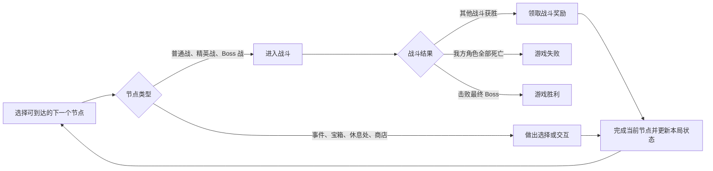
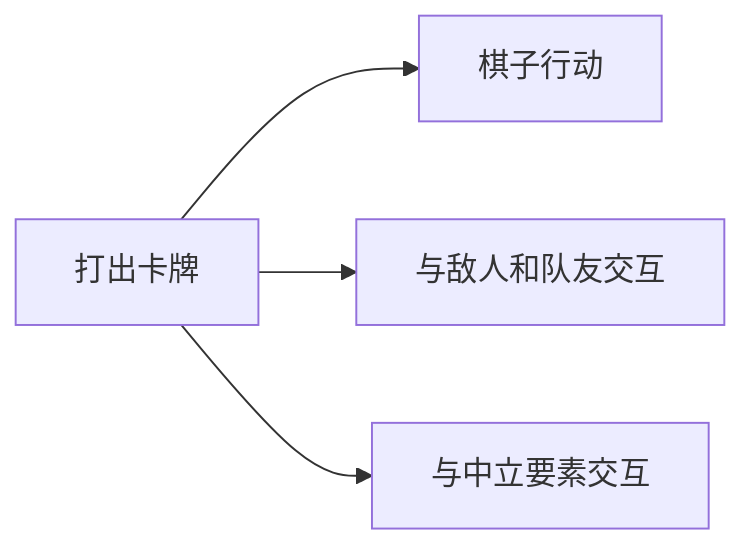

# 核心循环

- 文档版本：v0.1
- 文档状态：正式
- 对应里程碑：战斗垂直切片
- 最后更新：2026-09-27
- 相关文档：
    - [玩家行为与基础规则](02_玩家行为与基础规则.md)
    - [地图节点系统](核心系统/地图节点系统.md)
    - [奖励系统](核心系统/奖励系统.md)
    - [战斗流程与回合状态机](../TDD/战斗系统/战斗流程与回合状态机.md)

## 局外循环

## 局内循环

