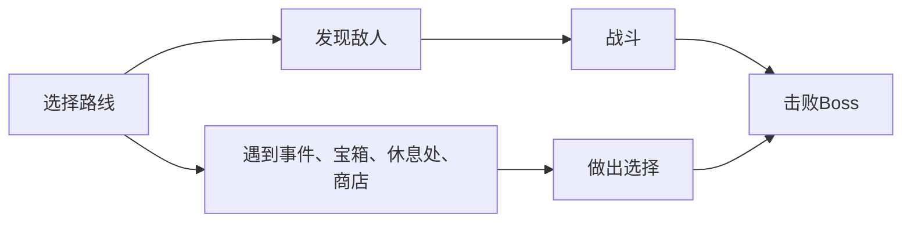
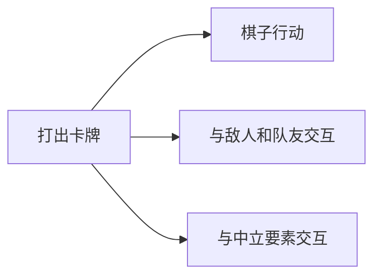

# 核心循环

## 局外循环

```mermaid
flowchart LR
    A[选择路线]-->B[发现敌人]
    A-->C[遇到事件、宝箱、休息处、商店]
    B-->D[战斗]
    C-->E[做出选择]
    D-->F[击败Boss]
    E-->F
```

## 局内循环

```mermaid
flowchart LR
    A[打出卡牌]-->B[棋子行动]
    A-->C[与敌人和队友交互]
    A-->D[与中立要素交互]
```