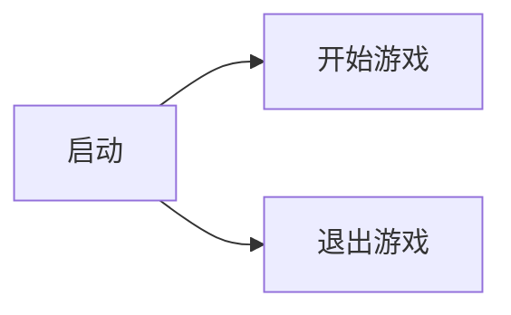

# UI流程

- 文档版本：v0.1
- 文档状态：草案
- 负责人：
- 对应里程碑：
- 最后更新：2026-09-27
- 相关文档：
    - [玩家行为与基础规则](02_玩家行为与基础规则.md)
    - [UI 与输入](../TDD/UI与输入.md)

```mermaid
flowchart LR
    A[启动]-->B[开始游戏]
    A-->C[退出游戏]
```
