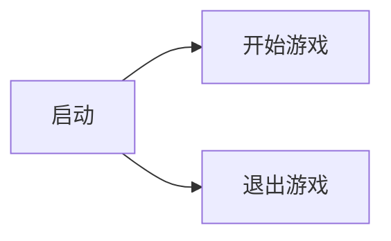
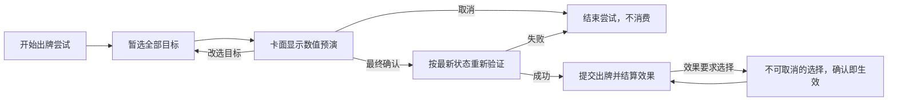

# UI流程

- 文档版本：v0.1
- 文档状态：草案
- 对应里程碑：待定
- 最后更新：2026-10-04
- 相关文档：
    - [玩家行为与基础规则](02_玩家行为与基础规则.md)
    - [UI 与输入](../TDD/UI与输入.md)

## 战斗中的出牌确认

满足基本出牌条件后，玩家依次暂选卡牌所需目标。全部选完才进入最终确认；玩家可查看打出中的卡面数值预演、改选目标或取消。确认前不发生实际扣费、卡牌移动和战斗效果。

卡面按卡牌定义中的可变数值位置显示预演结果。确定的数值取状态修正后的效果请求值，并计入出牌提交消息及其连锁的影响；随机、隐藏或取决于未知后续结果的数值标为不确定。目标或战斗状态改变时刷新预演。玩家最终确认后重新验证，成功才执行出牌；取消或验证失败时，本次尝试不扣费、不移动卡牌。

出牌提交后，部分卡牌效果会根据已结算的结果再要求玩家选择目标，例如击杀目标后再选择另一个敌人。这类选择在前面的表现播完后出现，没有取消按钮，确认后立即生效，不能改选；没有可选目标时直接跳过。

