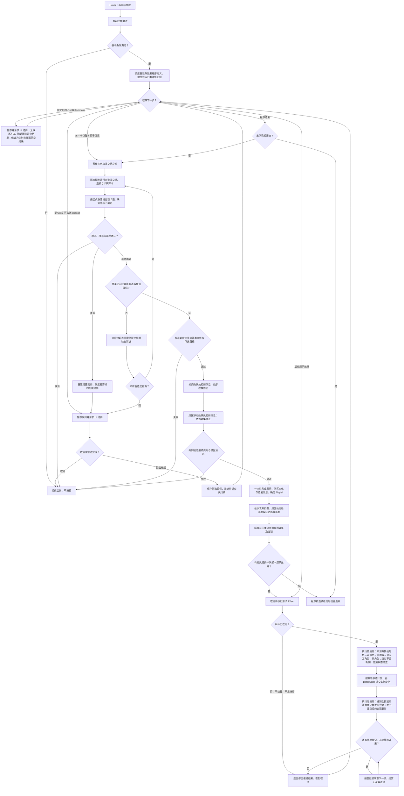

# 卡牌与效果系统

- 文档版本：v0.2
- 文档状态：草案
- 对应里程碑：战斗垂直切片
- 最后更新：2026-10-04
- 相关GDD：[卡牌系统](../../GDD/核心系统/卡牌系统.md)、[玩家行为和基础准则](../../GDD/02_玩家行为与基础规则.md)
- 相关模块：[战斗流程与回合状态机](战斗流程与回合状态机.md)、[实体与状态系统](实体与状态系统.md)、[棋盘与坐标系统](棋盘与坐标系统.md)、[UI与输入](../UI与输入.md)
- 相关ADR：

## 1. 职责

本模块管理战斗内卡牌实例和牌区，把通过基本条件检查的出牌尝试交给可暂停的卡牌效果程序，并调度卡牌、能力和回合产生的原子效果。当前设计仍为草案，未明确的边界见第 11 节。

- **出牌入口**：检查卡牌是否在手牌、回合是否允许出牌、是否付得起基础费用等基本条件。通过检查只允许开始尝试，不代表已经扣费或迁牌；基础费用不足时，即使状态可能降低费用，也不能开始尝试。
- **程序与选择**：`CardDefinition.effectLogic` 是可恢复的卡牌效果程序定义。基本条件通过后，`BattleEffectScheduler` 为本次出牌建立执行帧并运行程序；运行到 `choose()` 时暂停并请求 UI 暂选目标。所有可取消选择完成后，执行帧停在最终出牌确认前，玩家仍可改选或取消。
- **数值预演**：在最终确认前，以暂选目标和当前规则状态的隔离副本运行同一结算逻辑，包含出牌提交消息、其连锁及后续卡牌效果；把能确定的修正后请求值返回到当前出牌卡的显式数值槽。随机、隐藏或依赖它们的值显示为不确定。预演不改变真实战斗。
- **出牌提交**：玩家最终确认后，按最新状态重验；首个卡牌脚本原子效果执行前，由统一调度器处理扣费与卡牌去向两个独立原子效果。两者的执行前消息允许状态返回修正，但费用、牌区变化和成功出牌记录作为一组全部成功或全部不发生；提交成功后依次发布扣费、牌区的执行后消息及一次成功出牌消息，再结算它们触发的效果。取消或提交失败不消费。
- **效果结算**：伤害、推动、抽牌等均为独立原子 `Effect`。每个实际执行的效果在执行前、执行后发布规则消息。状态可以修正当前效果，也可以触发其他效果。执行后消息先通知完全部监听者并登记触发的效果，再按登记顺序逐个结算，每项连同其连锁稳定后才处理下一项；当前调用引发的连锁全部稳定后，卡牌程序才继续。

`BattleState`、`EntityState`、`BoardState` 是规则状态来源。棋盘系统负责占位、路径与坐标查询，适用规则模块负责目标、伤害、治疗和位移等判定；表现层只读取已提交的结果。普通移动、推动与拉动保留可区分的语义。

## 2. 设计约束

- 卡牌分攻击牌、技能牌和能力牌；战斗牌区为抽牌堆、手牌堆、弃牌堆和消耗牌堆。`CardDefinition` 是只读配置，另以显式数值槽标记卡面可变数值与效果请求值的对应关系；不从卡面文案自动猜测脚本中的数字。卡牌实例位置和当前费用是战斗运行时状态，本次程序的执行进度只保存在独立执行帧中，不写入 `CardInstance`。出牌后的去向按卡牌规则决定，并非一律进入消耗牌堆。
- 回合基础资源规则由[战斗流程与回合状态机](战斗流程与回合状态机.md)定义：全队共享费用创建时为 `0`，每个我方回合开始增加 `4`，抽 `6` 张，手牌上限 `12`。开局只执行首回合这一次资源增加与抽牌，初始牌组先用战斗随机源洗牌；满手时剩余应抽牌仍抽出并放入弃牌堆，抽牌堆不足则重洗弃牌堆继续抽，消耗牌堆不参与。回合结束默认弃掉手牌并清空费用。两者都是可被状态在执行前修正的原子效果，保留手牌或费用即通过这类修正实现；具体由哪些卡牌／状态提供属于内容设计。
- 玩家主动结束我方回合。目标暂选／最终确认阶段先取消未提交尝试；已提交程序或连锁运行中收到请求则等待本次结算稳定，由回合流程先判胜败，再在战斗继续时处理结束请求，不中断或退款已提交出牌。
- Hover 只预检基础费用、回合等非目标基本条件，不查询合法目标。`canStartSelection` 仅表示允许开始尝试；离开 Hover 时由 UI 重置，不影响已开始的尝试。正式开始以及出牌提交前仍须依最新状态重验基本条件，基础费用不足时不进入尝试；提交时还须验证状态修正后的最终费用。
- `CardEffectLogic` 是只读的可恢复程序定义，不设独立的计划构造步骤。基本条件通过后，调度器依据它和本次出牌上下文建立独立执行帧，按运行进度发起 `choose()` 与原子效果调用；不预先选择目标、执行效果、扣费或消耗随机数。简单卡牌可复用参数化逻辑，复杂卡牌可单独编写程序；不要求所有卡牌符合统一的序列化效果步骤表。
- 目标选择在程序运行到 `choose()` 时发生。`ChoiceSession` 保存当前请求、候选、暂选结果与暂停中的执行帧；可以先后多次请求实体或格子，按每次请求的规则查询候选。单次选择确认只保存暂选结果，并非最终出牌确认。`EntityId` 与逻辑格坐标不可混用，同格多个实体也不可混成一个目标。
- 最终确认前的程序前缀只在待提交上下文中推进；纯计算、规则查询和 `choose()` 可以产生暂选所需的局部结果，但不得改变权威规则状态、真实随机流或对外发布消息。改选时从程序起点重建待提交执行帧，按最新状态重放仍有效的暂选；若前一选择改变了后续候选或分支，作废受影响的后续暂选与局部值，重新请求选择。权威状态改变时同样重建并验证暂选，不能复用旧帧中的计算结果。
- 可取消的 `choose()` 只位于出牌提交事务开始之前。`choose()` 是执行帧中的选择请求，不算原子效果；扣费与迁牌现也属于原子效果，其消息可能引发连锁变化。调度器执行到选择请求时暂停队列并等待 UI；即使没有候选也提供取消入口。所有可取消选择完成后，执行帧停在首个卡牌脚本原子效果或正常结束前，进入预演和最终确认阶段；玩家可改选目标或取消。取消则丢弃待出牌帧，卡留手牌、费用不变，没有成功出牌记录。提交事务开始后不允许可取消的 `choose()`，但程序仍可发起不可取消的选择，规则见下一条。
- 出牌提交后，卡牌程序可以在原子效果之间发起不可取消的 `choose()`，用于依赖已结算结果的选择，例如“若该伤害移除了目标，再选择另一个敌人造成 `3` 点伤害”。调度器暂停执行帧并请求 UI 选择；UI 不提供取消入口，单次选择确认即为最终结果，不能改选。候选按选择时的最新状态查询；选中的目标在后续效果执行时仍按最新状态验证，已不在场则按目标不在场处理。候选为空时不等待玩家，直接返回空选择结果，程序继续；候选少于最少选择数量时，最少数量降为候选数。发起选择时上一次调用的连锁已经稳定，但出牌程序尚未结束，因此等待期间不是战斗稳定点，结束回合请求继续等待。
- 预演从当前暂选目标和规则状态建立隔离副本，复用 `BattleEffectScheduler` 的规则顺序：模拟扣费与牌区移动的执行前修正、共同提交、两者执行后与成功出牌消息及其连锁，再运行卡牌脚本和后续原子效果。副本必须覆盖本次结算会读取的全部可变规则输入，包括战斗状态、牌区、状态运行时、执行帧和可复现随机源；模拟通知和变化仅留在副本中，不分配真实 `PlayId`、不消耗真实随机数、不发真实规则或表现事件。若预演路径在提交复验或共同验证处失败，则返回不可确认原因，而非伪造效果数值。
- 预演以显式数值槽关联效果调用或提交请求，向卡面提供最终修正后的请求值，例如伤害 `12`、请求推距 `4`；即使实际生命损失或位移不同，也不以 `EffectResult.actualChanges` 替换卡面数字。随机、隐藏信息及受它们影响而无法确定的槽显示为不确定；若未知输入影响脚本分支，受影响分支的卡面数值也整体标为不确定，不展示某次试算走过的隐藏分支。提交后的不可取消选择在预演时尚未发生，预演运行到该处即停止，其后效果对应的数值槽标为不确定。未标记的效果不自动生成卡面数字；同一槽遇到多次效果或多目标时的展示规则待定。
- 参与预演的卡牌脚本与状态规则只能通过结算上下文读取或修改规则状态，并从该上下文取得随机结果；不能绕过上下文直接改变 Unity 对象、全局计数或外部系统，否则无法保证预演与正式结算共用规则且预演不产生真实副作用。
- 预演结果只对应生成时的战斗状态和暂选目标。改选目标或相关规则状态改变时废弃旧结果并重新预演；最终确认时以最新状态复验并真实执行，不直接把预演副本的状态或结果提交到 `BattleState`。若预演已过期，先更新卡面并保持待确认，使玩家确认的是当前可见数值。状态和选择不变且结果确定时，预演与真实执行应由同一规则和随机顺序得到一致的修正请求值。
- 玩家最终确认后，在首个卡牌脚本原子效果执行前，以最新状态重验卡牌、基础费用、回合和所选目标；无选择的卡牌同理。若程序没有原子效果，在正常结束前完成同样的重验与提交。通过后，调度器依次向扣费和牌区移动两个待执行原子效果发布执行前消息，收集并应用类型化修正；两者依据修正后的请求共同验证，再由战斗状态一次性提交。修正后的费用不可支付、牌区去向无效或任何提交步骤失败时，费用与牌区均不改变，不发布执行后消息或成功出牌记录。合法提交后的规则性受阻或零变化不退款。
- 扣费与牌区移动是两个独立原子 `Effect`，但同属一次不可部分成功的出牌提交。共同提交时确定 `PlayId`，将两项状态变化及完整的扣费执行后、牌区执行后、成功出牌三条待分发规则消息作为同一次提交结果；未形成完整结果便不得向外暴露已消费状态。提交成功后按上述顺序分发消息，三条消息触发的新效果待全部分发后，按消息顺序及各消息内的登记顺序深度优先结算，在卡牌程序继续前稳定。同一次提交只生成一份成功出牌记录。执行前消息只返回修正，不直接改变战斗状态或触发即时连锁；失败尝试不会留下由执行前消息产生的状态变化。消息分发异常的恢复策略待定，但不能重新扣费或遗失已提交的成功记录。
- `damage()`、`push()`、`draw()` 等产生各自的原子 `Effect`；能力、回合和卡牌产生的同类效果都走 `BattleEffectScheduler`。每个实际执行的原子效果在规则计算前和状态提交后各发布一次规则通知，分别称为执行前消息和执行后消息。卡牌程序执行帧只保存 `effect()` 的运行位置、局部变量、选择结果与提交状态，负责暂停和恢复程序；它不是原子效果，不发布伤害或推动的执行前／后消息。成功出牌记录在两项消费变化共同提交后单独发布。
- 每个原子效果按来源阵营与本次交互的一个对应阵营路由，执行前、执行后采用同一顺序：来源阵营的其他在场角色 → 其他在场非角色实体 → 来源实体本人 → 对应阵营的在场角色 → 对应阵营的在场非角色实体。各角色组与非角色组分别按监听序号升序，来源实体本人从前两组排除；同一实体先处理永久状态区、再处理临时状态区，各区按实例获得顺序。对应阵营取作用对象所属阵营，作用对象不是实体时由效果种类声明；对应阵营与来源阵营相同时（例如治疗队友、给自己施加状态），省略对应方步骤，该阵营只按来源方顺序通知一次。中立可作为交互的一方阵营，但中立实体不监听效果，实践中每次只与另一个阵营配对。无明确来源使用无监听者的虚拟阵营，同样与一个对应阵营配对，并跳过来源本人步骤。每个有监听资格的状态根据消息与自身条件决定是否响应，来源和目标不是唯一接收者。多来源、多目标操作按产生顺序生成多个效果依次入队，各效果独立发布前后消息、结算并处理连锁。监听序号在每个阵营内唯一：我方开局按出战顺序、敌方开局按遭遇配置赋号，重新部署的我方角色沿用原序号，其他新增实体取本阵营已分配的最大序号加 `1`，详见[实体与状态系统](实体与状态系统.md)。
- 执行前消息表示即将结算的原子效果，携带效果种类、来源、目标、可选 `PlayId`、语义和当前请求值，此时还没有实际结算结果。状态返回与效果种类相容的类型化修正；调度器依监听顺序逐个应用并校验，状态不直接改写 `BattleState`。例如伤害 `6` 先加 `2` 得 `8`，再受易伤乘 `1.5` 得 `12`；请求推距 `2` 加 `2` 得 `4`。每次应用修正后立即四舍五入取整，`.5` 进位，例如 `5 × 1.5 = 7.5` 取 `8`，因此后续监听者读到的始终是整数。修正结果不设硬上限，低于 `0` 时按 `0` 计。实现时注意：C# `Math.Round` 默认使用银行家舍入（`2.5` 得 `2`），须显式指定远离零的舍入方式。
- 原子效果依据修正值和最新状态计算、由 `BattleState` 提交实际变化后，执行后消息携带已执行效果及 `EffectResult`，区分修正请求与实际变化。触发型状态可据此产生新的原子效果；`BattleEffectScheduler` 结算它们及其连锁，才让当前原子效果返回并恢复卡牌程序。A 的“造成攻击伤害时抽一张牌”在 `DamageEffect` 执行后触发，即使实际生命损失为零。
- 执行后消息的分发与触发效果的结算分为两步。第一步，按监听顺序把消息发给全部有监听资格的状态；此期间不提交任何战斗状态变化，也不新增或移除状态，因此订阅列表在一次分发中固定。每个状态依据分发时的战斗状态判断是否触发；触发时构造具体的原子效果并登记，确定其来源、目标与请求，来源默认为状态持有者，状态定义也可声明为无明确来源，见[实体与状态系统](实体与状态系统.md)。同一状态触发多个效果时，按其声明顺序登记。第二步，分发结束后，调度器按登记顺序深度优先结算：取出一项，完成它的执行前消息、提交、执行后消息，以及由此登记的全部效果，稳定后才处理下一项。全部登记项稳定后，当前原子效果才返回。出牌提交的三条消息和回合开始／结束通知也遵循同一规则。
- 登记的效果一经入队即脱离触发它的状态与持有者，作为独立效果结算：执行前不重检持有者是否在场、触发状态是否仍存在，也不再判断触发条件。例如 C 的“荆棘”已登记对 A 的反伤，之后 C 被同一连锁中的其他效果移除，反伤仍照常结算。来源实体已移除的效果，仍按构造时记录的来源阵营路由；来源本人步骤因该实体不在场而没有监听者。是否存在依赖原持有者、需要在执行前重检或取消的触发效果，尚未确定。
- 某次原子效果的提交移除了实体（目标或来源本人）时，这次效果的执行后消息仍通知被移除的实体。它保留原监听序号并在原位置接收；若它是来源本人，则在来源本人步骤接收。这是它收到的最后一条规则消息，此后的消息不再通知它。执行后消息为此附带被移除实体的最后状态，包括位置、生命 `0`、阵营、监听序号与状态列表，供其状态判断是否触发；这些状态在本次分发结束后清除。分发期间不改变战斗状态，登记的效果又脱离持有者，因此被移除实体的状态只能登记效果，不能在移除后直接改动战斗状态。“死亡时触发”类状态即按此规则实现。
- 原子效果出队时，若其目标实体已不在场，该效果不结算：不发布执行前、执行后消息，不提交变化，也不引发连锁，结果记为“目标不在场”，调度器随即处理下一项。例如 B、D 的追击都登记了对 C 的伤害，B 的追击先移除 C，D 的追击便直接跳过，D 的“造成伤害后”类状态也不会因此触发。濒死实体登记的、以自身为目标的效果同样跳过。来源不在场不影响结算，见上文。推拉受阻等目标仍在场的零变化属于已执行，照常发布消息。
- 类型化修正的种类随内容扩展，本文列出的伤害加值、伤害倍率、推距加值只是示例。不设独立的“取消”修正：需要抵消一次效果时，把请求数值修正为 `0`，例如伤害 `0`、推距 `0`、抽牌 `0`、费用 `0`。该效果仍属已执行：后续监听者照常收到执行前消息，效果提交零变化后照常发布执行后消息，A 的“造成伤害后抽牌”会触发。归零只是一次普通修正，按监听顺序排在它之后的修正仍会改变数值，例如归零后再加 `1` 得 `1`。牌区移动、放置、直接移除实体等没有数值的效果不能被抵消。
- `damage()`、`push()` 等脚本调用返回本次效果的结果，包括结果类别、修正后的请求值与实际变化。`damage()` 的数值取修正完成的伤害值，不等于目标实际减少的生命；修正值 `12`、实际损失 `0` 时仍返回 `12`，实际变化见结果中的 `EffectResult` 记录。“推的威力 +2”指请求推距增加 `2`，实际移动距离由棋盘规则决定。
- 效果因目标不在场而未结算时，脚本调用不抛出错误，而是返回带“目标不在场”标识的结果；该结果没有修正值和实际变化，程序照常执行下一句。例如 `damage(enemy, 6)` 移除了 enemy 之后，`push(enemy, 2)` 返回该标识，随后的 `draw(1)` 照常执行。需要据此分支的脚本先检查结果类别，例如“若推动已结算，再造成 `3` 点伤害”。未检查标识就读取无效结果的数值属于脚本编写错误，按代码错误报告，不作为正常游戏流程处理。
- 能力牌附着于实体的能力效果是本场战斗的永久型状态，战斗结束清除；重复施加按 `StatusDefinition.repeatMode` 处理：可重复可叠加时合并实例并累加数据字段；可重复不可叠加时保留独立实例，数值字段不合并；不可重复不可叠加时保留唯一实例，数值字段统一为 `0`。对应 UI 展示和状态订阅规则见[实体与状态系统](实体与状态系统.md)。具有监听资格的实体所持临时状态只要存在便可响应适用效果；我方、敌方持有者在所属阵营回合按规则自然衰减，中立持有者的衰减时点同见该文档。状态触发的效果同样走统一调度器。
- 规则结算与动画速度解耦。实体、棋盘和牌区变化由战斗状态接口提交，表现事件在提交后产生，包括实际位移为零的受阻反馈。随机效果使用战斗提供的可复现随机源。胜败待活动程序及连锁稳定后判断。

## 3. 核心概念

| 概念 | 含义与边界 |
| --- | --- |
| `CardDefinition` | 跨战斗只读卡牌配置，描述类型、费用、牌区去向及效果逻辑引用；不保存一次出牌的选择进度。 |
| `CardInstance` 与 `DeckState` | 本场战斗的卡牌及其在四个牌区中的位置；出牌和抽弃牌效果通过受控操作修改牌区。 |
| `PlayCardCommand` | 开始出牌尝试的请求，标明卡牌实例与打出者；不要求预先携带全部目标。 |
| `CardEffectLogic` | 只读的可恢复卡牌效果程序定义；本次运行进度和局部变量由调度器创建的执行帧保存。 |
| `EffectExecutionFrame` | 本次程序的运行时位置、局部变量、已选目标、提交状态和可选 `PlayId`；可等待选择或连锁后继续。它是程序控制状态，不是原子 `Effect`，不会替代伤害、推动等效果发布规则消息。 |
| `ChoiceSession`、`ChooseRequest`、`TargetRef` | 调度器运行到 `choose()` 时建立的选择会话、请求和结果；目标引用明确区分 `EntityId` 与逻辑格坐标。 |
| 最终确认阶段 | 所有可取消选择已暂定，卡牌程序尚未开始出牌提交事务；玩家可查看预演数值、改选或取消，最终确认才进入真实复验与提交。 |
| 卡面数值槽 | `CardDefinition` 中显式声明的可变显示位置，与指定效果或提交请求的数值字段对应；UI 只替换这些槽，不解析任意卡牌脚本或卡面文案。 |
| 预演结果 | 由隔离结算产生，关联战斗状态和暂选目标；为每个数值槽返回确定的修正后请求值、不确定标记或不可确认原因，不是权威战斗结果。 |
| 出牌提交事务 | 把扣费与牌区移动两个独立原子效果作为一组验证和提交，连同完整的三条待分发消息形成一次提交结果；成功后才依序分发各自的执行后消息与一次成功出牌消息，并在卡牌脚本继续前结算所触发的效果。 |
| `PlayId` 与成功出牌记录 | 费用和牌区共同提交后发布的一次性通用事实；出牌产生的效果可关联同一 ID，取消或失败的尝试没有该记录。 |
| 原子 `Effect` | 一次待执行的规则操作，如扣费、牌区移动、`DamageEffect`、`PushEffect`、`DrawEffect`；有来源、目标、请求参数和语义，构造时不修改状态。 |
| 类型化修正 | 状态根据执行前消息返回适用操作，如伤害加值、伤害倍率、推距加值；种类随内容扩展，此处仅为示例。不设独立的取消修正，抵消效果即把请求数值修正为 `0`。调度器按监听顺序应用，每次应用后四舍五入取整。 |
| `EffectResult` | 修正后的请求、实际状态变化、结果类别和原因；与成功出牌及脚本函数返回值区分。 |
| `BattleEffectScheduler` | 统一调度卡牌程序、原子效果与嵌套连锁；维护待处理项和暂停的执行帧。执行后消息登记的效果按深度优先结算，不能仅依赖 FIFO 队尾追加。 |
| 规则消息与表现事件 | 执行前消息在原子效果规则计算前提供待修正请求；执行后消息在状态提交后提供 `EffectResult`。成功出牌消息在扣费与牌区共同提交后单独发布。它们供状态订阅者处理；`PresentationEventStream` 另供 UI、动画和音效读取，不参与规则结算。 |

## 4. 数据模型

以下字段描述模块间交换的数据；不规定 C# 方法签名、资产注册方式或集合类型。只读配置、战斗状态、出牌执行帧与单次原子效果分开。

### 4.1 定义、实例与牌区

| 对象及字段 | 类型 | 说明 |
| --- | --- | --- |
| `CardDefinition.definitionId`、`type`、`cost` | 稳定定义 ID、`CardType`、非负整数 | 同一定义可创建多张实例；开始尝试和提交复验均须付得起基础费用，提交时还要核验执行前消息修正后的费用。 |
| `CardDefinition.effectLogic` | `CardEffectLogic` 引用 | 调度器用它启动本次出牌程序并建立独立执行帧；程序运行到对应语句时才发起 `choose()` 和原子效果调用。 |
| `CardDefinition.onPlayDestination` | 牌区去向规则 | 给出本次牌区移动效果的初始请求；执行前可被适用状态修正，最终去向须通过验证。 |
| `CardDefinition` 的卡面数值槽绑定 | 只读槽标记与效果数值来源 | 明确哪一处卡面数字读取哪次效果或提交请求的修正后数值；不规定具体 UI 文案格式。 |
| `CardInstance.instanceId`、`definitionId` | 本场实例 ID、定义 ID | 出牌请求按实例 ID 指向手牌。 |
| `DeckState.cardsById` | 实例 ID → 卡牌实例 | 权威实例索引。 |
| `DeckState.drawPile[]`、`hand[]`、`discardPile[]`、`exhaustPile[]` | 有序实例 ID 集合 | 每张实例在稳定状态下恰属于一个牌区。 |

`BattleState` 提供当前费用；`DeckState` 不缓存 Hover 结果，也不保存选择或执行位置。

### 4.2 出牌执行与运行中选择

| 对象及字段 | 类型 | 说明 |
| --- | --- | --- |
| `PlayCardCommand.cardInstanceId`、`sourceEntityId` | 卡牌实例与打出者 | 基本条件通过后才建立待出牌执行帧，无须预选全部目标。 |
| `EffectExecutionFrame.position`、`locals` | 程序位置与局部结果 | 保存 `choose()` 的目标、`damage()` 的返回值等，等待后从原处继续；改选或待确认阶段的权威状态变化时重建前缀并作废受影响局部值，不写回定义。 |
| `EffectExecutionFrame.phase`、`playId?` | 尝试／等待选择／等待最终确认／已提交／等待不可取消选择／等待连锁／完成等状态和可选出牌 ID | 等待最终确认时尚未消费，允许改选或取消；提交只发生一次；提交后的选择不可取消。 |
| `ChoiceSession.request`、`candidateRefs`、`result`、`cancellable` | `ChooseRequest`、候选、选择结果、是否可取消 | 候选按最新状态查询；结果以 `TargetRef` 明确保存实体或格子引用。提交前的选择可取消，结果是暂选，最终确认时重验；提交后的选择不可取消，确认即为最终结果。 |
| 预演输入 | 当前规则状态的隔离副本、暂选目标、待提交执行帧及随机源副本 | 每次改选或相关状态变化后重新建立；真实状态和随机流不被预演推进。 |
| 预演输出 | 数值槽 → 修正后请求值／不确定；可选不可确认原因 | 只供当前出牌卡的显示；与生成时的状态和目标关联，不能直接提交为战斗结果。 |
| 出牌提交组 | 扣费与牌区移动两个待执行原子效果、共同验证结果及待分发消息 | 保存两项执行前修正与共同提交的边界；状态变化和完整的三条待分发消息同属一次成功提交结果，两项均成功前没有执行后消息或成功出牌记录。不作为额外的伤害、推动等原子效果。 |
| 成功出牌记录的 `playId` | 本场已提交出牌 ID | 扣费和牌区移动共同提交后只发布一次；取消或失败无该记录。 |
| 出牌历史 | 本场成功出牌记录的有序列表，每项含 `playId`、卡牌实例与定义、卡牌类型、打出者、轮次与回合阵营 | 由 `BattleState` 在共同提交时按顺序追加，战斗结束时清除；取消或失败的尝试不记录。状态与卡牌脚本经结算上下文只读查询，例如“本回合是否已打出过攻击牌”；回合中途获得的“每回合第一张攻击牌”类能力据此判断此前的出牌。预演只在副本中追加记录。 |

以下是程序运行顺序的伪代码，不代表固定配置格式：

```text
effect() {
    enemy = choose(entity);
    damage(enemy, 6);
    push(enemy, 2);
}
```

程序可依赖前一原子效果的返回值决定后续行为，也可先后发出多个 `choose()`。可取消的选择须在出牌提交组开始之前完成；提交后发起的选择不可取消。若卡面有“伤害 6、推距 2”两个可变数字，则由定义显式将两个数值槽分别绑定到这两次效果的请求值；预演得到修正请求 `12` 和 `4` 时，当前出牌卡显示“伤害 12、推距 4”。槽绑定只影响显示，不改变 `effect()` 的规则代码。

### 4.3 原子效果、通知与结果

| 对象及字段 | 类型 | 说明 |
| --- | --- | --- |
| `Effect.effectId`、`parentEffectId?` | 效果与因果链 ID | 用于嵌套结算、日志和非终止连锁检测。 |
| `Effect.origin`、`target`、`playId?` | 单一来源或无明确来源标记、作用对象及可选出牌 ID | 能力与回合效果也可执行，不必伪造出牌。多来源、多目标操作先展开为多个效果，按产生顺序依次入队，各效果记录自己的来源与作用对象。 |
| 效果路由上下文 | 来源阵营或无明确来源虚拟阵营、一个对应阵营 | 记录本次交互的路由双方；对应阵营取作用对象所属阵营，与来源阵营相同时只遍历该阵营一次。中立与无明确来源均不提供监听者，只处理配对的另一侧有监听资格的实体，不同时遍历其他阵营。无明确来源分类仅用于路由，不加入实体定义的阵营枚举。 |
| `Effect.kind`、`tags`、`request` | 种类、语义及请求参数 | 扣费保存费用请求，牌区移动保存卡牌与去向请求；伤害保存基础值，推动保存请求推距，抽牌保存抽取需求。普通移动、推动、拉动可区分；重新部署角色的放置带“部署”语义，与卡牌召唤等其他放置效果可区分；需要映射卡面的效果另有数值槽标记。治疗、格挡、生命上限、状态获得与移除及直接移除实体等效果的请求与提交语义见[实体与状态系统](实体与状态系统.md)。 |
| 执行前规则消息 | 效果上下文与当前待修正请求 | 待执行原子效果在规则计算前独立发布；此时没有实际结果，状态可返回类型化修正。按来源方其他角色、其他非角色、来源本人、对应方角色及非角色的顺序检查适用订阅，中立和无明确来源侧不监听。出牌提交的两个效果依次收集修正后共同验证，验证失败则不执行。 |
| 类型化修正 | 与效果种类相容的提案 | 调度器逐个应用并校验，状态不直接修改共享请求或 `BattleState`。抵消效果通过把请求数值修正为 `0` 实现，效果仍会结算。每次应用后四舍五入取整，不设硬上限，低于 `0` 时按 `0` 计。 |
| `EffectResult.modifiedRequest` | 修正完成的请求 | `damage()` 返回其中的伤害值，而非实际生命损失。 |
| `EffectResult.actualChanges`、`outcome`、`reason` | 实际变化、结果类别、规则原因 | 表达生命、牌区、位置变化；受阻可为零位移并带原因。结果类别区分已执行（含零变化与受阻）和目标不在场；目标不在场时没有实际变化，也不发布执行前、执行后消息。实体被移除时，记录其最后状态（位置、阵营、监听序号与状态列表），供本次执行后消息通知该实体。 |
| 执行后规则消息 | 已执行效果与 `EffectResult` | `BattleState` 提交后发布；状态依据修正请求、实际结果及分发时的战斗状态判断是否触发，并登记新的原子效果。全部监听者通知完后，这些效果按登记顺序深度优先结算。被本次提交移除的实体仍按原位置接收这条消息。出牌提交共同成功时依次发布扣费、牌区的执行后消息，再发布成功出牌消息；三者引发的新效果随后结算。 |
| 调度器待处理项与活动帧 | 有序待处理效果、程序位置、连锁层级 | 多来源、多目标操作展开后的效果依次入队；每个效果出队时读取最新状态，目标不在场则跳过，否则完成自身消息与连锁后再推进后续效果。执行后消息登记的效果构成该效果的下一层待处理列表，逐项深度优先结算。出牌提交组仍遵守共同提交及三条消息先分发再结算连锁的约束；具体容器在实现时决定。 |

规则消息与 `PresentationEventStream` 分离。原子效果执行时读取最新 `BattleState`，适用规则计算后由战斗状态接口统一提交；本次路由双方中有监听资格的实体状态依据自身条件响应，而不局限于效果来源或目标。中立实体可持有状态，但不监听效果执行前、执行后消息。

## 5. 运行流程

下图覆盖暂选、预演与最终确认路径；出牌提交的两个原子效果不属于卡牌脚本中的首个原子效果。提交后的不可取消选择见第 2 节。



例：我方 A 打出此攻击牌。A 是我方监听序号 2，具有“造成攻击伤害时抽一张牌”和“推距 +2”；B 是我方序号 3，具有“范围内友军的攻击效果伤害 +2”，且 A 在其范围内；敌方 C 有易伤 `+50%`。程序执行到 `choose(entity)` 时等待玩家暂选 C；完成暂选后，预演在隔离副本中依照真实出牌顺序模拟提交组、其消息连锁、`damage(C, 6)`、抽牌连锁与 `push(C, 2)`。在本例已知规则下，B 先使伤害 `6 → 8`，C 再使 `8 → 12`，A 使请求推距 `2 → 4`；卡面已绑定的伤害和推距槽显示 `12`、`4`。若实际生命损失为零，伤害槽仍显示 `12`；抽到哪张牌若属于隐藏信息，则不在卡面显示确定结果。玩家此时可改选或取消，真实卡牌与费用不变。最终确认且复验通过后，扣费与牌区移动共同提交，依次发布两项执行后消息和成功出牌消息并处理其连锁；真实 `DamageEffect` 执行后即使生命损失为零仍触发 A 的 `DrawEffect`，抽牌及其连锁稳定后 `damage()` 返回 `12`，程序才执行推动。实际移动仍由棋盘规则决定。

例：同一条执行后消息触发多个状态。C 生命 `10`，A 的 `damage(C, 6)` 提交后 C 剩 `4`。三个状态分别是：B 的“追击”，我方其他角色造成伤害后，B 对同一目标造成 `3` 点伤害；A 的“斩杀”，A 造成伤害后若目标生命 ≤ `3`，抽 `2` 张；C 的“荆棘”，受到伤害后对来源造成 `1` 点伤害。

该消息按 B → A → C 分发：B 登记追击；A 判断时 C 生命为 `4`，不触发；C 登记对 A 的反伤。分发结束后先结算追击，C 降到 `1`。追击的执行后消息使 C 的荆棘登记对 B 的反伤，这次反伤在追击返回前结算，之后才结算对 A 的反伤。最终顺序为追击 → 反伤 B → 反伤 A，A 不抽牌，`push(C, 2)` 在三者之后执行。

若 C 初始生命为 `9`：A 的伤害使 C 剩 `3`，分发时斩杀也满足条件，登记顺序为追击、A 抽 `2` 张、对 A 的反伤。追击使 C 生命归零并被移除，但追击的执行后消息仍按 C 的原监听位置通知 C，荆棘因此登记对 B 的反伤，并在追击返回前结算。之后依次结算抽牌和对 A 的反伤；C 已移除，不影响这两项。最终顺序为追击 → 反伤 B → 抽 `2` 张 → 反伤 A。随后的 `push(C, 2)` 因目标不在场而不结算、不发消息，返回“目标不在场”标识，程序继续执行。

共同提交后卡牌脚本产生的效果关联本次 `PlayId`；提交前的扣费与牌区移动待执行请求属于同一出牌提交组，不以尚未生成的 `PlayId` 表示成功。能力触发的连锁是否继承它待定。暂停选择或嵌套结算时不接收新的玩家出牌；胜败在全部活动程序与连锁稳定后判断。

## 6. 状态与生命周期

`CardDefinition`、卡面数值槽绑定和 `CardEffectLogic` 是跨战斗只读配置；`CardInstance`、`DeckState`、执行帧、选择会话、预演结果、原子效果与结果均为战斗或出牌运行时数据。预演结果只归属当前待确认尝试，取消或真实提交后丢弃。

| 阶段 | 创建、变更与清理 |
| --- | --- |
| 战斗创建 | `BattleFlow` 依据本局牌组建立本场实例与牌区索引；我方本局角色按出战顺序、敌方初始实体按 `EncounterDefinition` 的监听顺序分配本场监听序号，规则见[实体与状态系统](实体与状态系统.md)；中立实体不分配序号，也不监听效果。 |
| 待操作与 Hover | 卡仍在手牌，UI 暂存 `canStartSelection`；预检不创建效果、不消费。 |
| 基本检查与启动 | 玩家发起尝试后以最新状态检查手牌、基础费用、回合；即使后续可能有费用减免，基础费用不足仍不能启动。通过后由调度器依据 `effectLogic` 建立本次执行帧并运行程序。 |
| 等待可取消选择 | `ChoiceSession` 保存请求、暂选结果与暂停的帧；取消清理会话和高亮，手牌、费用不变，没有 `PlayId`。 |
| 预演与最终确认 | 所有可取消选择暂定后，在提交组前暂停；隔离运行同一规则，更新当前出牌卡的数值槽。改选或规则状态变化使结果过期，重新预演；取消清除结果且不消费。 |
| 成功出牌提交 | 玩家最终确认后、首个卡牌脚本原子效果前重验；无脚本原子效果的程序在正常结束前重验。扣费与牌区移动效果先依次收集执行前修正，再共同验证并提交；成功后依次发布两者的执行后消息与成功出牌消息，随后处理连锁。同一实例不能重复消费或发布记录。 |
| 提交后的不可取消选择 | 已提交的程序发起不可取消的 `choose()` 时暂停执行帧；UI 不提供取消入口，确认后程序继续。候选为空时直接返回空结果。等待期间不是战斗稳定点。 |
| 原子效果与连锁 | 每个效果先经状态修正，再提交实际变化，随后通知全部触发型状态并登记效果，再按登记顺序深度优先结算；被本次提交移除的实体也参与这次通知，其状态在分发结束后清除。连锁稳定后原调用才返回，程序继续。 |
| 战斗稳定与结束 | 活动帧、原子效果和连锁全部结束后判断胜败。结束后清理未完成帧、队列和出牌历史；跨节点牌组信息由 `RunState` 管理。 |

稳定状态下一张卡恰位于一个牌区，实例 ID 本场不复用。已提交后的受阻与零变化不回滚消费；表现速度不影响规则结果。

## 7. 模块接口

名称描述职责，不限定 C# 签名。费用、牌区、实体和棋盘变化均经战斗状态接口提交；规则消息与表现事件分开。

| 接口能力 | 调用方 → 负责模块 | 输入 | 输出与状态权限 |
| --- | --- | --- | --- |
| 读取卡牌与牌区 | UI、命令处理器 → 定义索引、`DeckState` | 实例 ID | 返回只读配置和牌区信息，不移动卡牌。 |
| Hover 基本预检 | UI → 命令处理器 | 手牌、费用、回合 | 返回 `canStartSelection` 和原因，不查目标、不扣费。 |
| 开始出牌尝试 | UI → 命令处理器 | `PlayCardCommand` | 重验基本条件，通过后交由调度器启动本次程序，不立即扣费。 |
| 启动出牌程序 | 命令处理器 → `BattleEffectScheduler` | `CardDefinition.effectLogic`、卡牌实例、来源及出牌上下文 | 为本次出牌建立执行帧并推进程序；选择、提交与原子效果均在程序运行到对应位置时处理。 |
| 请求选择 | 执行帧 → `BattleEffectScheduler`、目标服务、UI | `ChooseRequest` 与最新状态 | 暂停并展示候选。提交前的选择：单次选择确认返回暂选 `TargetRef`，不提交出牌，允许阶段取消则结束尝试。提交后的选择：不提供取消，确认结果直接写入执行帧；候选为空时不请求 UI，直接返回空结果。 |
| 请求预演 | 当前出牌 UI → 隔离的规则结算上下文 | 卡牌实例、暂选目标、待提交执行帧与当前规则状态 | 在副本中使用同一调度与状态订阅规则，包含模拟出牌提交组、其消息连锁和卡牌效果；返回各卡面数值槽的修正后请求值、不确定标记或不可确认原因。不改权威状态、真实随机流、`PlayId` 或真实消息流。 |
| 显示预演 | 隔离结算结果 → 当前出牌卡 UI | 数值槽绑定、预演结果 | 仅更新显式绑定的卡面数字；改选、取消或结果过期时更新或撤销，不把实际扣血、位移冒充请求值。 |
| 最终确认 | 当前出牌 UI → 命令处理器、调度器 | 待提交执行帧、暂选目标、当前预演所对应状态 | 预演已过期时先重新预演并保持待确认；确认有效结果后按最新状态复验，真实执行出牌提交与卡牌效果，不提交预演副本。 |
| 提交出牌 | 命令处理器、调度器 → 状态订阅者、`BattleState` 与 `DeckState` | 卡牌、基础费用、去向、已选目标 | 最终确认后、首个卡牌脚本原子效果前重验；扣费和牌区移动两个原子效果依次发执行前消息、接受修正，最终请求共同验证并一次性提交。随后依次发扣费和牌区的执行后消息及一次成功出牌消息，结算所触发的效果后继续脚本；无脚本原子效果的程序在正常结束前完成此流程。失败不留半提交。 |
| 执行原子效果 | 卡牌帧、能力、回合逻辑 → `BattleEffectScheduler` | `Effect`、来源、目标、可选 `PlayId` | 每个实际执行效果经过前通知、提交、后通知；调用方等待连锁稳定。 |
| 执行前消息 | 调度器 → 状态订阅者 | 效果上下文和当前请求 | 在规则计算前发布；按来源阵营其他角色 → 其他非角色实体 → 来源者 → 对应阵营角色 → 非角色实体检查（各组序号升序，同阵营交互只遍历一次）；实体内先永久区、后临时区，各区按获得顺序，依次应用类型化修正。 |
| 计算并提交 | 调度器 → 规则模块、`BattleState` | 修正后请求和最新状态 | 得到 `EffectResult` 并统一提交；受阻可有零变化与原因。 |
| 执行后消息 | 调度器 → 状态订阅者 | 已执行效果及 `EffectResult` | `BattleState` 提交后按相同监听顺序通知全部订阅者，被本次提交移除的实体（含来源本人）也接收这一次；分发期间不改变战斗状态。登记的效果在分发结束后按登记顺序深度优先结算，均在原调用返回前稳定。 |
| 返回调用 | 调度器 → 等待中的执行帧 | 结果类别、修正值与 `EffectResult` | `damage()` 返回修正后的伤害值；目标不在场时返回带该标识、没有数值的结果，不抛出错误。两种情况下程序都继续执行下一语句。 |
| 发表现事件 | 调度器 → `PresentationEventStream` → UI、动画、音效 | 已提交结果与受阻原因 | 状态提交后发出，表现层不反写规则。 |
| 接收回合效果 | 回合状态机 → `BattleEffectScheduler` | 回合产生的原子效果 | 经同一规则消息与提交流程，不伪造出牌消费。 |
| 查询出牌历史 | 状态规则、卡牌脚本 → `BattleState`（经结算上下文） | 查询条件，如轮次、回合阵营、卡牌类型、打出者 | 只读返回本场成功出牌记录；预演时读取副本中的历史。 |

## 8. 异常与边界情况

| 情况 | 处理原则 |
| --- | --- |
| 卡牌配置无效 | 定义 ID 缺失或重复、费用为负、效果逻辑或去向缺失、`choose()` 规则无效，或已声明的数值槽绑定无效时报告具体卡牌与字段；不建立不完整实例。 |
| 牌区索引不一致 | 未知实例、一卡多区或手牌与索引不一致时拒绝操作；不能靠 UI 显示替代权威牌区索引。 |
| 抽牌堆不足 | 由抽牌规则决定是否重洗及实际抽得数量；不越界读取、复制或丢失实例。重洗规则与 GDD 对齐。 |
| Hover 过时 | 正式尝试与成功提交前均重验基本条件，不沿用 Hover 结果。 |
| 无候选或目标无效 | 可取消选择仍提供取消；未知、已移除、越界或不符规则的目标不能确认，提交前再依最新状态复核。提交后的不可取消选择：候选为空时直接返回空结果，候选少于最少数量时最少数量降为候选数。 |
| 改选、取消或切换卡牌 | 出牌提交组开始前可以改选并重新预演，或在允许阶段取消、切换卡牌并丢弃帧与预演结果；不扣费、不迁牌、不发布成功记录。提交后的取消语义不套用退款路径。 |
| 预演过期或不确定 | 暂选目标或相关规则状态变化时，旧数值不用于最终确认，更新预演后继续等待玩家确认。随机、隐藏信息及其依赖值显示为不确定，不把试算采样或隐藏结果作为准确卡面数字。 |
| 预演失败 | 预演的复验、共同提交验证或规则执行不能完成时，交互界面给出不可确认原因，不产生真实消费或消息；非终止连锁的预演中断策略待定。 |
| 重复命令或提交失败 | 同一实例不能重复消费；基础费用付不起时不开始尝试，修正后的费用付不起或最终牌区请求无效时整组提交失败。任何共同提交步骤失败均无费用或牌区变化，也无两项效果的执行后消息及成功出牌记录。已提交后的消息分发异常不得重复扣费或遗失成功记录，具体恢复策略待定。启动程序或建立执行帧失败时，在消费前报告配置或代码错误。 |
| 已提交后目标变化 | 后续原子效果依执行时最新状态得到规则结果，卡牌不退款。目标已被前一效果移除时，以它为目标的效果不结算、不发消息，记为目标不在场；脚本调用返回该标识而不抛出错误，后续语句照常执行。脚本未检查标识就读取其数值时，按代码错误报告。 |
| 效果被抵消 | 通过把请求数值修正为 `0` 实现：效果照常结算，提交零变化并发布执行后消息；排在其后的修正仍可改变数值。没有数值的效果不能被抵消。 |
| 推拉受阻 | 目标可选性不默认取决于路径畅通；零位移返回原因并有表现反馈，不回滚消费。 |
| 非终止连锁与战斗结束 | 追踪父效果和嵌套层级，报告非终止连锁；程序与连锁稳定后判胜败，结束后不再接受出牌。中断策略待定。 |

## 9. 调试和日志

- 调试视图显示费用、卡牌实例与定义 ID、牌区数量、当前执行帧位置、`ChoiceSession`、最终确认阶段、预演槽值及其确定性、暂停原因、当前原子效果与连锁层级；只读取状态。
- 日志用战斗／回合、命令、`PlayId`、卡牌实例、执行帧、`effectId` 和父效果 ID 串联尝试、选择、提交、每个原子效果和连锁。
- 每个规则消息记录阶段、路由双方、实体类别、监听序号、状态分区与获得顺序、是否匹配、类型化修正与逐次修正值。区分请求值、修正值、实际状态变化和函数返回值，如伤害返回 `12` 但实际扣血 `0`。执行后消息另记各状态登记的效果及其登记顺序，以及以最后状态接收消息的已移除实体。因目标不在场而跳过的效果，记录其结果类别。
- 记录可复现随机种子或流位置、执行帧恢复顺序与嵌套效果顺序。Hover 和候选查询可高频发生，常规日志仅记变化或摘要。
- 预演诊断与真实结算日志区分，记录所用暂选目标、规则状态标识、数值槽来源与不确定原因；预演不得写入真实战斗的 `PlayId`、效果记录或表现事件流。
- 开发检查牌区唯一归属、消费恰一次、提交失败无半提交和成功记录、扣费与牌区执行后消息晚于共同状态提交、三类消息全部发出后才处理其连锁、表现事件不参与规则结算。

## 10. 测试计划

以下为后续实现时的用例；项目目前没有既定自动化测试套件，规则测试应不依赖动画播放。

| 范围 | 关键用例与预期 |
| --- | --- |
| 配置与牌区 | 同一定义的不同实例有不同 ID，每张实例稳定时恰在一个牌区；非法费用、缺失逻辑或去向被拒绝。抽牌不足不复制或丢失实例。 |
| 基本检查与 Hover | 基础费用或回合不满足时不能开始，即使状态可能给予费用减免；满足时即使没有合法目标也能进入尝试，候选仅在 `choose()` 运行时查询；Hover 退出重置 UI 状态。 |
| 选择与取消 | 帧到 `choose()` 时暂停，单次选择确认仅保存暂选结果；全部可取消选择完成后进入预演和最终确认，改选会刷新预演，取消或切换卡牌不扣费、不迁牌，没有 `PlayId` 或成功记录。候选为空且尚未达到最少选择数量时不能确认，可选择取消；已达到最少选择数量时仍可确认。提交后的不可取消选择没有取消入口，确认后不能改选；候选为空时直接返回空结果，程序继续；等待期间结束回合请求保持待处理。预演到达该选择即停止，其后数值槽标为不确定。 |
| 预演隔离与卡面映射 | `choose → damage → push` 的两个显式数值槽显示修正请求 `12` 和 `4`，即使实际扣血为 `0` 或推动受阻也不改为实际变化。预演包含出牌提交消息和能力连锁对后续效果的影响；重复预演、改选和取消均不改变真实费用、牌区、实体、状态计数、随机流、`PlayId`、规则消息或表现事件。 |
| 预演不确定与过期 | 随机、隐藏及依赖它们的槽显示不确定，不泄露抽牌等隐藏结果。暂选目标或相关规则状态改变后旧值过期，先刷新并等待再次确认；真实结算只在最终确认后执行，且确定的修正请求与同状态、同选择的预演一致。 |
| 最新状态重验与提交 | 选择期间卡牌离手、基础费用或回合变化、目标失效时在首个卡牌脚本原子效果前拒绝提交；基础费用可支付但执行前修正后的最终费用不可支付、牌区请求无效时整组失败。扣费与牌区效果各有执行前修正和执行后消息；只有共同提交成功才依次发两项执行后消息与成功出牌消息，三者触发的效果随后结算。重复提交不二次消费，失败无半提交。 |
| 顺序执行与返回 | 示例卡按 `choose → damage → push` 运行；抽牌连锁结束后才执行推动。修正伤害为 `12`，实际扣血为零时 `damage()` 仍返回 `12`。`damage` 移除目标后，`push` 返回“目标不在场”标识且不抛出错误，后续 `draw(1)` 照常执行；读取该结果的数值被报告为脚本错误。 |
| 监听顺序与修正 | A 是来源者、序号 2，队友 B 序号 3，仍先检查 B，再检查我方非角色实体，接着检查 A，最后检查敌方角色与非角色实体；来源为非角色时本人只在来源本人步骤处理一次。B 范围加伤与 C 易伤得到 `6 → 8 → 12`。同一实体先处理永久区、后处理临时区，各区按状态实例获得顺序；A 推距修正 `2 → 4`。给队友施加效果时我方只遍历一次。 |
| 数值取整与边界 | 伤害 `5` 乘 `1.5` 得 `7.5`，取 `8`，后续监听者读到 `8`；`2.5` 取 `3`，不使用银行家舍入。修正结果可以超过任何固定数值，没有硬上限；减到负数时按 `0` 计。 |
| 监听序号赋值 | 我方序号按出战顺序覆盖全部本局角色，冷却中未上场者也保留序号；敌方初始实体按遭遇配置的监听顺序取号，该顺序可与敌方行动顺序不同。召唤等新增实体取本阵营已分配的最大序号加 `1`；即使当前在场实体的最大序号更小，也不复用已移除实体或保留中的序号。重新部署的角色使用新 `EntityId`，但沿用原序号并回到原监听位置。实体移除后不再收到通知，其余实体序号不变；中立实体没有序号。 |
| 中立、无来源与效果展开 | 中立及无明确来源侧没有监听者，只通知本次配对的另一阵营，其他阵营不参与。多来源、多目标操作生成的各效果依次入队，各有前后消息；前一效果改变位置、生命或移除实体后，后一效果依据最新状态结算。 |
| 执行后连锁 | `DamageEffect` 提交后即使实际扣血零，A 仍生成独立 `DrawEffect`；抽牌及其反应先稳定，抽牌本身也发布前后消息。 |
| 同一消息多个触发 | 追击、斩杀、荆棘示例按 B → A → C 分发，分发期间战斗状态不变；A 依分发时 C 的生命 `4` 判断，不触发。结算顺序为追击 → 反伤 B → 反伤 A，`push` 在三者之后执行。追击移除 C 时，已登记的对 A 反伤仍结算。出牌提交的三条消息先全部分发，登记的效果按消息顺序结算。 |
| 移除实体的最后通知 | C 初始生命为 `9` 时，追击移除 C 后，其执行后消息仍按 C 的原监听序号通知 C；荆棘登记对 B 的反伤，顺序为追击 → 反伤 B → 抽 `2` 张 → 反伤 A。来源本人被自身效果移除时，在来源本人步骤收到该消息。被移除实体此后不再收到任何消息，其状态在该次分发结束后清除；分发期间战斗状态不变。 |
| 目标不在场与抵消 | B、D 的追击都登记了对 C 的伤害，B 的追击先移除 C；D 的追击不发前后消息、不提交变化，D 的“造成伤害后”类状态不触发，结果为目标不在场。濒死 C 以自身为目标的效果同样跳过，而来源已移除的反伤仍结算。抵消伤害即把伤害修正到 `0`：后续监听者仍收到执行前消息，效果提交零变化并发布执行后消息，A 的“造成伤害后抽牌”照常触发。 |
| 出牌历史 | 回合中途获得“每回合第一张攻击牌”类能力后，查询到本回合已打出过攻击牌，本回合不再触发。取消或失败的尝试不进入历史；预演不向真实历史追加记录。 |
| 推拉与受阻 | 路径阻挡时实际位移零且原因可见，消费保留；推动、拉动和普通移动语义区分，后续效果按最新状态结算。 |
| 状态与表现 | 实际提交早于执行后规则消息和表现事件；动画速度不改结果，同初态、输入与随机种子产生相同效果顺序。 |
| 连锁与战斗结束 | 选择暂停或连锁期间不接受另一玩家出牌；全部帧与连锁稳定后判胜败，异常连锁能报告来源。 |

## 11. 开放问题

- 执行后消息登记的效果目前一经入队即脱离持有者，执行前不重检持有者或触发状态。是否存在依赖原持有者的触发效果（例如数值读取持有者执行时的属性，或持有者移除后应当作废），以及这类效果如何声明与处理，尚未确定。
- 无效修正（例如与效果种类不相容的修正）如何处理，尚未确定。扣费和牌区移动的可修正字段、有效范围及去向限制也待细化；最终请求始终须经共同验证。
- 卡牌实例的当前费用如何由定义基础费用及既有变化形成扣费效果的初始请求，尚未确定；但开始尝试和提交复验时均须能支付定义基础费用。
- 成功出牌消息的订阅范围、能力连锁是否继承卡牌 `PlayId`，以及除本次出牌的牌区移动效果外，其他抽弃牌等牌区操作是否另发通用事实，尚未确定。出牌提交中的扣费、牌区移动与成功出牌消息已按第 2 节顺序发布。
- 同一卡面数值槽绑定多次效果或多个目标时如何汇总、条件分支未执行、或因目标不在场而未结算对应效果时如何显示，以及非终止或过长连锁的预演中断与提示方式，尚未确定。
- 出牌提交已生成待分发消息后，订阅者执行异常时如何重试、继续或中止连锁，尚未确定；恢复过程须保留已经形成的成功出牌记录且不能重复消费。
