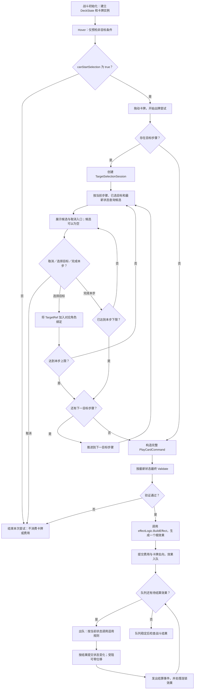

# 卡牌与效果系统

- 状态：草案
- 负责人：
- 相关GDD：卡牌系统、玩家行为和基础准则
- 相关模块：战斗流程与回合状态机、实体与状态系统、棋盘与坐标系统、UI与输入
- 相关ADR：

## 1. 职责

本模块负责将卡牌配置和玩家的目标选择转成完整的出牌命令，再将合法命令转成按顺序结算的战斗效果。覆盖战斗内卡牌的使用、牌区变化、目标选择与效果编排。

- **卡牌与牌区**：提供卡牌类型、费用、目标步骤和效果逻辑引用；维护战斗中的抽牌堆、手牌堆、弃牌堆和消耗牌堆。出牌时按卡牌规则扣费并处理牌的去向，抽牌、弃牌等效果引起的牌区变化也由本模块处理。
- **出牌交互**：响应战斗 UI 发起的 Hover 非目标预检，返回能否开始出牌流程；管理多步骤目标选择会话、已选目标和取消操作，并按当前步骤查询合法候选。卡牌可以选择实体、格子或无需选择目标，各步骤的目标数量可不同。
- **命令提交**：在目标收集完成后，依据最新战斗状态验证完整出牌命令。通过后生成运行时效果对象、提交费用与卡牌去向并使效果入队；验证不通过或选择取消时不消费卡牌与费用。
- **效果结算**：按队列顺序处理卡牌效果及其连锁效果，调用适用规则计算结果，再请求战斗状态模块提交变化。结算结果进入表现事件流，供 UI、动画和音效使用；推动与拉动保留独立于普通移动的效果语义。

回合是否允许出牌由战斗流程与回合状态机提供条件；目标、伤害、治疗、位移等具体规则由相应规则模块判定。`BattleState`、`EntityState`、`BoardState` 是状态来源，棋盘与坐标系统负责格子和占位查询及坐标转换；本模块不直接改写棋盘索引或依据动画结果判断规则。UI 与输入模块负责鼠标操作、目标高亮、取消入口和表现播放，不决定目标是否合法或效果如何结算。

## 2. 设计约束

- 卡牌支持攻击牌、技能牌和能力牌三类；战斗内牌区包括抽牌堆、手牌堆、弃牌堆和消耗牌堆。卡牌定义是只读配置，具体卡牌所在牌区及当前可用费用属于运行时状态。“打出并消费卡牌”不等于一律放入消耗牌堆，牌的去向按卡牌规则决定。
- 一张卡可以有多个有序的目标步骤。每步独立规定目标角色、目标类型、选择数量及约束；同一张卡可先选多个我方实体，再选一个敌方实体，或选择若干格子。已选目标按角色绑定，不能靠数组位置猜测其用途。实体以 `EntityId` 标识，格子以逻辑坐标标识，同格多个实体不得混为一个目标。
- Hover 只检查费用、回合等非目标条件，不搜索是否存在合法作用对象。返回的 `canStartSelection` 仅表示可以开始出牌流程；离开 Hover 时由 UI 重置为 `false`，已经开始的拖拽或选择会话不依赖此值继续存在。
- 进入目标选择会话后，才依据当前步骤、之前选中的目标和当前战斗状态查询候选。要求选择目标的步骤即使没有候选也可进入界面并取消；任一步取消均清除本次选择，不提交命令、不扣费、不移动卡牌。无需目标的卡牌跳过选择会话。
- 完整 `PlayCardCommand` 在提交时必须按最新状态重新验证卡牌、费用、回合和所有已选目标。验证通过后先构造运行时效果，再提交费用与卡牌去向并将效果入队；命令验证失败与效果结算后未产生预期变化是不同的结果。
- 推动或拉动目标是否可选，按卡牌的目标条件判断，不以位移路径畅通作为默认出牌条件。合法打出后，推拉因阻挡而未产生位移属于正常效果结算，费用与卡牌去向不回滚，并应产生可供表现层使用的结算结果。
- 效果对象表达待执行的行为，不在创建时直接修改战斗状态。出队时由对应处理逻辑按当前状态调用适用规则；不要求所有效果重复完整出牌验证，也不要求共用一个验证函数。普通移动、推动、拉动须保留可区分的语义，供后续规则与表现使用。
- 卡牌效果逻辑是可编程策略：简单卡牌可复用带参数的实现，复杂卡牌可编写专门逻辑，不强制所有效果符合统一的 `type`／`targetRole`／数值字段格式。策略可读取本次目标绑定和只读战斗信息，但不保存跨出牌的可变数据，也不在构造效果时直接修改状态。
- 规则结算与动画播放速度解耦。棋盘、实体和牌区的状态变化由战斗状态相关模块统一提交，表现层只读取提交后的结果；即使推拉未改变坐标，也要能反馈受阻原因。涉及随机性的效果应使用战斗提供的可复现随机源。

## 3. 核心概念

| 概念 | 含义与边界 |
| --- | --- |
| `CardDefinition`（卡牌定义） | 卡牌的只读配置，描述类型、费用、目标步骤并引用效果逻辑；同一定义可对应多张战斗中的卡牌，不存放一次出牌的选择进度。 |
| `CardEffectLogic`（效果逻辑） | 可编程的效果构造策略；读取本次已验证的目标绑定和只读战斗信息，生成一个根运行时效果。简单卡牌可复用通用实现，复杂卡牌可用专门实现；策略对象不保存本次出牌的可变状态。 |
| 战斗卡牌实例与 `DeckState` | 卡牌实例表示战斗中可被持有和打出的具体卡牌；`DeckState` 记录其在抽牌堆、手牌堆、弃牌堆或消耗牌堆中的位置。出牌后的牌区迁移与效果产生的抽弃牌操作需要区分。 |
| 非目标预检 | Hover 阶段的轻量判断，只回答是否允许开始出牌流程，结果为 `canStartSelection`；不保证有合法目标，也不提交卡牌消费。 |
| `TargetStep`（目标步骤） | 卡牌定义中的一个有序选择阶段，指定本阶段目标的角色、实体／格子等类型、最少与最多数量及筛选条件。例如先选择“触发者”，再选择“受影响敌人”。 |
| 目标引用与目标绑定 | 目标引用以 `EntityId` 或逻辑格坐标指向具体实体或格子；目标绑定按角色组织一个或多个引用，避免靠不同角色间的数组下标猜测用途。若同一角色内的选择顺序会影响效果，应由卡牌规则明确并保留该顺序。 |
| `TargetSelectionSession` | 一次出牌的临时选择状态，保存当前步骤、已选目标和取消状态；只组织选择，不扣费或结算效果。 |
| `TargetingService` | 根据当前 `TargetStep`、已有目标绑定及最新战斗状态，查询本步骤合法候选；结果可为空，不替代完整出牌命令的最终验证。 |
| `PlayCardCommand` 与 `CommandProcessor` | 命令携带本次要打出的卡牌及完整目标绑定；处理器先做最终验证，通过后生成效果、提交卡牌消费并入队。命令被拒绝不会启动效果结算。 |
| 运行时效果 `BattleEffect` | 已接受的出牌或回合触发所产生的待结算指令，例如 `HealEffect`、`PushEffect`、`PullEffect`。它与卡牌的只读效果配置不同，仅保存本次结算所需的参数和语义，不直接修改状态。 |
| `BattleEffectQueue` | 有序保存运行时效果并逐项结算；效果处理逻辑根据出队时的战斗状态调用适用规则、提交状态变化，也可接续产生新的连锁效果。 |
| 效果结算结果与表现事件 | 结算结果描述实际发生的变化及原因，例如请求推动两格但实际位移为零、原因是阻挡。状态提交后发出对应事件，表现层据此播放移动、推动、拉动、治疗或受阻反馈；效果结果与出牌命令是否成功是两层不同信息。 |
| 效果构造与结算上下文 | 构造效果时需要卡牌、来源和目标绑定；结算效果时需要当前战斗状态、适用规则与事件出口。这些依赖可在实现时用 `EffectContext`、`BattleContext` 等参数对象传递，它们不是额外的战斗状态副本，也不是 Unity 内置类型。 |

## 4. 数据模型

以下字段描述模块之间需要交换的信息；卡牌通过效果逻辑引用连接可编程实现，不以统一的序列化效果字段格式描述所有卡牌。策略引用的资产或注册方式、效果处理器的 C# 签名及牌区容器的具体集合类型可在实现时确定。只读配置、战斗状态和一次出牌的临时数据必须分开。

### 4.1 卡牌定义与目标步骤

| `CardDefinition` 关键字段 | 类型 | 说明 |
| --- | --- | --- |
| `definitionId` | 稳定的卡牌定义 ID | 用于从战斗卡牌实例找到对应配置；同一定义可创建多张卡牌实例。 |
| `type` | `CardType` | 攻击牌、技能牌或能力牌。 |
| `cost` | 非负整数 | 卡牌的基础费用；实际能否支付在命令提交时依据当前战斗状态判断。 |
| `targetSteps[]` | 有序的 `TargetStep` 集合 | 定义需要依次完成的目标步骤；为空表示无需玩家选择目标，可直接提交出牌命令。 |
| `effectLogic` | `CardEffectLogic` 策略引用 | 指向实现效果构造逻辑的代码策略；最终验证通过后，由 `CommandProcessor` 调用其 `BuildEffect`，根据本次目标绑定生成一个根 `BattleEffect`。策略可有自身的只读配置，但该字段不保存本次出牌的效果对象或可变战斗状态。 |
| `onPlayDestination` | 出牌后牌区规则 | 命令通过验证后，决定这张卡按自身规则进入弃牌堆或消耗牌堆等；不把“打出卡牌”统一解释为进入消耗牌堆。 |

| `TargetStep` 关键字段 | 类型 | 说明 |
| --- | --- | --- |
| `role` | 目标角色键 | 标识这一步所选目标在效果中的用途，例如 `Sources` 或 `Victim`；同一张卡的各目标步骤使用不同角色键，避免目标绑定含义不明确。 |
| `targetKind` | 目标类型 | 实体或逻辑格子；作用于全局的卡牌无需目标步骤。 |
| `minCount`、`maxCount` | 整数 | 本步允许选择的数量范围，需满足 `1 ≤ minCount ≤ maxCount`；达到最大值可自动进入下一步，在范围内可由玩家确认完成本步。 |
| `targetRules` | 目标条件配置或规则引用 | 表达阵营、距离、状态、与前序已选目标的关系等条件；供候选查询和最终命令验证共同使用。 |

例如一张“由 1～3 名我方角色推动 1 名敌人”的卡牌，可依次定义 `Sources`（我方实体，1～3 个）和 `Victim`（敌方实体，1 个）两个步骤。效果通过角色键读取所选目标；若 `Sources` 中的先选者决定方向，该角色下的选择顺序须保留。

`CardEffectLogic` 提供类似 `BuildEffect(EffectContext)` 的入口。通用治疗逻辑可以读取“治疗目标角色”和治疗量等少量参数；“按多名来源角色数量计算推动距离、并根据首名来源角色确定方向”的卡牌可以使用专门的 C# 实现。两者都返回一个根运行时效果对象，而不是让卡牌定义保存固定格式的效果步骤表。若卡牌有多个初始动作，可由一个组合根效果按顺序产生后续效果。依赖前一个效果的实际命中、阻挡或伤害结果才能决定的后续行为，应在出队时判断或由 `EffectResult` 触发，不在效果构造时预判。

### 4.2 战斗卡牌实例与牌区

| 对象及关键字段 | 类型 | 说明 |
| --- | --- | --- |
| `CardInstance.instanceId` | 本场战斗唯一的卡牌实例 ID | 区分同一定义生成的多张卡牌；出牌命令引用实例 ID，不只引用定义 ID。 |
| `CardInstance.definitionId` | 卡牌定义 ID | 指向只读的 `CardDefinition`。 |
| `DeckState.cardsById` | 实例 ID → `CardInstance` 的索引 | 根据牌区内的实例 ID 找到具体卡牌；运行时只保存卡牌实例和索引，不复制定义内容。 |
| `DeckState.drawPile[]`、`hand[]`、`discardPile[]`、`exhaustPile[]` | 有序的卡牌实例 ID 集合 | 分别表示抽牌堆、手牌堆、弃牌堆和消耗牌堆。每张战斗卡牌实例在任一稳定状态下恰好属于一个牌区，牌区迁移由受控操作提交。 |

当前可用费用是本场战斗的回合资源，由 `BattleState` 提供给预检与命令验证；`DeckState` 不缓存 Hover 判断结果，也不承担目标选择状态。

### 4.3 目标引用、选择会话与出牌命令

`TargetRef` 是带类型的目标引用：实体目标保存 `EntityId`，格子目标保存逻辑 `CellCoord`；两者不能互相代替。`TargetBindings` 将目标角色键映射到有序的 `TargetRef` 列表，例如 `Sources → [我方实体 A, 我方实体 B]`、`Victim → [敌方实体 C]`。完整绑定的角色、数量和目标类型必须符合 `CardDefinition.targetSteps[]`。

| 对象及关键字段 | 类型 | 说明 |
| --- | --- | --- |
| `TargetSelectionSession.cardInstanceId` | 卡牌实例 ID | 指向本次尝试出牌的手牌。 |
| `TargetSelectionSession.currentStepIndex` | 整数 | 当前正在选择的 `TargetStep` 索引。 |
| `TargetSelectionSession.bindings` | `TargetBindings` | 保存已完成步骤及当前步骤已选目标；候选目标按当前状态重新查询，不作为永久有效的结果保存。 |
| `TargetSelectionSession.status` | 会话状态 | 区分选择中、已完成、已取消；会话属于一次出牌尝试。 |
| `PlayCardCommand.cardInstanceId` | 卡牌实例 ID | 指定实际要打出的手牌；无目标卡也使用相同命令。 |
| `PlayCardCommand.targets` | 不可变的 `TargetBindings` 快照 | 携带全部已选目标；无目标卡使用空绑定。命令不携带 `canStartSelection`、候选高亮或 Unity 对象引用。 |

### 4.4 运行时效果、队列与结算结果

| 对象及关键字段 | 类型 | 说明 |
| --- | --- | --- |
| `BattleEffect.origin` | 卡牌实例 ID 或其他触发来源 | 标明效果从哪次出牌或回合触发产生，供规则和日志追踪。 |
| `BattleEffect` 的具体参数 | 按效果类型定义 | 例如 `HealEffect` 保存目标实体 ID 和治疗量；`PushEffect` 保存推动来源、目标实体 ID 和请求距离。普通移动、推动、拉动保留不同的效果类型或显式语义标签。 |
| `BattleEffectQueue.pendingEffects` | 有序的 `BattleEffect` 队列 | 保存尚未结算的效果；每次合法出牌先入队一个根效果，后续效果由结算结果按确定顺序追加。 |
| `EffectResult.outcome` | 结算结果类别 | 表示实际生效、受阻或其他规则性结果；与 `PlayCardCommand` 是否通过验证分开。 |
| `EffectResult.actualChanges` | 实际状态变化描述 | 保存本次结算实际产生的生命、牌区、位置等变化；位移效果应能表达实际移动零格。 |
| `EffectResult.reason` | 可选的规则原因 | 例如推动受阻的原因，供连锁规则、调试日志与表现反馈使用。 |
| `EffectResult.followUpEffects[]` | 有序的 `BattleEffect` 集合 | 根据本次实际结算结果产生的后续效果；由队列在当前效果完成后追加，不在卡牌构造阶段预判。 |

`EffectContext` 若在实现中使用，只向 `BuildEffect` 提供本次卡牌来源、目标绑定与只读战斗查询；构造阶段不扣费、不消耗随机数、不发事件。`BattleContext` 可在效果出队时提供当前 `BattleState`、规则服务、可复现随机源和事件出口。两者都是依赖传递对象，不是第二份可变战斗状态，也不写入卡牌配置。

## 5. 运行流程

Hover 预检不查询合法目标；`canStartSelection` 在 Hover 退出时由 UI 重置，即使选择会话仍在进行也不影响会话。目标会话每一步根据之前的绑定重新查询候选；没有候选且未满足本步最少数量时保留取消入口。数量在 `minCount` 与 `maxCount` 之间时，玩家可以确认完成本步；达到 `maxCount` 后自动推进。无目标卡牌直接构造空目标绑定的 `PlayCardCommand`。

最终验证检查卡牌仍在手牌、费用和回合条件仍满足，以及所有目标的角色、数量与当前合法性。通过后调用本卡的 `effectLogic.BuildEffect` 构造一个根效果，再将费用扣除、卡牌移出手牌并按出牌规则进入目标牌区，同时把根效果入队；这些动作构成一次出牌提交，不允许只扣费却没有入队。效果逐项按出队时的战斗状态结算。推动或拉动受阻是正常的 `EffectResult`：即使位置不变也不撤销已提交的卡牌消费，并发出受阻表现事件。卡牌效果、回合触发和连锁效果共用结算队列；同一队列结算期间不接受新的玩家出牌命令。

## 6. 状态与生命周期

`CardDefinition` 和其引用的 `CardEffectLogic` 是跨战斗复用的只读配置与代码策略。`CardInstance`、`DeckState`、目标选择会话、出牌命令、运行时效果和结算结果均属于一次战斗或一次出牌的运行时数据，不将目标选择或队列内容写回卡牌定义或效果逻辑对象。

| 阶段           | 状态的创建、变更与清理                                                                                                                             |
| ------------ | --------------------------------------------------------------------------------------------------------------------------------------- |
| 战斗创建         | `BattleFlow` 依据本局牌组和卡牌定义创建本场 `CardInstance` 与 `DeckState`，分配本场唯一的卡牌实例 ID，建立牌区索引。起始抽牌与费用按战斗及回合规则初始化，不由卡牌定义保存当前值。                         |
| 手牌待操作与 Hover | 卡牌实例停留在原牌区；战斗 UI 临时保存 `canStartSelection` 并在离开 Hover 后重置。预检不创建出牌命令、不移动牌区，也不改变战斗资源。                                                      |
| 目标选择         | 对需要目标的卡牌创建一个 `TargetSelectionSession`。会话保存步骤进度和角色绑定；当前候选按最新状态查询，不当作永久有效的授权。拖拽状态或选择会话不依赖 Hover 布尔值。任一步取消均销毁会话与高亮，卡牌仍在手牌且费用不变。            |
| 命令验证         | 选择完成或无目标卡直接提交不可变的 `PlayCardCommand`。`CommandProcessor` 以最新状态重新验证；未通过则结束本次尝试并清理会话，不移动卡牌、不扣费、不生成效果。                                       |
| 合法出牌提交       | 先生成本次的根效果，再一次性提交费用扣除与牌区迁移并将根效果入队；会话完成后清理。卡牌从手牌按卡牌规则进入目标牌区，同一张卡不能因重复提交而再次扣费或入队。                                                         |
| 效果结算         | `BattleEffectQueue` 按确定顺序逐项出队。效果处理器读取最新战斗状态，请求适用规则计算 `EffectResult`，再通过状态模块提交实际变化；随后发出表现事件，并将触发的后续效果按统一顺序加入队列。推拉受阻可使实体位置不变，但已提交的卡牌消费保留。 |
| 结算稳定与战斗结束    | 本次队列及其连锁效果结算完成后，由战斗流程检查胜败并进入下一阶段。战斗结束后不再接受出牌，清除未完成的选择会话及队列，释放本场 `CardInstance` 与 `DeckState`；需要延续到局内下一节点的牌组信息由 `RunState` 负责。           |

生命周期中始终满足以下约束：

- 一张 `CardInstance` 在稳定状态下恰好位于一个牌区；同一个实例 ID 在本场战斗中不复用。牌区迁移与费用扣除只在合法命令提交时进行一次。
- 取消、Hover 预检失败或最终命令验证失败，均不消费费用或卡牌，也不向效果队列加入该命令的效果；效果结算后的受阻不能被当作命令验证失败来回滚消费。
- 选择会话中的目标引用、卡牌实例 ID、当前步骤和已选数量必须与卡牌定义一致。候选高亮只是 UI 状态，完整目标以命令快照为准；命令提交时再次检查其当前合法性。
- `BattleEffect` 构造本身不改变状态；同一时刻只结算一个队列效果，状态提交成功后才发出反映该结果的事件。零位移等无状态变化的规则结果仍可发出对应反馈。

## 7. 模块接口

下表定义信息如何跨模块流转；名称描述能力，不限定最终 C# 方法签名。Hover、目标查询、选择会话和根效果构造不修改战斗状态。费用、牌区、实体与棋盘状态只通过受控的战斗状态接口提交；表现事件不能反写规则状态。

| 接口能力 | 调用方 → 负责模块 | 输入 | 输出与状态权限 |
| --- | --- | --- | --- |
| 读取卡牌与牌区 | 战斗 UI、命令处理器 → `CardDefinition` 索引、`DeckState` | 卡牌实例 ID | 返回只读卡牌定义、所属牌区及当前可见牌区信息；查询不移动卡牌。 |
| Hover 非目标预检 | 战斗 UI → `CommandProcessor` | 手牌实例、当前费用和回合状态 | 返回 `canStartSelection` 及不可开始的原因；不查询目标、不扣费。Hover 退出后由 UI 重置布尔值。 |
| 创建、推进和取消选择 | 战斗 UI、交互表现 → `TargetSelectionSession` | 卡牌实例、`TargetStep`、玩家选择的 `TargetRef` 或取消操作 | 返回当前步骤、按角色组织的已选目标及是否可完成本步；只修改临时会话，取消后清除会话与高亮。 |
| 查询当前步骤候选 | `TargetSelectionSession` → `TargetingService` → 规则模块 | 当前步骤、之前的目标绑定、最新 `BattleState` | 返回可为空的实体 ID 或格坐标候选；查询不修改战斗状态，结果只供本次展示和选择使用。 |
| 提交完整命令 | 选择会话或无目标卡的战斗 UI → `CommandProcessor` | `PlayCardCommand`：卡牌实例 ID 与不可变目标绑定 | 依据最新状态验证卡牌仍在手牌、费用、回合和全部目标；失败返回明确原因，不构造效果、不消费卡牌。重复提交不能重复生效。 |
| 构造根效果 | `CommandProcessor` → `CardEffectLogic.BuildEffect` | 已验证的命令、目标绑定和只读 `EffectContext` | 返回一个根 `BattleEffect`；构造逻辑不扣费、不消耗随机数、不写状态、不发事件。 |
| 提交出牌并入队 | `CommandProcessor` → `BattleState`（含 `DeckState`）、`BattleEffectQueue` | 卡牌实例、实际费用、出牌后去向、根效果 | 作为一次受控提交扣费、迁移牌区并入队一次；任一提交步骤失败时不得留下已扣费、已迁牌却未入队的半成品。 |
| 出队计算效果 | `BattleEffectQueue` → 效果处理器、适用规则模块 | 一个 `BattleEffect` 与出队时的最新 `BattleState` | 返回 `EffectResult`：实际变化、结果类别、原因和有序后续效果；规则计算不直接改写状态。受阻可以是零位移的正常结果。 |
| 提交结算变化 | `BattleEffectQueue` → `BattleState`（含 `DeckState`） | `EffectResult.actualChanges` | 统一提交生命、状态、位置、占位或牌区变化；必须保持实体、棋盘及牌区索引一致，不得部分提交。 |
| 追加连锁效果 | `BattleEffectQueue` → 自身 | 已完成效果返回的 `followUpEffects[]` | 在当前效果结算完成后按确定顺序加入队列；已入队效果不能被 UI 操作重新排序。 |
| 发出表现事件 | `BattleEffectQueue` → `PresentationEventStream` → UI、动画与音效 | 已提交的 `EffectResult`，包括零位移与受阻原因 | 先完成状态提交，再发出与实际结果相符的事件；表现层只读取结果，不影响后续规则计算。 |
| 接收回合触发 | `TurnStateMachine` → `BattleEffectQueue` | 回合开始或结束时产生的根效果 | 使用同一效果结算通道，但不视为玩家打出卡牌，也不执行卡牌扣费或牌区迁移。 |

## 8. 异常与边界情况

| 情况 | 处理原则 |
| --- | --- |
| 卡牌配置无效 | `definitionId` 重复或缺失、费用为负、目标步骤角色冲突、`minCount`／`maxCount` 不合法、目标类型或 `effectLogic` 引用无效、出牌后牌区规则缺失时，在内容校验或战斗创建阶段报告具体卡牌与字段；不得建立不完整的战斗卡牌实例。 |
| 牌区索引不一致 | 未知实例 ID、同一实例出现在多个牌区、手牌与 `cardsById` 不一致时拒绝相关操作并报告状态错误；不能靠 UI 显示的卡牌对象替代权威牌区索引。 |
| 抽牌堆不足 | 抽取数量超过当前可抽数量时，由抽牌规则决定是否重洗及实际抽得数量；`DeckState` 返回实际抽到的实例 ID，不越界读取，也不复制或丢失卡牌实例。具体重洗规则需与 GDD 对齐。 |
| Hover 结果过时 | `canStartSelection` 只控制是否开始尝试；离开 Hover 后重置。费用、回合或手牌状态在选择期间变化时，以最终命令验证为准，不沿用先前的预检结果。 |
| 本步没有合法候选 | 尚未达到 `minCount` 时仅提供取消；已达到下限时允许确认完成本步。空候选本身不提交命令，也不扣费或移动卡牌。 |
| 选择的目标无效 | 未知或已移除的 `EntityId`、越界格坐标、错误目标类型、超过本步数量上限或违反卡牌条件的目标均不能进入有效绑定。若选择后目标位置、状态或阵营变化，最终命令验证重新检查。 |
| 选择取消、切换卡牌或战斗结束 | 同一时间只保留一个有效的目标选择会话；取消、改选其他卡牌或战斗结束时清理旧会话和高亮。命令提交前取消不消费；合法出牌已提交后不能再用取消回滚。 |
| 最终命令不合法或重复提交 | 卡牌已不在手牌、当前费用不足、回合不允许出牌、目标绑定不完整或已失效时拒绝命令，不生成根效果也不消费。相同卡牌实例的重复提交只允许首次合法提交成功，不能重复扣费或入队。 |
| 根效果构造或出牌提交失败 | `BuildEffect` 返回空效果或抛出异常属于配置或代码错误，发生在消费前，应返回可识别错误并保留卡牌与费用。费用扣除、牌区迁移和入队必须作为一次受控提交；内部失败不得留下半提交状态。 |
| 已入队效果的目标发生变化 | 前序效果可能移除目标、改变位置或施加免疫。当前效果按出队时的状态得到明确的无变化、受阻或其他规则结果；已合法打出的卡牌不因后续规则性失效而退款。内部状态不变量损坏应单独报告，不能伪装成正常受阻。 |
| 推动或拉动受阻 | 目标仍可按卡牌目标条件被选择；结算时若无法位移，返回实际位移零和受阻原因，不回滚卡牌与费用，并发出对应反馈。推动、拉动与普通移动的语义标记保持可区分。 |
| 连锁效果过多或战斗将结束 | 队列按确定顺序处理，结算期间拒绝新的玩家出牌；胜败在当前队列及连锁效果处理完毕后检查。检测非终止连锁并报告效果链来源，避免队列无限增长；战斗确认结束后清除未完成选择。 |

## 9. 调试和日志

- 调试视图可显示当前费用、选中卡牌的实例 ID 与定义 ID、`canStartSelection`、目标步骤及 `minCount`／`maxCount`、已选目标绑定与候选数量、四个牌区的卡牌数量，以及队列当前效果和待结算数量。视图只读取状态，不参与合法性判断。
- 记录一次出牌从最终验证、根效果构造、消费提交到效果结算的关键事件。日志用战斗／回合标识、命令标识、卡牌实例及定义 ID 串联；选择相关日志包含步骤索引、目标角色和 `TargetRef`，结算相关日志包含效果标识、父效果标识及队列顺序。
- 命令拒绝、合法出牌、效果受阻和系统错误使用不同的结果类别。消费日志记录费用与卡牌牌区的前后值；效果日志记录效果类型或推拉语义、请求值、实际值、`EffectResult.outcome`、`reason` 及追加的后续效果，便于确认零位移与退款错误没有混淆。
- 记录可复现随机种子或随机流位置、出牌命令顺序和效果出队顺序，以便复现同一场战斗。Hover 和逐候选查询可能高频发生，常规日志只记录状态变化或摘要；详细候选及规则排除原因仅在专门调试开关下输出。
- 开发和测试环境检查牌区唯一归属、消费恰一次、目标绑定数量与类型、效果队列顺序，以及表现事件发生在状态提交之后。发现不变量损坏时输出相关卡牌、目标和效果链标识。

## 10. 测试计划

优先验证可观察的出牌与结算行为，而非仅检查某个方法是否被调用。规则测试应能在不播放动画的环境中运行。

| 测试范围 | 关键用例与预期 |
| --- | --- |
| 配置与牌区 | 同一定义的多张卡具有不同实例 ID；抽牌、出牌、弃牌及进入消耗牌堆后，每张实例恰在一个牌区且 `cardsById` 可查询。抽牌堆不足时按抽牌规则返回实际抽得数量，不复制或丢失实例。非法费用、目标数量、重复角色键、缺失效果逻辑或去向规则在内容校验时被拒绝。 |
| Hover 预检 | 费用或回合不满足时 `canStartSelection` 为假；满足时为真，即使当前没有合法目标也不查询目标集合。离开 Hover 后重置为假，已开始的选择会话仍可继续。 |
| 多步骤目标选择 | 使用“选 1～3 名我方角色，再选 1 名敌人”的卡牌验证角色绑定和同角色选择顺序；达到下限可确认本步、达到上限自动推进。候选为空且未达下限时只能取消，已达下限时可完成本步。 |
| 取消与无目标卡 | 任意选择步骤取消、切换卡牌或战斗结束均清理会话与高亮，不扣费、不移动手牌。`targetSteps[]` 为空的卡牌不创建选择会话，直接提交空目标绑定的命令。 |
| 最终验证与重复命令 | 选择后费用不足、回合变化、卡牌离开手牌、实体消失或格子失效时拒绝命令且无消费、无根效果入队。对同一卡牌实例重复提交，仅首次合法提交扣费并入队一次。 |
| 构造与提交一致性 | `BuildEffect` 返回空效果或抛错时不扣费、不迁牌；模拟出牌提交任一步失败，检查费用、牌区与队列均未留下半提交。效果逻辑构造阶段不改变战斗状态或消耗随机数。 |
| 推拉与规则性受阻 | 合法选择的目标即使推动路径受阻仍可打出卡牌；效果返回零位移与原因、实体位置不变、卡牌和费用正常消费并发出受阻事件。推动、拉动、普通移动在后续规则和表现事件中可被区分。 |
| 条件连锁效果 | 使用测试效果验证“实际推动成功才追加一个状态效果”；受阻零位移时不追加。前序效果改变目标位置或状态后，后续效果按最新 `BattleState` 结算，且追加效果的顺序稳定。 |
| 队列与战斗结束 | 队列未清空时拒绝新的玩家出牌；连锁效果结算完毕后才检查胜败。结束时清除未完成会话，后续命令不能再改变牌区或战斗状态。 |
| 状态与表现顺序 | 已提交的实际状态先于表现事件可见；无位移仍有受阻反馈，被拒绝的命令没有成功结算事件。调整动画播放速度不改变结算结果；相同初始状态、命令和随机种子得到相同效果顺序与结果。 |

## 11. 开放问题
