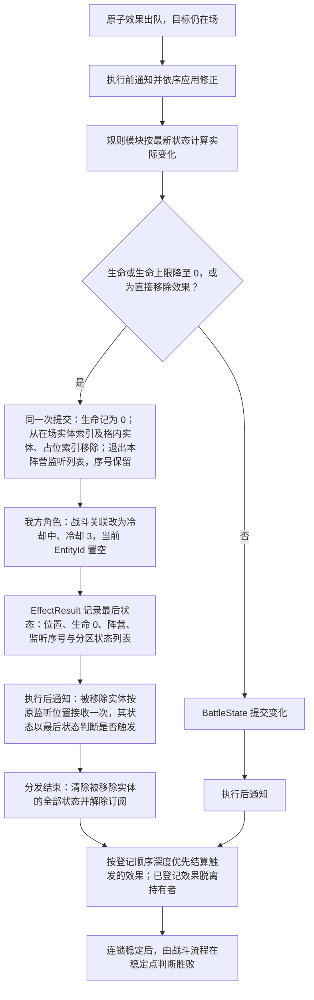
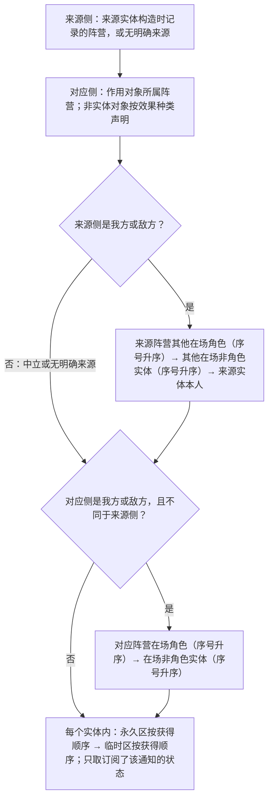
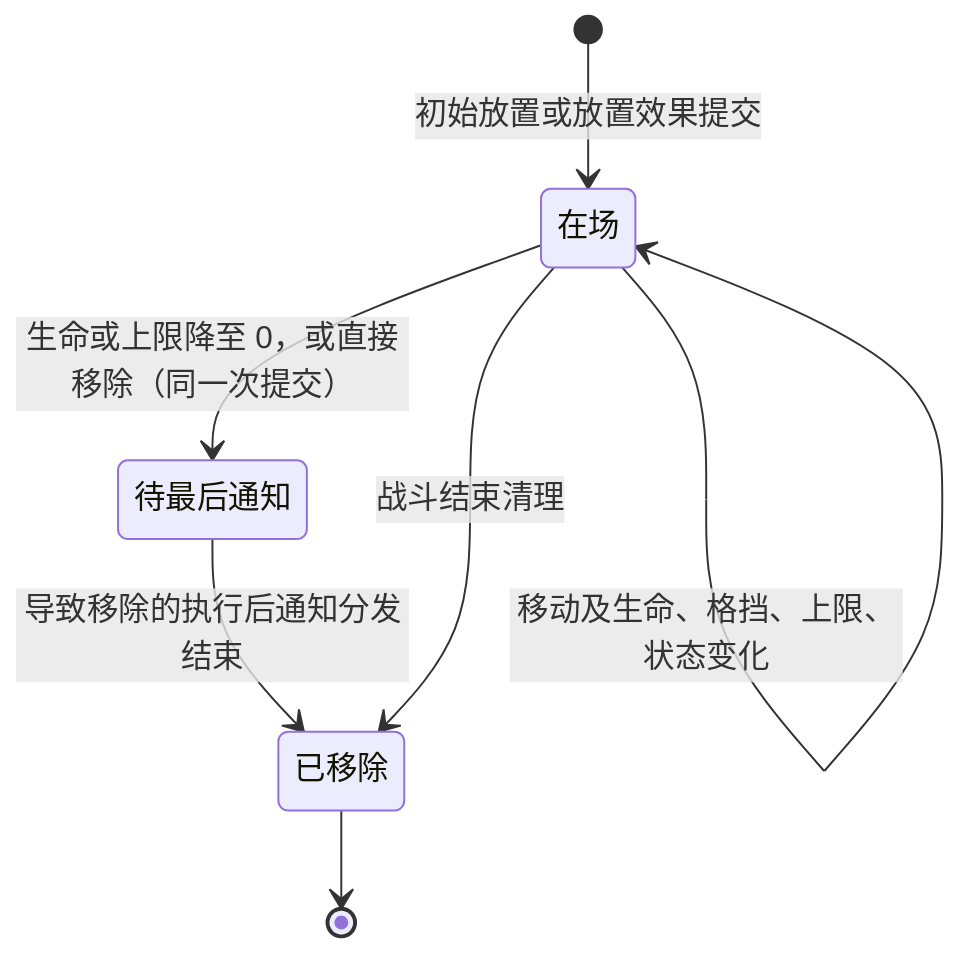
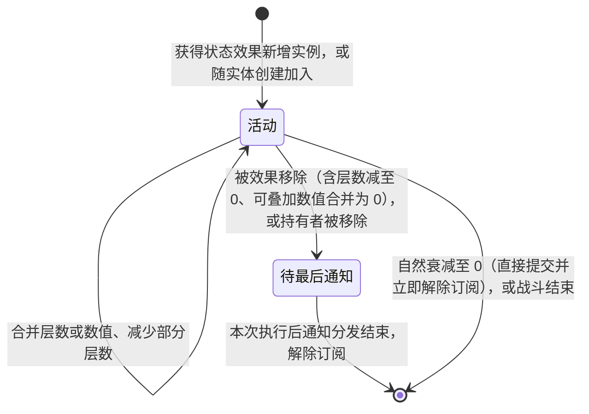

# 实体与状态系统

- 文档版本：v0.1
- 文档状态：草案
- 对应里程碑：战斗垂直切片
- 最后更新：2026-10-04
- 相关GDD：[实体系统](../../GDD/核心系统/战棋系统/实体系统.md)、[棋盘系统](../../GDD/核心系统/战棋系统/棋盘系统.md)
- 相关模块：[棋盘与坐标系统](棋盘与坐标系统.md)、[卡牌与效果系统](卡牌与效果系统.md)、[敌人意图与AI](敌人意图与AI.md)、[局内外状态与存档](../局内外状态与存档.md)
- 相关ADR：

## 1. 职责

实体与状态系统管理战斗中我方、敌方和中立实体的身份、生命、格挡与状态。只读的 `EntityDefinition` 描述实体的固定属性与初始状态；每场战斗独立创建的 `EntityState` 记录当前位置、生命、格挡和已生效状态。`BattleState` 按 `EntityId` 提供实体查询，并统一提交实体放置、移动、移除、生命、格挡与状态变化，保证实体记录与棋盘索引一致。

`EntityDefinition` 是所有实体的只读初始模板。我方角色在一局游戏开始时由模板创建 `RunState` 持有的 `CharacterState`，该角色状态持续到本局结束，保存跨战斗的本局生命上限、天赋和当前生命。每场战斗从已有的 `CharacterState` 建立该角色本场的 `EntityState`，不重新套用模板初值覆盖成长；敌方和中立实体在进入战斗时由各自定义创建战斗实体状态。战斗结束后将我方角色当前生命与复活冷却更新回 `CharacterState`。

卡牌效果和回合触发由统一的战斗效果调度器按最新战斗状态调用适用规则，再由 `BattleState` 提交实际变化。伤害、生命流失、治疗、获得与减少格挡、生命上限变化、状态的获得与移除以及实体的直接移除都是原子效果；只有回合流程中的复活冷却变化与临时状态自然衰减由 `BattleState` 直接提交。状态系统以规则层发布订阅方式响应出牌和原子效果执行：具有监听资格的实体所持状态实例登记所需的效果规则通知，原子效果执行前后按约定顺序向订阅者分发；中立实体不监听效果通知。扣费与卡牌去向也分别作为原子效果参与通知，但属于同一次不可部分提交的出牌事务；成功出牌记录在两项变化都提交后另行发布。卡牌执行帧仅保存本次程序的进度、局部变量及暂停位置，不代表一次伤害、推动等原子效果，也不因此发布这些效果的执行通知。棋盘与坐标系统负责格子、地形和占位索引；卡牌与效果系统负责命令、效果执行与结算调度；敌人意图与 AI 负责行动决策。实体视图、UI 和动画只读取已提交的状态与表现事件，不决定规则结果或回写实体状态。

## 2. 设计约束

- `EntityDefinition` 是可复用的只读初始配置；我方角色的 `CharacterState` 属于整局游戏，`EntityState` 仅属于当前战斗。每个战斗实体实例使用本场唯一的 `EntityId`；实体移除后，该 ID 在本场战斗中也不复用，避免旧目标引用指向新实体。
- 我方角色的本局成长不得写回共享的 `EntityDefinition`。`CharacterState` 需要独立于 `EntityId` 的跨战斗身份，保存本局生命上限、天赋与当前生命。该角色的战斗投影被移除时，整局角色记录仍持续到本局结束，并进入复活冷却；冷却结束后可重新部署，届时建立新的战斗投影与 `EntityId`，规则见[战斗流程与回合状态机](战斗流程与回合状态机.md)。垂直切片中我方角色除生命上限外没有其他成长属性：`CharacterState` 以单个整数保存本局生命上限，本局开始时取 `initialMaxHealth`，此后局外的生命上限变化（如奖励）与战后写回的永久变化都直接累加到这一数值上，不分项保存各来源。天赋如何作用于战斗规则，留待天赋设计明确。
- 所有实体统一具有生命与格挡，且都可以接收临时型与永久型状态，不因实体类别或阵营而区别。实体至少区分角色与非角色，以及我方、敌方、中立三个阵营。所有实体的阵营均由 `EntityDefinition.faction` 定义；创建战斗实体时从定义取得阵营，之后在本场战斗中固定，供目标和交互规则读取。
- 实体只能位于有效棋盘格。`EntityState` 的位置必须与 `BoardState` 的格内实体索引一致；同一格至多有一个占据型实体。非占据型实体不占据所在格，不写入该格的 `occupiedBy`，也不阻挡其他实体的移动、推动、拉动等位移；仍在该格的 `entities[]` 中记录其位置。放置、移动和移除通过 `BattleState` 同步提交，失败时不得只改变实体或棋盘的一侧。
- 所有仍在场的实体保存当前生命与当前生命上限，当前生命不能超过上限。生命上限下降时，仅将超过新上限的当前生命截断；上限上升不自动治疗。生命上限最低为 `0`，降至 `0` 时当前生命随之为 `0`，按生命归零处理。实体有两种移除途径：生命降至 `0`，或受到直接移除效果。直接移除不经伤害，提交时将实体生命记为 `0`，此后与生命归零走同一移除流程。实体在导致移除的那次状态提交中立即从实体索引和棋盘索引移除；该次效果的执行后通知仍以最后状态通知该实体一次，详见[卡牌与效果系统](卡牌与效果系统.md)。我方角色经任一途径移除都进入复活冷却。战斗胜败在本次效果及其触发的其他效果结算完毕后判定。
- 生命上限变化分为永久与临时两类，效果须标明属于哪一类。永久变化属于我方角色的 `CharacterState`，跨战斗保留；战斗中发生时同时作用于当前 `EntityState`，并在战斗结束时写回。临时变化只属于当前 `EntityState` 投影，随投影移除或战斗结束失效；同一角色在同场重新部署也不沿用。本局生命上限与本场永久变化合成后至少为 `1`：永久降低使当前投影的上限降至 `0` 时，投影照常移除，但同场重新部署与战后写回使用的生命上限按 `1` 计。敌方与中立实体没有跨战斗记录，其生命上限变化只在本场有效。具体流程见[战斗流程与回合状态机](战斗流程与回合状态机.md)。
- 格挡是 `EntityState` 上独立于状态的非负整数，不属于临时型或永久型状态，也不占用状态订阅位置。伤害先扣除格挡，剩余部分再扣除生命；`EffectResult` 分别记录格挡与生命的实际减少量，因此修正后的伤害值可以大于实际生命损失，其他文档示例中“护盾使实际扣血为 `0`”即指这种情况。伤害不能无视格挡；需要绕过格挡时使用生命流失 `LoseHealthEffect`，它不改变格挡，直接扣减生命。生命流失与伤害是不同的效果种类：只订阅伤害的修正与触发（如易伤、荆棘）不响应生命流失，状态须显式订阅生命流失才能修正或响应它。获得格挡与减少格挡都是可被修正的原子效果。格挡只属于当前投影，不写回 `CharacterState`，新建投影的格挡为 `0`。
- 格挡在持有者所属阵营的回合结束时清除：我方、敌方实体分别在本阵营回合结束阶段清除；中立实体没有所属阵营回合，与其临时状态计时一致，在我方和敌方各完成一个回合后的完整轮结束处理中清除。因此我方回合获得的格挡默认不保留到敌方回合，需要保留时由状态修正清除效果。清除步骤开始时，按该阵营的通知顺序（角色组 → 非角色组，各组监听序号升序；中立实体按创建顺序）确定在场实体列表，逐个处理：轮到某实体时按最新状态生成一个带“回合清除”语义的 `RemoveBlockEffect`，请求值为其当时的全部格挡，路由为无明确来源 ↔ 持有者阵营；实体已不在场或格挡为 `0` 时跳过。每个效果及其连锁稳定后才处理下一个实体；清除步骤开始后新出现的实体不在本次清除范围内。状态可在执行前减少请求值以保留部分或全部格挡，与保留费用的机制相同。清除位于该阵营回合结束通知及其连锁之后、该阵营临时状态自然衰减之前，因此本回合获得的临时“保留格挡”类状态仍能修正这次清除；具体时序见[战斗流程与回合状态机](战斗流程与回合状态机.md)。
- 状态只分为临时型与永久型。Buff、Debuff 是临时型状态的典型例子；能力型卡牌施加的能力效果是永久型状态的典型例子。两类状态都只存在于本场战斗，随实体移除或战斗结束清除，不带入下一场战斗。实体移除时，其状态保留到导致移除的那次执行后通知分发结束，再清除。临时状态的层数是正整数，不设上限；永久状态的数值字段是可以为负的整数，不设上下限。
- 获得状态、移除状态和减少临时层数都是原子效果，经统一调度器发布执行前、执行后通知，可被修正，也可触发连锁；回合流程中的临时层数自然衰减则由 `BattleState` 直接提交，不发布原子效果通知。获得效果的请求值为临时状态的层数或永久状态的数值字段；修正为 `0` 时该效果仍属已执行，但不新增实例，也不改变已有实例。临时层数请求与其他数值请求一样，修正后低于 `0` 时按 `0` 计；永久状态数值字段的请求带符号，可以为负，修正后不设上下限，允许越过 `0` 变号，例如 `−2` 加 `3` 得 `1`。不可重复不可叠加的能力及其他没有数值字段的能力，其获得效果不能被抵消。移除效果的请求为要移除的状态实例，或要从某个临时状态减少的层数；修正可从中移出实例或减少层数，临时层数减至 `0` 时移除该实例。
- `EntityDefinition` 可配置有序的初始状态。实体创建时，初始状态与实体在同一次提交中加入，不单独发布获得状态的通知，并按配置顺序在各自分区内取得获得顺序。开战时的初始放置整体直接提交；战斗中的放置效果（包括我方角色重新部署）把初始状态作为该次放置提交的一部分。我方角色每次建立战斗投影都重新获得定义中的初始状态，不沿用旧投影的状态。
- 临时型状态只有数值层数，同名状态叠加时层数相加而不覆盖；当前层数同时就是剩余回合数，例如原有 `3` 层再获得 `1` 层后为 `4` 层、剩余 `4` 回合。我方和敌方实体在所属阵营回合结束时将层数减 `1`，本回合施加且到达该扣减时点的状态也减 `1`；中立实体在我方和敌方各完成一个回合后将层数减 `1`。层数降至 `0` 时移除该临时状态。
- 回合开始／结束通知只由对应回合阵营内具有监听资格的状态响应，另一阵营与中立不接收；该阵营内部按角色组 → 非角色组、各组监听序号升序通知，每个实体内部先永久区、后临时区，各区按获得顺序。它与原子效果的来源方／对应方通知范围不同。我方开始通知在费用增加与抽牌之后；结束时先完成结束通知及其连锁，再弃牌、清空费用、清除我方格挡，最后扣减我方临时状态。敌方结束通知及其连锁完成后清除敌方格挡，再扣减敌方临时状态；随后在完整轮结束处理中清除中立格挡，再统一扣减中立临时状态。完整时序见[战斗流程与回合状态机](战斗流程与回合状态机.md)。
- 永久型状态在本场战斗内不按回合到期，由 `StatusDefinition.repeatMode` 枚举字段确定同一实体再次获得同一能力时的处理方式，枚举值为“可重复可叠加”“可重复不可叠加”“不可重复不可叠加”。可重复可叠加的能力将各次获得的数据字段累加到同一状态实例，累加结果为 `0` 时移除该实例，UI 显示一个能力图标及叠加后的字段值；可重复不可叠加的能力每次获得均保留独立实例，各实例的数值字段不合并，UI 按实例重复显示对应能力图标；不可重复不可叠加的能力只保留一个实例，数值字段统一置为 `0`，再次获得不产生额外实例，UI 不重复显示图标，也不显示对应数值字段。
- 临时状态只要存在，就不因当前回合所属阵营而停止生效；是否响应某次效果规则通知，取决于持有者的监听资格及状态自身的触发条件。其层数只在持有者所属阵营回合结束时自然衰减；中立实体继续按我方和敌方各完成一个回合后的完整战斗轮扣减，可持有状态，但不监听效果执行前、执行后通知。永久状态在我方和敌方任一阵营的回合均可生效，效果通知触发同样须满足监听资格与自身条件。
- 我方与敌方实体的活动状态形成该实体的有序效果订阅列表，分为永久区与临时区：处理同一实体时先处理永久区，再处理临时区，各区内按状态实例的获得顺序排列。临时状态合并层数、可重复可叠加的永久状态合并数值时保留原有位置；可重复不可叠加的永久状态每次新增实例都排到永久区末尾；不可重复不可叠加的永久状态再次获得时保留原实例及其位置。状态被移除后再次获得同一状态，作为新实例排到对应分区末尾，不恢复原位置，也不继承旧实例的计数进度。状态只订阅其需要的规则通知，随状态移除或战斗结束解除订阅；中立实体保存活动状态，但不登记效果通知订阅。
- 订阅列表在效果提交之后、执行后通知分发之前固定。某次效果提交时新获得的状态（包括随放置加入的初始状态）接收这次效果的执行后通知，可借此实现“获得时触发”；被这次效果移除的状态与被移除的实体相同，以最后状态接收这一次，分发结束后才解除订阅。持有者被移除时，其全部状态同样在导致移除的那次执行后通知分发结束后解除订阅。
- 状态触发的效果是独立的原子效果，默认以状态持有者为来源实体并按其阵营路由；`StatusDefinition` 可声明其触发效果没有明确来源，例如持续伤害类状态。状态实例不记录施加者。这些效果与卡牌、回合产生的效果共用战斗效果调度器；战斗状态的实际变化由 `BattleState` 受控提交。
- 暂选完成后、玩家最终确认前，预演在隔离的战斗状态、状态实例及随机源副本上按正式结算的订阅范围和监听顺序试算。预演包括扣费与卡牌去向的执行前修正、共同提交、执行后与成功出牌消息，以及这些消息引发的连锁，再试算卡牌脚本效果。预演期间状态层数、能力计数器、真实 `BattleState`、正式随机流和真实出牌 ID 均不改变；副本中的规则通知不得进入真实战斗消息流，也不产生真实表现事件。卡面可读取预演得到的修正后效果请求值，而不是生命实际减少量；随机、隐藏或依赖未知结果的数值标为不确定。
- 基本出牌条件验证通过后，才进入包含可取消选择的卡牌执行流程；基本检查要求能支付卡牌的基础费用，即使状态随后可能修正费用，基础费用不足也不能开始出牌尝试。可取消选择必须在首个**卡牌脚本原子效果**前结束。暂选完成后进入最终确认阶段；确认时按最新战斗状态复验基本条件及目标，再开始实际出牌事务。取消或复验失败不扣费、不移动卡牌，也不发布成功出牌记录。预演结果不能替代确认时的复验与正式结算。
- 复验通过后，统一调度器将扣费和卡牌去向作为两个独立原子效果，按此顺序发布执行前规则通知，允许订阅状态分别返回类型化修正。调度器一并验证修正后的费用与牌区去向，再由 `BattleState` 将两项变化作为一次出牌事务共同提交，同时形成完整的扣费执行后、牌区执行后、成功出牌三条待分发消息；任一项不能提交时，两项都不发生，也不形成这些提交后消息。共同提交成功后，依次分发扣费与卡牌去向的执行后通知，再分发一次成功出牌规则消息／记录。三条消息触发的后续效果待三条消息均分发后才结算，完成后才继续卡牌脚本的首个原子效果；卡牌脚本没有原子效果时则正常结束。该次出牌产生的效果可引用同一个出牌 ID。成功出牌记录描述已提交的操作，不能代替效果执行时按最新状态确定实际作用对象。成功出牌消息与卡牌目标无关，固定按我方 ↔ 敌方路由：我方其他在场角色 → 其他在场非角色实体 → 打出者本人 → 敌方在场角色 → 敌方在场非角色实体，各组按监听序号升序；中立实体不监听。
- 每个实际执行的原子效果分别发布执行前、执行后两阶段规则通知，扣费和卡牌去向亦适用。执行前通知描述待结算的效果种类、来源、目标和当前请求值；订阅状态可据此返回适用于该效果的类型化修正，调度器按监听顺序逐个应用，再依据最新战斗状态结算并由 `BattleState` 提交。修正只改变请求数值与参数，不改写效果种类、来源或作用对象，因此路由双方不因修正改变，也不重新派发执行前通知；转移作用对象的能力以“抵消原效果 + 执行后登记新效果”实现，见[卡牌与效果系统](卡牌与效果系统.md)。执行后通知描述已执行的效果、`EffectResult` 及执行前修正记录，在提交后发布，供订阅状态判断是否触发独立的后续效果。两阶段通知都属于规则层，与 UI、动画使用的表现事件不同。卡牌执行帧只负责推进和暂停程序，不作为原子效果发布前后通知；成功出牌记录是出牌事务完成后发布的另一类规则消息。
- 每个原子效果按本次交互的来源阵营与一个对应阵营分发通知。对应阵营取作用对象所属的阵营；作用对象不是实体时（如费用、牌区或格子），由效果种类声明其所属阵营。执行前、执行后采用相同的监听次序：先遍历来源阵营的**其他在场角色**，再遍历该阵营的**其他在场非角色实体**，最后处理**来源实体本人**；角色组与非角色组各按监听序号升序，来源实体本人在两组之后，即使其序号更小也不提前，并且不在前两组中重复处理。随后处理对应阵营，先遍历其在场角色，再遍历其在场非角色实体，两组各按监听序号升序。对应阵营与来源阵营相同时（例如治疗队友、给自己施加状态），省略对应方步骤，该阵营只按来源方顺序通知一次。每个实体内部先处理永久区、再处理临时区，各区内按状态实例的获得顺序处理。被本次效果提交移除的实体（包括来源本人）仍参与这次效果的执行后通知，按原位置处理，此后不再接收通知。双方具有监听资格的在场实体所持相关状态均可尝试响应，不以持有者是否为来源或目标限制候选；状态仍须检查通知内容及自身条件。中立实体不监听效果，但中立作为交互的一方阵营，实践中每次只与另一个阵营配对，按同一流程跳过中立侧监听。无明确来源的效果使用独立的“无明确来源”虚拟阵营与一个对应阵营配对，该虚拟阵营没有监听者，也没有来源本人步骤；它仅用于效果路由，不增加实体阵营类别。多来源、多目标操作在实际设计中生成多个效果，按产生顺序依次入队；每个效果分别确定自己的来源与作用对象、发布前后通知并按最新战斗状态结算。
- 监听序号只分配给我方和敌方实体。两个阵营分别编号，同一阵营的角色与非角色实体共用一个序列；序号在本阵营内唯一，本场战斗中不回收，因此不会出现同序号。开局时，我方按出战顺序（即本局角色顺序，由玩家配置）为本局全部我方角色依次分配 `1`、`2`、`3`……，复活冷却中、开局不上场的角色也保留自己的序号。敌方按 `EncounterDefinition` 配置的敌方初始监听顺序，为敌方初始角色和非角色实体依次分配序号；该顺序独立于敌方行动顺序。
- 战斗中，我方角色重新部署时，新投影使用新的 `EntityId`，但沿用该角色本场原有的监听序号。召唤物等其他新增的我方或敌方实体，在放置提交时取得本阵营已分配的最大序号加 `1`；同一操作新增多个实体时，按各放置效果的提交顺序依次取号。“已分配的最大序号”包括已移除实体和冷却中角色所保留的序号，以免新增实体占用之后复活角色的序号。敌方目前没有复活规则，战斗中出现的敌方实体都按新增处理。实体移除时，在同一次提交中退出本阵营的监听列表，只在导致其移除的那次执行后通知中按原序号再接收一次；其余实体的序号不变，也不重新排列。中立实体不分配序号，不适用上述规则。
- 状态不直接改写待处理的消息或提交战斗状态，而是返回有类型的本次效果修正供调度器应用。效果执行通知与实际状态变化的结果应区分：例如“执行 `DamageEffect` 时抽一张卡”的能力，只要求该效果确实执行，即使实际扣血为 `0` 也可触发，不需要读取伤害数值。该能力的 `draw(1)` 生成独立 `DrawEffect`，由同一调度器完成前后通知、结算及其连锁，随后才恢复卡牌后续的 `push()`。执行后通知同样不在分发期间改变战斗状态。状态依据分发时的战斗状态决定是否触发，并登记具体效果；全部订阅者通知完后，再由调度器按登记顺序深度优先结算。登记的效果脱离持有者，持有者随后被移除也照常结算，规则见[卡牌与效果系统](卡牌与效果系统.md)。修正的种类随内容扩展，不设独立的取消修正；抵消效果即把请求数值修正为 `0`，该效果仍属已执行。数值修正每次应用后四舍五入取整，不设硬上限。出队时目标已不在场的效果不结算，也不发布执行前、执行后通知。状态不得依赖表现事件决定规则结果。
- 目标筛选、伤害、治疗、状态变化和持续时间触发以结算时的最新战斗状态为准。规则计算与动画播放速度解耦；状态成功提交后才发出表现事件。涉及随机性的规则使用战斗提供的可复现随机源。

具体状态清单及各能力采用的重复模式仍待确定。可重复不可叠加的永久能力由各实例分别保存内置计数进度；不可重复不可叠加的永久能力只保留单一实例的进度。带内置计数器的能力（例如“每消耗 `4` 点能量则获得 `1` 点”）不得配置为可重复可叠加，因此不存在叠加时合并计数进度的问题；配置检查应拒绝这种组合。消息分发期间不新增或移除状态，订阅列表在一次分发中固定。回合结束状态触发先于该阵营临时状态扣减，具体步骤以[战斗流程与回合状态机](战斗流程与回合状态机.md)为准。尚未确定的内容见第 11 节。

## 3. 核心概念

| 概念 | 含义 |
| --- | --- |
| 实体定义 `EntityDefinition` | 所有实体可复用的只读初始模板，描述实体类别、阵营、是否占据格子、初始生命上限及有序的初始状态等属性；所有实体都有生命与格挡，且都可接收状态。不保存某个角色的成长或某场战斗的当前位置。创建战斗实体时从定义取得阵营。 |
| 本局角色状态 `CharacterState` | 我方角色从本局开始到本局结束的运行时记录。由实体定义创建初值，此后跨战斗保存本局生命上限、天赋和当前生命；垂直切片中生命上限是唯一的成长属性，以单个整数保存。 |
| 战斗实体状态 `EntityState` | 一场战斗内一个具体实体的运行时记录。对我方角色而言，它是对应 `CharacterState` 的本场战斗投影；其他实体按其进入战斗时的初始定义创建。 |
| `EntityId` | 本场战斗内标识实体实例的 ID。卡牌目标和棋盘索引使用此 ID，而不是 Unity `GameObject` 或单独的格坐标；同场战斗中不复用。 |
| 实体类别与阵营 | 类别至少区分角色和非角色，以识别我方角色等规则对象；阵营区分我方、敌方和中立，由 `EntityDefinition.faction` 定义，且战斗中不变化。两者不互相代替。 |
| 生命与生命上限 | 所有实体都具有这两个数值。当前生命可受伤害、生命流失和治疗，当前生命上限可在战斗中改变；生命或生命上限降至 `0` 意味着实体立即移除。生命上限变化分永久（记入 `CharacterState`）与临时（只在当前 `EntityState`）两类；本局生命上限与本场永久变化合成后至少为 `1`。 |
| 格挡 | 所有实体都有的非负整数。伤害先扣格挡再扣生命，生命流失不经格挡；在持有者所属阵营回合结束时（中立在完整轮结束时）经可修正的减少格挡效果清除。格挡不是状态，只属于当前投影，不跨战斗。 |
| 生命流失 | 不经格挡、直接扣减生命的原子效果，与伤害是不同的效果种类；只订阅伤害的状态不响应它。生命归零时与伤害走同一移除流程。 |
| 状态 | 附着于战斗实体实例的规则状态，而非 `EntityState` 整体。仅分临时型和永久型：Buff、Debuff 是临时型的典型例子，能力型卡牌施加的能力效果是永久型的典型例子。获得、移除与减少层数都是原子效果，只有回合末的自然衰减直接提交。两类状态均在本场战斗结束时清除，与 `CharacterState` 中跨战斗保留的天赋不同。 |
| 初始状态 | `EntityDefinition` 中配置的有序状态，随实体创建在同一次提交中加入，不单独发布获得状态的通知；我方角色每次建立投影都重新获得。 |
| 临时状态层数 | 临时状态唯一的数值层数；同名叠加时求和，当前层数也表示剩余回合数，到扣减时点减 `1`。层数不设上限。 |
| 永久状态重复模式 `PermanentStatusRepeatMode` | 状态定义上的枚举，决定同一实体再次获得同一永久能力时是合并数值、保留独立实例，还是维持唯一实例；同时决定 UI 的图标重复与数值展示方式。 |
| 实体状态订阅列表 | 我方与敌方实体的有序效果订阅，分为永久区与临时区；先处理永久区、再处理临时区，各区内按获得顺序。新实例排到对应分区末尾。本次交互双方中有监听资格的在场实体可收到通知，由状态自身决定是否响应。中立实体可持有状态，但不监听效果通知。 |
| 实体监听序号 | 我方与敌方的角色及非角色实体的阵营内顺序；同一阵营先处理角色组，再处理非角色组，两组各按序号升序。来源实体本人从两组中排除，在来源阵营的两组之后单独处理。我方开局按出战顺序、敌方开局按遭遇配置赋号；重新部署的我方角色沿用原序号，其他新增实体取本阵营已分配的最大序号加 `1`。序号在本阵营内唯一，且不回收；中立实体没有序号。 |
| 效果路由双方 | 每个效果的来源阵营与一个对应阵营。对应阵营取作用对象所属阵营，与来源阵营相同时该阵营只遍历一次。中立可作为交互一方但没有监听者；无明确来源使用没有监听者的虚拟阵营，同样只与一个对应阵营配对。状态触发的效果默认以持有者为来源。 |
| 执行前规则通知 | 一个原子效果结算前发布的待处理效果消息，包含效果种类、来源、目标及当前请求值；订阅状态可返回类型化修正，由调度器依监听顺序应用。此时实际状态变化尚未提交。 |
| 执行后规则通知 | 一个原子效果由 `BattleState` 提交后发布的已执行效果及 `EffectResult`；订阅状态可据此触发其他原子效果，当前效果的实际生命或位置变化可以为零。监听序列在提交后固定，包含本次新获得的状态和本次被移除的实体与状态。 |
| 出牌事务与成功出牌记录 | 扣费和卡牌去向分别作为原子效果接受执行前修正，经共同验证后一次提交。两项均提交成功，才依次发布各自执行后通知及一份成功出牌规则消息；这些消息触发的效果在三条消息均发布后结算。成功出牌消息与卡牌目标无关，固定通知我方与敌方的监听状态。成功记录不能代替原子效果的前后通知。 |
| 状态规则预演 | 暂选完成后、最终确认前，在隔离副本中沿正式监听顺序试算出牌事务消息、状态修正及其连锁，再取得卡牌效果的修正后请求值。预演只提供卡面展示值和不确定标记，不改变真实状态、随机流或状态订阅顺序。 |
| 卡牌执行帧 | 保存程序运行位置和暂停中的选择或效果调用，仅负责编排；它不是原子效果，也不发布原子效果执行通知。 |
| 完整战斗轮 | 我方与敌方各完成一个回合；用于没有所属阵营回合的中立实体的临时状态计时。 |
| 实体移除 | 因生命归零（含生命上限降至 `0`）或直接移除效果，从 `BattleState` 的在场实体索引和 `BoardState` 的格内索引同步清除；被移除实体的旧 ID 不再指向任何在场实体。导致移除的那次效果的执行后通知仍以最后状态通知它一次，之后其状态清除。我方角色经任一途径移除都进入复活冷却。 |

## 4. 数据模型

下表描述模块间需要共享的逻辑数据，不限定最终 C# 容器或 Unity 资产的具体实现。我方角色的数据路径为 `EntityDefinition` → 本局 `CharacterState` → 每场 `EntityState`；其他实体在进入战斗时由定义创建战斗状态。垂直切片中实体没有生命上限以外的属性配置；状态效果参数仍待相应规则确定后细化。

### 4.1 实体定义

| `EntityDefinition` 关键字段 | 类型 | 说明 |
| --- | --- | --- |
| `definitionId` | 稳定的实体定义 ID | 多个战斗实体实例可引用同一定义。 |
| `entityKind` | 实体类别 | 至少能区分角色与非角色；两类实体都具有生命与格挡且都可接收状态。 |
| `faction` | 我方／敌方／中立 | 定义该实体的阵营；创建战斗实体时赋给 `EntityState.faction`，此后在本场战斗中固定。 |
| `occupiesCell` | 布尔值 | 是否属于占据型实体；为假时只加入所在格的 `entities[]`，不写入 `occupiedBy`，不阻挡其他实体移动、推动、拉动等位移。具体占位索引由棋盘系统维护。 |
| `initialMaxHealth` | 正整数 | 所有实体必需的初始生命上限。我方角色创建 `CharacterState` 时作为本局生命上限的初值；敌方、中立等没有本局角色状态的实体进入战斗时，用于创建其 `EntityState`。不在每场战斗开始时重置我方角色成长后的生命数据。 |
| `initialStatuses` | 有序的状态定义 ID 及其初始层数或数值字段 | 可为空。实体创建时随同一次提交加入，不发布获得状态的通知，按配置顺序在各自分区内取得获得顺序；临时状态的初始层数须大于 `0`，使用数值字段的永久状态初始数值不能为 `0`，可以为负。我方角色每次建立战斗投影都重新获得。 |

### 4.2 本局角色状态

| 对象及关键字段 | 类型 | 说明 |
| --- | --- | --- |
| `RunState` 的我方角色记录 | 本局角色身份 → `CharacterState` | 保存本局存续的我方角色；战斗中的 `EntityId` 不作为跨战斗身份。 |
| `CharacterState` 的定义引用 | 实体定义 ID | 标识该角色最初使用的 `EntityDefinition`，不把成长结果写回定义。 |
| `CharacterState` 的生命与天赋 | 本局生命上限（单个正整数）、当前生命、天赋 | 在同一局的战斗之间保留。本局生命上限由 `initialMaxHealth` 初始化，局外变化与战后写回的永久变化直接累加到该数值，结果至少为 `1`，不分项保存来源；战斗中的临时生命上限变化不写入这里。天赋结构由天赋设计确定。 |
| `CharacterState` 的复活冷却 | 非负整数 | 角色死亡后到可重新部署前剩余的我方回合数，存活角色为 `0`；跨战斗保存，计数与部署规则见[战斗流程与回合状态机](战斗流程与回合状态机.md)。 |

### 4.3 战斗实体状态与索引

| 对象及关键字段 | 类型 | 说明 |
| --- | --- | --- |
| `EntityState.entityId` | 本场战斗唯一的 `EntityId` | 在本场战斗中不复用；被移除后不再对应在场实体。 |
| `EntityState.definitionId` | 实体定义 ID | 指向只读的 `EntityDefinition`；类别及占据属性由定义读取。 |
| `EntityState.faction` | 我方／敌方／中立 | 创建本场实体时从 `EntityDefinition.faction` 取得，此后在本场战斗中不变化。 |
| `EntityState.listenerOrder` | 可选整数序号 | 我方／敌方的角色与非角色实体使用；角色组、非角色组各按序号升序处理，来源实体本人排除在两组之外并在两组之后处理。中立实体不监听效果，不使用此序号。赋值规则见第 2 节：序号在本阵营内唯一，重新部署的我方角色沿用原序号，其他新增实体取新号。 |
| `EntityState.position` | 逻辑格坐标 `CellCoord` | 与 `BoardState` 中该格的实体 ID 索引一致；只有 `BattleState` 的受控操作可以提交位置变化。 |
| `EntityState.maxHealth`、`currentHealth` | 所有实体必需的运行时数值 | 分别记录当前生命上限与当前生命；当前生命上限包含本投影上的永久与临时变化，最低为 `0`。上限降低时当前生命按新上限截断；生命或上限降至 `0` 时在同一次提交中移除实体。 |
| `EntityState.block` | 非负整数 | 当前格挡；伤害先扣格挡再扣生命，生命流失不改变格挡。新建投影为 `0`，不写回 `CharacterState`；在持有者所属阵营回合结束时（中立在完整轮结束时）经 `RemoveBlockEffect` 清除，可被修正保留，见第 2 节。 |
| `EntityState.activeStatuses` | 状态实例索引与分区有序订阅 | 所有实体均支持，以状态实例 ID 区分活动状态，并支持按状态定义 ID 查询实例列表；同一可重复不可叠加能力可对应多个实例。供查询、按重复模式处理再次获得及规则通知分发；没有活动状态时此索引为空。我方／敌方实体先处理永久区、再处理临时区，各区按实例获得顺序处理效果订阅；中立实体保留活动状态但不登记效果通知订阅。 |
| 我方角色的本局身份关联 | 可选的本局角色身份 | 使本场 `EntityState` 能对应到 `RunState` 中的 `CharacterState`，以便战后写回当前生命；其他实体不需要此关联。 |
| `BattleState` 的在场实体索引 | `EntityId` → `EntityState` | 供目标验证和效果结算查询。`BoardState.cellsState[].entities[]` 与 `occupiedBy` 仅保存棋盘分布及占位索引，放置、移动、移除时与实体索引同步更新。 |
| `BattleState` 的监听序号分配记录 | 我方、敌方各自已分配的最大序号 | 开局分别等于我方本局角色数和敌方初始实体数；新增实体取号后加 `1`，实体移除或角色死亡时不减少。我方角色保留的序号记在[战斗流程与回合状态机](战斗流程与回合状态机.md)的我方角色战斗关联中。 |

我方角色的 `EntityState` 在每场战斗中重新建立；战斗内位置、格挡及所有状态均不写回 `CharacterState`，永久型状态与整局天赋分别管理。战斗结束时依据结算结果写回全部我方角色的最终生命、复活冷却与永久生命上限变化，包括战斗中已移除角色的 `0` 生命；临时生命上限变化不写回，写回后的本局生命上限至少为 `1`，写回的当前生命按该上限截断。已移除角色经复活冷却后重新部署的规则见[战斗流程与回合状态机](战斗流程与回合状态机.md)。

### 4.4 状态定义与实例

| 对象及关键字段 | 类型 | 说明 |
| --- | --- | --- |
| `StatusDefinition.statusId` | 稳定的状态定义 ID | 供运行时状态实例引用；具体效果规则和参数由相应状态定义或规则提供。 |
| `StatusDefinition.kind` | 临时型／永久型 | 临时型按回合到期，归入临时区；永久型在本场战斗内不按回合到期，归入永久区。Buff、Debuff 与能力效果是例子，不是额外的状态类型。 |
| `StatusDefinition.repeatMode` | `PermanentStatusRepeatMode` 枚举 | 仅永久型使用，取值为 `RepeatableStackable`（可重复可叠加）、`RepeatableNonStackable`（可重复不可叠加）、`UniqueNonStackable`（不可重复不可叠加）；决定实例合并、数值字段处理及 UI 展示，见下表。 |
| `StatusDefinition` 的数值字段 | 永久型状态的数值配置 | 描述各次获得能力时的数据字段，可以为负；可重复可叠加时累加，可重复不可叠加时分别保留，不可重复不可叠加时统一置为 `0`。运行时计数进度另行管理。 |
| `StatusDefinition.triggerOrigin` | 持有者／无明确来源 | 该状态触发的原子效果所用的来源，默认为持有者；声明为无明确来源时按虚拟阵营路由，没有来源本人步骤。 |
| `StatusInstance.statusInstanceId` | 本场战斗唯一的状态实例 ID | 区分同一实体上同一定义的多个独立实例，供状态索引、订阅与 UI 图标关联使用；被移除的实例 ID 不复用。 |
| `StatusInstance.statusId`、所属 `EntityId` | 状态定义 ID、实体 ID | 标识状态实例的定义与持有实体；同一实体再次获得同一定义时，临时型合并层数，永久型按 `repeatMode` 合并、新增实例或保留唯一实例。 |
| `StatusInstance.stacks` | 临时型状态的正整数层数 | 仅临时型使用；层数既是当前数值，也是剩余回合数，不设上限。同名叠加时相加，到扣减时点减 `1`，降至 `0` 时移除。永久型不使用。 |
| `StatusInstance.stackValue` | 永久型状态的带符号数值字段 | 可重复可叠加时保存累计值并供 UI 显示，累计值为 `0` 时移除实例；可重复不可叠加时保存各实例自己的数值，互不累加，实例创建时数值不为 `0`；不可重复不可叠加时恒为 `0` 且不显示。可以为负，不设上下限；临时型不使用；内置计数进度不存入该字段。 |
| `StatusInstance.firstAcquiredOrder` | 该实体内单调递增的获得序号 | 创建状态实例时确定；合并数值或保留唯一实例时不改变，可重复不可叠加的新增实例及移除后再次获得的实例各自取得新序号。同一实体内先按分区（永久区在前）、再按此序号决定订阅处理顺序。 |
| 状态规则订阅 | 状态实例、关注的通知种类与时点 | 我方／敌方实体上需要响应原子效果或回合时点的状态登记有序订阅；状态移除或战斗结束时注销，被效果移除的状态及被移除持有者的状态在该次执行后通知分发结束后注销。原子效果按本次交互双方的路由范围通知，回合开始／结束只通知对应回合阵营；是否响应由具体状态规则决定。中立实体不登记这些通知订阅，不为每一种能力定义一种出牌记录。 |

`PermanentStatusRepeatMode` 的三个枚举值按同一实体、同一 `statusId` 判断重复，均不改变永久型状态的战斗内生命周期。

| 枚举值 | 再次获得时的实例与数据处理 | UI 展示 |
| --- | --- | --- |
| `RepeatableStackable`（可重复可叠加） | 保留一个实例，将各次获得的数据字段（可为负）相加，位置不变；相加结果为 `0` 时移除该实例。带内置计数器的能力不可使用此模式。 | 显示一个能力图标及叠加后的字段值。 |
| `RepeatableNonStackable`（可重复不可叠加） | 每次新增独立实例并排到永久区末尾，各实例保留自己的数值字段与运行时进度，数值互不叠加。 | 按实例重复显示对应能力图标。 |
| `UniqueNonStackable`（不可重复不可叠加） | 只保留一个实例，数值字段统一为 `0`，再次获得不增加实例或数值，位置不变。 | 只显示一个能力图标，不显示对应数值字段。 |

临时状态合并层数；永久状态按上述枚举分别处理。带内置计数器的能力不使用可重复可叠加模式，因此不需要合并计数进度。实体移除后，其运行时生命和状态一同退出本场战斗状态，状态只额外保留到导致移除的那次执行后通知分发结束；战斗结束时清除所有剩余状态，下一场战斗不继承。胜败判断仍由战斗流程在本次效果及其触发的其他效果结算完毕后执行。

### 4.5 实体与状态相关的原子效果

下表列出由本模块定义提交语义的原子效果。它们的来源、路由、修正、连锁与脚本返回值遵循[卡牌与效果系统](卡牌与效果系统.md)：数值修正每次应用后四舍五入取整，低于 `0` 时按 `0` 计；永久状态数值字段的获得请求例外，可以为负，修正不设上下限。修正为 `0` 即抵消，效果仍属已执行。

| 效果 | 请求 | 能否抵消 | 提交与 `EffectResult` |
| --- | --- | --- | --- |
| `DamageEffect` | 伤害值 | 修正为 `0` | 先扣格挡再扣生命；记录修正后伤害、格挡减少量、生命减少量及是否移除。生命归零时在同一次提交中移除，并记录最后状态。 |
| `LoseHealthEffect` | 流失值 | 修正为 `0` | 不改变格挡，直接扣减生命；记录修正后流失值、生命减少量及是否移除。生命归零时在同一次提交中移除，并记录最后状态。 |
| `HealEffect` | 治疗值 | 修正为 `0` | 当前生命增加，不超过当前生命上限；记录实际增加量，满生命时为 `0`。 |
| `GainBlockEffect` | 格挡值 | 修正为 `0` | 格挡增加；记录实际增加量。 |
| `RemoveBlockEffect` | 减少量 | 修正为 `0` | 格挡减少，最低为 `0`；记录实际减少量。回合结束清除格挡使用此效果并带“回合清除”语义，请求值为当时的全部格挡，减少请求即保留相应格挡。 |
| `MaxHealthChangeEffect` | 提升或降低、非负变化量、永久或临时 | 修正为 `0` | 上限最低为 `0`；降低时截断当前生命，提升时不治疗；降至 `0` 时生命为 `0` 并移除。我方角色的永久变化另累计到角色战斗关联。 |
| `ApplyStatusEffect` | 状态定义 ID；临时状态层数（非负），或永久状态数值字段（带符号，修正不设上下限） | 有数值时修正为 `0`；没有数值时不能抵消 | 按种类与重复模式新增实例、合并或不变；可重复可叠加的实例合并为 `0` 时移除。记录实例 ID、是否新增或移除，以及变化后的层数或数值；被移除的实例另记最后状态。 |
| `RemoveStatusEffect` | 要移除的状态实例，或某个临时状态要减少的层数 | 从请求中移出实例或减少层数 | 减少层数或移除实例；记录被移除实例及其最后状态、剩余层数。 |
| `RemoveEntityEffect` | 目标实体 | 没有数值，不能抵消 | 生命记为 `0` 并移除；记录最后状态。 |

放置、普通移动、推动与拉动效果由[卡牌与效果系统](卡牌与效果系统.md)和[棋盘与坐标系统](棋盘与坐标系统.md)定义；它们的提交同样经 `BattleState` 同步实体与棋盘索引，放置提交时按 5.1 节创建 `EntityState`。

## 5. 运行流程

以下流程描述本模块数据的创建、提交与通知分发。原子效果的修正、连锁与脚本返回遵循[卡牌与效果系统](卡牌与效果系统.md)，回合时序遵循[战斗流程与回合状态机](战斗流程与回合状态机.md)。

### 5.1 创建与放置实体

开战创建由 `BattleFlow` 发起，整体直接提交，不发布原子效果通知：

1. 为本局全部我方角色登记战斗关联，并按出战顺序分配我方监听序号 `1`、`2`……。
2. 复活冷却为 `0` 的角色由其 `CharacterState` 建立投影：生命上限取本局生命上限；当前生命沿用 `CharacterState`，此前死亡而冷却已结束的角色取生命上限；格挡为 `0`；阵营从定义取得。冷却中的角色不建立 `EntityState`。
3. 敌方、中立实体由定义建立：生命上限与当前生命均为 `initialMaxHealth`，格挡为 `0`。敌方按遭遇的初始监听顺序取号，中立实体不取号。
4. 每个实体取得本场新的 `EntityId`，连同位置、初始状态与订阅一次提交，同步 `BoardState` 的 `entities[]` 与 `occupiedBy`；初始状态按配置顺序进入各自分区。
5. 任一定义、位置或初始状态无效时，整个战斗创建失败，不留下部分实体，见[战斗流程与回合状态机](战斗流程与回合状态机.md)。

战斗中的召唤、增援与我方角色重新部署都是放置原子效果：

1. 执行前通知发布时新实体尚不存在，不接收这次通知。
2. 提交时按最新状态验证目标格，失败不留部分变化。成功时建立 `EntityState`，分配新的 `EntityId` 与监听序号：重新部署沿用该角色原序号，其他我方或敌方新增实体取本阵营已分配的最大序号加 `1`，中立不取号。初始状态与订阅随同一次提交加入，并与棋盘索引同步。重新部署的生命上限取本局生命上限并计入本场永久变化（至少为 `1`），生命为满；新增的敌方角色另由回合流程登记到行动顺序。
3. 执行后通知的监听序列在提交后固定，新实体及其初始状态按其监听位置接收这次放置的执行后通知。

### 5.2 位置变化

普通移动、推动与拉动由规则模块依据[棋盘与坐标系统](棋盘与坐标系统.md)的规则算出实际终点，`BattleState` 在同一次提交中更新 `EntityState.position` 与新旧格的 `entities[]`、`occupiedBy`。受阻造成的零位移属于已执行，照常发布执行后通知。位置变化不改变实体的生命、格挡、状态或监听序号。

### 5.3 生命、格挡与生命上限

设修正完成的请求值为 `n`，规则模块按最新 `EntityState` 计算实际变化：

| 效果 | 实际变化 |
| --- | --- |
| 伤害 | 格挡减少 `min(格挡, n)`；剩余伤害 `n − 格挡减少量` 再扣生命，生命最低为 `0`。 |
| 生命流失 | 格挡不变；生命减少 `min(生命, n)`。 |
| 治疗 | 生命增加 `min(n, 生命上限 − 生命)`。 |
| 获得格挡 | 格挡增加 `n`。 |
| 减少格挡 | 格挡减少 `min(格挡, n)`。 |
| 生命上限提升 | 上限增加 `n`，当前生命不变。 |
| 生命上限降低 | 上限变为 `max(0, 上限 − n)`；当前生命超过新上限时截断到新上限。 |

`BattleState` 一次提交计算结果；生命或生命上限变为 `0` 时，在同一次提交中按 5.4 节移除实体。我方角色的永久上限变化同时累计到角色战斗关联，供同场重新部署和战后写回。

例：C 生命 `5`、格挡 `3`，受到修正后 `11` 点伤害。格挡减少 `3`，剩余 `8` 点伤害使生命减少 `5`，C 被移除；`EffectResult` 同时记录修正后伤害 `11`、格挡减少 `3`、生命减少 `5` 与移除。若改为受到 `4` 点生命流失，格挡仍为 `3`，生命减少 `4` 后剩 `1`；C 的荆棘只订阅伤害，不因此触发。

回合结束清除格挡按第 2 节逐个实体生成 `RemoveBlockEffect`。例：我方回合结束时 A 格挡 `8`、B 格挡 `0`，A 持有本回合获得的临时状态“坚守” `1` 层（我方回合结束清除格挡时，至多保留 `5` 点）。结束通知及连锁、弃牌、清空费用之后进入格挡清除：A 的清除效果请求 `8`，执行前坚守把请求改为 `3`，A 保留 `5` 点格挡；B 格挡为 `0`，不生成效果。随后我方临时状态衰减，坚守降至 `0` 而移除。A 的 `5` 点格挡可抵挡敌方回合的伤害，到下一个我方回合结束时再按同一规则清除。

### 5.4 实体移除

非我方角色跳过冷却登记这一步。敌方角色被移除后，回合流程在其行动时点跳过它，并删除其意图。旧 `EntityId` 此后查询返回“不在场”，以它为目标的待处理效果出队时按目标不在场跳过。

### 5.5 获得与移除状态

`ApplyStatusEffect` 的请求完成修正后，提交按以下规则处理：

1. 请求带数值且修正为 `0`：效果属已执行，不新增实例，也不改变已有实例。
2. 临时型：目标已有同一 `statusId` 的实例时层数相加，位置不变；否则新建实例，排到临时区末尾。
3. 永久型按 `repeatMode` 处理：
   - `RepeatableStackable`：已有实例时数值字段相加，位置不变，相加结果为 `0` 时移除该实例；否则新建实例，排到永久区末尾。
   - `RepeatableNonStackable`：总是新建实例，排到永久区末尾，数值字段与计数进度独立。
   - `UniqueNonStackable`：已有实例时不变；否则新建实例，数值字段为 `0`，排到永久区末尾。
4. 我方／敌方持有者为新实例登记所需的通知订阅；中立持有者只保存实例。新实例接收本次效果的执行后通知；因合并为 `0` 而移除的实例以最后状态接收本次执行后通知，分发结束后解除订阅，之后再次获得时作为新实例排到永久区末尾。

例：B 的可重复可叠加能力“力量”数值为 `2`，再获得 `−2` 后合并为 `0`，该实例移除；再获得 `−1` 时新建数值为 `−1` 的实例。

`RemoveStatusEffect` 提交时减少指定临时状态的层数，或移除请求中的实例；层数降至 `0` 的临时状态一并移除。被移除的实例以最后状态接收本次执行后通知，分发结束后解除订阅。请求所指实例在出队时已不存在的，该部分不产生变化；目标实体仍在场时，效果仍属已执行。

临时状态的自然衰减由回合流程在规定时点直接提交：对应阵营（或中立）全部实体的临时状态层数减 `1`，降至 `0` 的实例立即移除并解除订阅。自然衰减不在通知分发期间执行，也不发布原子效果通知。

### 5.6 规则通知的监听序列

调度器为每个原子效果的执行前、执行后通知建立监听序列：

- 执行前通知按提交前的在场实体与状态建立序列。执行后通知的序列在提交后建立并在分发期间固定：本次新放置的实体与新获得的状态加入序列，被本次提交移除的实体与状态保留在原位置，此后不再出现。
- 来源实体本人只在来源本人步骤出现一次；来源已在更早的效果中移除时，该步骤为空，但仍按其阵营确定来源侧。
- 回合开始／结束通知只取当前回合阵营：角色组 → 非角色组，各组序号升序，实体内永久区 → 临时区，没有来源本人步骤。
- 成功出牌消息不按卡牌目标路由，固定以打出者为来源、敌方为对应侧：我方其他在场角色 → 其他在场非角色实体 → 打出者本人 → 敌方在场角色 → 敌方在场非角色实体。
- 修正不改变效果的来源与作用对象，因此执行前通知的序列在效果出队时确定后不会因修正而重建或重新派发。
- 序列中的状态依据通知内容与自身条件决定是否响应：执行前返回类型化修正，执行后与回合通知登记新效果。登记效果的来源默认为持有者，或按 `triggerOrigin` 为无明确来源。

### 5.7 战斗结束

稳定点胜败成立后，`BattleFlow` 按[战斗流程与回合状态机](战斗流程与回合状态机.md)形成结果，并写回全部我方角色的当前生命、复活冷却与永久生命上限变化；写回后的本局生命上限至少为 `1`，当前生命按该上限截断。格挡、临时生命上限变化、全部状态实例与订阅、监听序号分配记录随 `BattleState` 清除，不写回。

### 5.8 示例

我方角色 A、B 的监听序号分别为 `1`、`2`；敌方角色 C 的序号为 `1`，生命 `5`、格挡 `3`。B 先获得临时状态“鼓舞” `2` 层（我方其他角色造成伤害时，伤害加上层数），之后获得永久能力“增幅”（我方其他角色造成伤害时，伤害翻倍）。C 持有临时状态“荆棘” `1` 层（受到伤害后，对来源造成等于层数的伤害）。

1. A 执行 `damage(C, 6)`。执行前通知的序列为 B → A → C。B 内部先处理永久区的增幅，再处理临时区的鼓舞，伤害 `6 → 12 → 14`；若只按获得先后处理，结果会是 `16`。
2. 提交时格挡减少 `3`，生命减少 `5`，C 被移除。执行后通知仍按 C 的原位置通知 C，荆棘以最后状态登记对 A 的 `1` 点伤害，来源为持有者 C。分发结束后 C 的状态清除。
3. 反伤出队时 A 仍在场，照常结算。来源 C 已移除，但仍按敌方路由：敌方没有其他在场实体，来源本人步骤为空；随后按 A → B 通知我方。
4. 之后 A 打出一张使 B 获得 `5` 点格挡的卡。来源与作用对象都属我方，只按来源方顺序 B → A 通知一次，不再重复遍历我方。
5. 我方回合结束时，先以 `RemoveBlockEffect` 清除 B 的 `5` 点格挡（无状态修正），再自然衰减：鼓舞变为 `1` 层；下一个我方回合结束时减为 `0` 而移除。B 此后再次获得鼓舞时，新实例排到 B 的临时区末尾。

## 6. 状态与生命周期

`EntityDefinition` 与 `StatusDefinition` 是跨战斗只读配置；`CharacterState` 随 `RunState` 存续整局；`EntityState`、格挡、状态实例、订阅和监听序号分配记录只属于本场 `BattleState`，仅存在于内存中，不写入存档。预演在隔离副本上复制这些运行时数据，不改变真实实例。

### 6.1 战斗实体

| 阶段 | 实体索引与棋盘 | 监听与状态 |
| --- | --- | --- |
| 在场 | 位于在场实体索引和格内索引，位置一致 | 我方／敌方实体按序号参与通知；生命、格挡与状态可以变化。 |
| 待最后通知 | 已从两类索引移除，旧 ID 查询返回不在场 | 只在导致移除的执行后通知中，按原位置以最后状态出现一次；状态不再变化。 |
| 已移除 | 不存在 | 状态已清除，订阅已注销；监听序号不回收，`EntityId` 不复用。 |

### 6.2 状态实例

### 6.3 运行时数据

| 数据 | 创建 | 变更 | 清理 |
| --- | --- | --- | --- |
| `CharacterState` | 本局开始时由 `EntityDefinition` 创建 | 战斗结束写回当前生命、复活冷却与永久生命上限变化，本局生命上限至少为 `1`；局外的生命上限变化与天赋由局外规则更新 | 本局结束 |
| `EntityState` | 开战初始放置，或放置效果提交 | 经 `BattleState` 受控提交位置、生命、格挡、生命上限与状态 | 导致移除的执行后通知分发结束后；或战斗结束 |
| 格挡 | 新建投影时为 `0` | 获得格挡、受到伤害、减少格挡（含持有者阵营回合结束时的清除，可被修正保留） | 随 `EntityState` 清除 |
| `StatusInstance` 与订阅 | 获得状态效果新增，或随实体创建加入 | 合并层数或数值、减少层数；合并时分区内位置不变 | 被效果移除（含可叠加数值合并为 `0`）或持有者被移除时，在该次执行后通知分发结束后；自然衰减至 `0` 时立即；战斗结束 |
| 监听序号分配记录 | 开战时，我方为本局角色数，敌方为初始实体数 | 新增实体取号时加 `1`，移除时不减少 | 战斗结束 |

### 6.4 不变量

- 每个在场实体的 `EntityId` 在在场实体索引中唯一，在棋盘的 `entities[]` 中恰好出现一次，所在格与 `EntityState.position` 一致；`EntityId` 本场不复用。
- 在场实体满足 `0 < 当前生命 ≤ 生命上限`，格挡非负。
- 同一实体的同一 `statusId`：临时型至多一个实例；`RepeatableStackable` 与 `UniqueNonStackable` 至多一个实例；`UniqueNonStackable` 的数值字段为 `0`，`RepeatableStackable` 与 `RepeatableNonStackable` 的活动实例数值字段不为 `0`。
- 活动的临时实例层数大于 `0`；临时实例不使用数值字段，永久实例不使用层数。
- 订阅列表中永久区整体位于临时区之前，各区内获得序号严格递增；中立实体没有效果通知订阅。
- 同一阵营内监听序号唯一，已分配的最大序号只增不减；中立实体没有序号。
- 规则通知分发期间，实体集合、状态实例集合与订阅列表都不变化。

## 7. 模块接口

名称描述职责，不限定 C# 签名。实体、格挡、生命与状态的变化只经 `BattleState` 受控接口提交；规则模块与状态规则只读取最新状态，返回结果或提案。

| 接口能力 | 调用方 → 负责模块 | 输入 | 输出与状态权限 |
| --- | --- | --- | --- |
| 创建战斗实体 | `BattleFlow` → `BattleState` | 实体定义、我方 `CharacterState` 与战斗关联、初始格、监听序号 | 开战时一次提交实体、初始状态、订阅与棋盘索引，不发布原子效果通知；任一项无效则整体失败。 |
| 提交放置 | `BattleEffectScheduler` → `BattleState` | 放置效果的结算结果、实体定义或我方角色关联、目标格 | 建立 `EntityState`、新 `EntityId`、监听序号、初始状态与订阅，并同步棋盘索引；重新部署沿用原序号。失败不留部分更新。 |
| 查询实体 | 规则模块、`TargetingService`、AI、UI → `BattleState` | `EntityId` | 返回只读 `EntityState`，包括生命、上限、格挡、阵营、类别与序号；已移除或未知 ID 返回“不在场”。 |
| 查询活动状态 | 规则模块、状态规则、UI → `BattleState` | `EntityId`，可选 `statusId` | 按永久区 → 临时区、各区获得顺序返回只读实例列表；UI 依 `repeatMode` 决定图标与数值显示。 |
| 计算生命类结果 | 调度器 → 规则模块 | 修正后请求、最新 `EntityState` | 返回格挡、生命、生命上限的实际变化及是否移除；不修改状态。 |
| 计算状态变化 | 调度器 → 状态规则 | 修正后的获得或移除请求、目标实体当前状态 | 按 `kind` 与 `repeatMode` 返回新增、合并、减层、移除或无变化；不修改状态。 |
| 提交实体与状态变化 | 调度器 → `BattleState` | 规则结算结果 | 一次提交生命、格挡、上限、位置、状态实例与订阅、实体与棋盘索引、监听列表及我方角色关联；移除时生成最后状态快照。失败不留部分更新；不得在通知分发期间调用。 |
| 构建监听序列 | 调度器 → 状态订阅分发 | 效果路由上下文、通知阶段；执行后另含本次被移除的实体与状态 | 返回有序的（实体，状态实例）序列；同阵营交互只遍历一次，中立与无明确来源侧为空。成功出牌消息固定使用以打出者为来源的我方 ↔ 敌方路由。 |
| 构建回合通知序列 | `TurnStateMachine` → 状态订阅分发 | 回合阵营、时点 | 只含该阵营：角色 → 非角色、序号升序、永久区 → 临时区。 |
| 状态响应通知 | 状态订阅分发 → 状态规则 | 通知内容、只读结算上下文 | 执行前返回类型化修正；执行后与回合通知返回要登记的原子效果，来源默认为持有者。不得直接修改状态或发出表现事件。 |
| 回合格挡清除 | `TurnStateMachine` → `BattleEffectScheduler` | 我方、敌方或中立 | 按第 2 节顺序逐个为在场且格挡大于 `0` 的实体生成带“回合清除”语义的 `RemoveBlockEffect`，请求值取当时全部格挡，按无明确来源 ↔ 持有者阵营路由；经执行前／后通知结算，可被修正保留；全部稳定后回报。 |
| 自然衰减 | `TurnStateMachine` → `BattleState` | 我方、敌方或中立 | 对应实体的临时层数减 `1`，归零实例移除并解除订阅；不发布原子效果通知。 |
| 战斗结束清理 | `BattleFlow` → `BattleState` | 已形成的 `BattleResult` | 清除实体、格挡、临时上限、状态与订阅；写回 `CharacterState` 的规则见[战斗流程与回合状态机](战斗流程与回合状态机.md)，写回的本局上限至少为 `1`。 |
| 发出表现事件 | 调度器 → `PresentationEventStream` | 已提交的实体放置、移动、移除，以及生命、格挡、上限与状态变化 | 提交后发出；表现层不回写规则状态。 |
| 预演复制 | 规则预演 → `BattleState` 副本 | 当前实体、状态实例、订阅、计数进度与序号分配记录 | 副本中的变化不影响真实的实例 ID、订阅、计数进度或序号分配。 |

## 8. 异常与边界情况

| 情况 | 处理原则 |
| --- | --- |
| 实体定义无效 | 缺少阵营或类别、`initialMaxHealth` 不大于 `0`、初始状态引用不存在、临时初始层数不大于 `0`，或使用数值字段的永久初始状态数值为 `0` 时，报告定义与字段；相关战斗创建或放置失败。 |
| 状态定义无效 | 永久型缺少 `repeatMode`、临时型配置了 `repeatMode`、带内置计数器的能力使用 `RepeatableStackable`、`triggerOrigin` 无效时，配置检查拒绝。 |
| 未知或已移除的 `EntityId` | 查询返回不在场；以其为目标的效果出队时按目标不在场跳过，不发布通知。直接修改不在场实体的提交视为代码错误，不留部分更新。 |
| 重复 ID 或索引不一致 | `EntityId` 或状态实例 ID 重复、实体位置与格内索引不一致、订阅指向不存在的实例时，报告状态错误并拒绝本次提交。 |
| 伤害完全被格挡 | 生命变化为 `0`，`DamageEffect` 属已执行，照常发布执行后通知；修正后伤害值不变。 |
| 有格挡的实体受到生命流失 | 格挡不变，直接扣减生命；只订阅伤害的修正与触发不响应。 |
| 回合清除格挡被修正 | 请求被减少时保留相应格挡，到持有者阵营下一个回合结束（中立为下一个完整轮结束）时再次清除；请求修正为 `0` 即保留全部格挡，效果仍属已执行。清除时格挡为 `0` 的实体不生成效果。 |
| 满生命时治疗 | 实际增加为 `0`，效果属已执行。 |
| 生命上限降至 `0` | 生命随之为 `0`，按生命归零移除，我方角色进入复活冷却。由永久降低导致时，同场重新部署与写回的本局上限按 `1` 计。 |
| 生命上限提升 | 当前生命不变；之后的治疗可以达到新上限。 |
| 获得状态被修正为 `0` | 不新增实例、不改变已有实例；效果属已执行并发布执行后通知。没有数值的获得效果不能被抵消。 |
| 再次获得 `UniqueNonStackable` 能力 | 效果属已执行，实际变化为零，实例与位置不变。 |
| `RepeatableStackable` 能力合并为 `0` | 在同一次提交中移除该实例；实例以最后状态接收本次执行后通知后注销，再次获得时为新实例。 |
| 负数值的获得请求被修正变号 | 允许；按修正后的带符号数值处理，例如 `−2` 修正为 `1` 后按获得 `1` 合并或新建实例。 |
| 移除已不存在的状态 | 目标实体在场而所指实例已不存在时，该部分没有变化，效果仍属已执行。 |
| 中立实体获得状态 | 保存实例并按完整战斗轮衰减，但不登记效果通知订阅，也不接收回合通知。 |
| 状态在通知中试图直接改动战斗状态 | 视为代码错误。状态只能返回修正或登记效果；分发期间实体与状态集合不变。 |
| 状态触发效果的来源已移除 | 已登记效果照常结算，按构造时记录的阵营路由，来源本人步骤为空。 |
| 来源同时是作用对象 | 例如自伤，按同阵营交互只遍历一次；该效果移除了来源时，来源在来源本人步骤以最后状态接收执行后通知。 |
| 直接移除效果 | 没有数值，不能被抵消；执行前通知照常发布，但没有可修正的请求值。 |
| 层数或数值极大、数值为负 | 规则上临时层数不设上限，永久数值不设上下限；实现须使用足够的有符号整数范围，溢出视为代码错误并报告，不静默截断。 |
| 战斗结束时仍有状态 | 全部清除，不写回 `CharacterState`，下一场不继承。 |

## 9. 调试和日志

- 调试视图只读显示每个实体的 `EntityId`、定义 ID、类别、阵营、是否占格、监听序号、位置、生命与生命上限（区分本局基础值、本场永久变化与临时变化）、格挡，以及按永久区 → 临时区排列的状态实例：实例 ID、获得序号、层数或数值字段、计数进度与订阅的通知种类。我方角色另显示战斗关联与复活冷却。
- 日志记录实体创建的途径（开战、召唤、增援、部署）、新 `EntityId` 与监听序号；记录移除原因（生命归零、生命上限归零、直接移除）、最后状态快照与复活冷却登记。
- 生命、格挡与生命上限变化记录 `effectId`、效果种类（区分伤害与生命流失）、请求值、修正值与实际变化，包括格挡减少量、生命减少量与截断量。回合格挡清除另记阵营、处理的实体顺序、各实体清除前格挡、修正后请求与保留量，以及跳过的实体。状态变化记录判定依据（种类与 `repeatMode`）、结果（新增、合并、无变化或移除）、实例 ID、分区位置及变化前后的层数或数值；自然衰减记录阵营、变化前后的层数和被移除的实例。
- 每条规则通知可在调试开关下输出完整监听序列：路由双方、是否省略对应方、各实体及其分区内状态的顺序、是否匹配、返回的修正或登记的效果。常规日志只记摘要，避免刷屏。
- 开发和测试环境检查 6.4 节的不变量；发现破坏时记录实体 ID、状态实例 ID、格坐标与相关效果链。

## 10. 测试计划

以下为后续实现时的用例；项目目前没有既定自动化测试套件。规则测试不依赖动画播放，作为[构建与测试](../构建与测试.md)中 `BS-05`、`BS-07`、`BS-08` 实体与状态部分的细化。

| 范围 | 关键用例与预期 |
| --- | --- |
| 实体创建与投影 | 我方投影沿用 `CharacterState` 的当前生命与本局上限，不被定义初值覆盖；此前死亡、冷却已结束的角色满生命上场；冷却中的角色不建立 `EntityState` 但保留序号。敌方、中立按 `initialMaxHealth` 满生命创建；新实体格挡为 `0`、阵营取自定义；初始状态按配置顺序进入对应分区且不发布获得通知。任一定义无效时创建整体失败。 |
| `EntityId` 与监听序号 | 同场新实体的 ID 不与已移除实体重复；重新部署使用新 ID 并沿用原序号；召唤取已分配最大序号加 `1`，不复用已移除实体或冷却中角色的序号；中立没有序号。 |
| 放置与通知 | 战斗中放置的新实体及其初始状态不接收该放置的执行前通知，但接收其执行后通知；“获得时触发”的初始状态可在这次执行后通知中响应。 |
| 生命与格挡 | 格挡 `3`、生命 `5` 的实体受到 `11` 点伤害时，格挡减少 `3`、生命减少 `5` 并被移除；伤害完全被格挡时生命不变，效果仍属已执行，“造成伤害后”类状态照常触发。生命流失不改变格挡、直接扣减生命，归零时移除；只订阅伤害的状态不响应。治疗不超过上限，满生命时实际为 `0`。 |
| 回合格挡清除 | 我方实体格挡在我方回合结束、敌方在敌方回合结束、中立在完整轮结束时清除；清除位于结束通知及连锁之后、该阵营临时状态衰减之前。按角色组 → 非角色组、序号升序逐个生成效果，格挡为 `0` 或已不在场的实体跳过，步骤开始后新出现的实体不清除。“坚守”把请求从 `8` 修正为 `3` 时保留 `5` 点，且该临时状态在随后的衰减中才移除；修正为 `0` 时保留全部格挡。清除发布执行前、执行后通知并可触发连锁。 |
| 生命上限 | 降低时截断当前生命，提升时不治疗；降至 `0` 时实体移除，我方角色进入冷却。临时变化不随重新部署或写回保留；永久变化写回，合成上限至少为 `1`。 |
| 实体移除 | 生命归零、上限归零与直接移除都在同一次提交中清除实体与棋盘索引并退出监听；该次执行后通知按原位置以最后状态通知被移除实体一次，其状态可以登记效果；分发后状态清除，之后的消息不再通知它。直接移除不能被抵消。 |
| 临时状态 | 同名叠加层数相加且位置不变；施加当回合也在所属阵营回合结束时减 `1`；中立在完整战斗轮后减 `1`；减至 `0` 时移除并注销；自然衰减不发布原子效果通知。层数可以超过任何固定数值。 |
| 永久状态重复模式 | `RepeatableStackable` 合并数值并保留位置，UI 显示一个图标与累计值；`RepeatableNonStackable` 每次新增实例并排到永久区末尾，数值与计数进度独立，UI 重复显示图标；`UniqueNonStackable` 只保留一个数值为 `0` 的实例，再次获得没有变化，UI 不显示数值。配置检查拒绝带计数器的 `RepeatableStackable`。永久数值可以为负；`RepeatableStackable` 数值 `2` 再获得 `−2` 时实例移除，并以最后状态接收本次执行后通知，之后再获得时为排在永久区末尾的新实例；负请求经修正可以变号，修正为 `0` 时不新增实例。 |
| 状态变更效果 | 获得、移除与减层都发布执行前、执行后通知并可触发连锁；获得请求被修正为 `0` 时不新增实例，执行后通知照常发布；没有数值的获得不能被抵消；移除请求可被修正为保留部分实例或层数。新获得的状态接收本次执行后通知；被本次移除的状态以最后状态接收一次后注销。 |
| 分区顺序 | 同一实体先获得临时的“鼓舞”、后获得永久的“增幅”时，修正顺序为增幅 → 鼓舞，伤害 `6 → 12 → 14`。状态移除后再次获得时作为新实例排到对应分区末尾，计数进度从零开始。回合开始／结束通知同样先处理永久区、后处理临时区。 |
| 路由与同阵营 | 对敌伤害按来源方其他角色 → 其他非角色 → 来源本人 → 对应方角色 → 非角色通知；给队友加格挡或给自己施加状态时，我方只遍历一次；中立与无明确来源侧没有监听者。状态触发效果默认以持有者为来源，持有者已移除时仍按其阵营路由；声明无明确来源的状态按虚拟阵营路由。成功出牌消息在卡牌只作用于我方或没有目标时，仍依次通知我方与敌方。修正不能改写目标：转移类状态把原伤害修正为 `0`，执行后依据修正记录登记对新对象的伤害，原效果不重新派发通知。 |
| 预演隔离 | 预演中的伤害、格挡、状态获得与移除只改变副本；真实层数、计数进度、实例 ID、订阅顺序与序号分配记录不变。 |
| 战斗结束 | 全部状态、格挡与临时上限变化被清除且不写回；全部我方角色的当前生命、冷却与永久上限变化写回，当前生命按写回后的上限截断。 |
| 确定性 | 相同初态、命令与随机种子得到相同的实体 ID、监听序号、状态实例顺序与通知序列。 |

## 11. 开放问题

- 天赋如何作用于战斗规则，例如开战时转为永久状态，或作为独立的规则监听者参与通知。若以后引入生命上限以外的成长属性，再确定其字段与合成方式。
- 具体状态清单、各能力采用的重复模式，以及哪些状态的触发效果声明为无明确来源，留待后续专门讨论。
- “临时状态层数归零而到期”“角色可部署”等直接提交的时刻是否发布规则通知，将在后续整理的状态相关原子效果清单中与各效果一并详细定义，见[战斗流程与回合状态机](战斗流程与回合状态机.md)。
- 直接移除效果的具体用途（如召唤物到期、致死地形）及其来源，由内容与地形规则确定。
- 战斗中放置的目标格在结算时已不可进入的处理（放置失败或改选其他格），留待召唤与放置规则细化。
