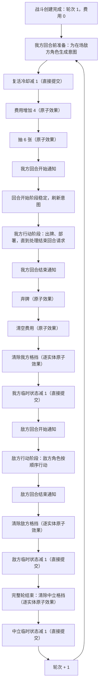
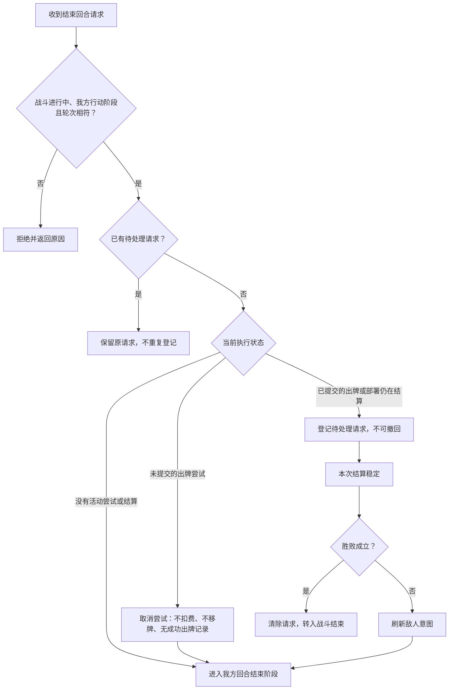
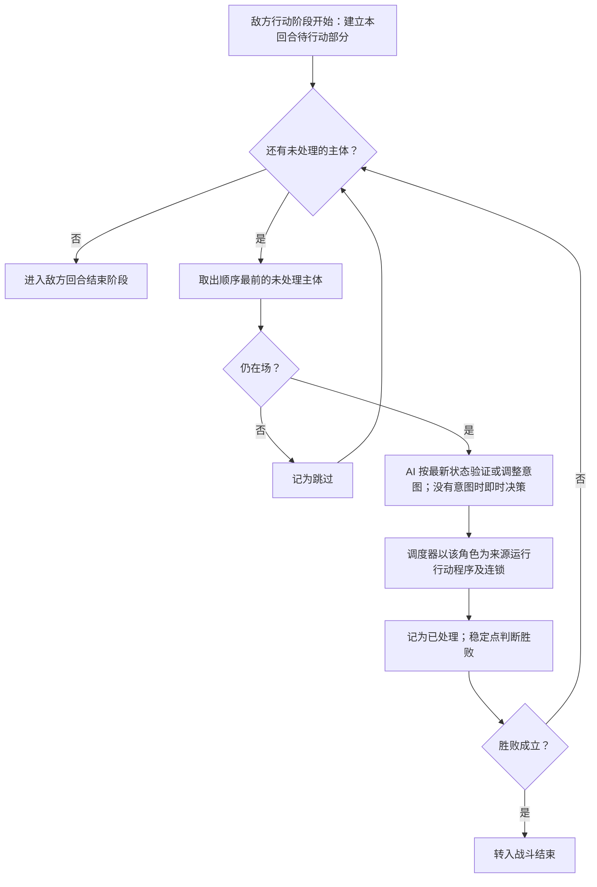
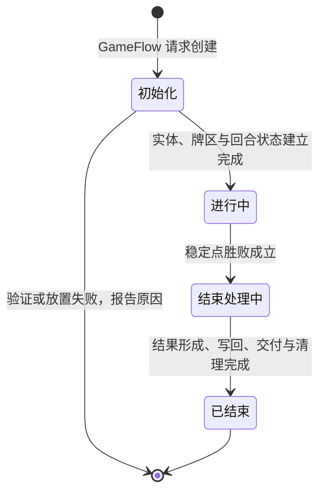
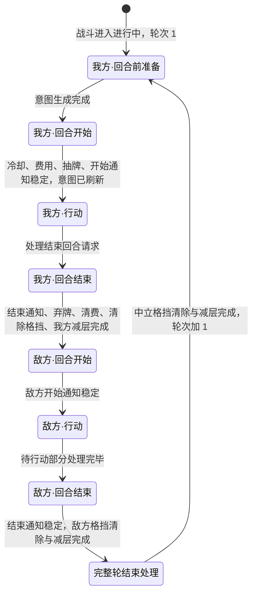

# 战斗流程与回合状态机

- 文档版本：v0.1
- 文档状态：草案
- 对应里程碑：战斗垂直切片
- 最后更新：2026-10-04
- 相关GDD：[核心循环](../../GDD/01_核心循环.md)、[玩家行为和基础准则](../../GDD/02_玩家行为与基础规则.md)、[实体系统](../../GDD/核心系统/战棋系统/实体系统.md)
- 相关模块：[卡牌与效果系统](卡牌与效果系统.md)、[实体与状态系统](实体与状态系统.md)、[棋盘与坐标系统](棋盘与坐标系统.md)、[敌人意图与AI](敌人意图与AI.md)、[局内外状态与存档](../局内外状态与存档.md)、[UI与输入](../UI与输入.md)、[构建与测试](../构建与测试.md)
- 相关ADR：

## 1. 职责

本模块负责一场战斗的创建、回合编排、胜败判定与结束交接。`BattleFlow` 管理战斗的整体生命周期，`TurnStateMachine` 管理战斗内的阵营回合与阶段；卡牌、回合触发和敌方行动产生的规则效果交由 `BattleEffectScheduler` 统一结算。本节描述待实现的设计，不代表仓库中已有对应类。

| 责任      | 内容与边界                                                                                                                                                  |
| ------- | ------------------------------------------------------------------------------------------------------------------------------------------------------ |
| 战斗创建    | 读取棋盘、遭遇及本局状态，建立本场 `BattleState`、棋盘索引、实体与牌区。复活冷却已结束的我方角色由已有 `CharacterState` 建立战斗投影并按遭遇部署位上场，不用实体定义的初值覆盖本局成长；冷却中的角色本场开局不上场。敌方与中立实体按其定义创建。为规则结算提供可复现随机源。 |
| 回合编排    | 固定我方先手，按我方回合、敌方回合循环；管理阶段和行动准入，处理出牌、手动部署与玩家主动结束回合，推进我方角色的复活冷却，组织敌方角色按固定顺序行动。敌方具体决策与意图内容由敌人意图与 AI 模块提供。                                                  |
| 结算衔接    | 将回合产生的效果送入统一调度器，等待当前程序、原子效果与连锁稳定后再作相应的胜败判定或阶段推进。实体、棋盘、费用和牌区的实际变化通过战斗状态的受控接口提交。                                                                         |
| 战斗结束与交接 | 在稳定状态下判定胜败，形成 `BattleResult`，将全部我方角色的最终生命与复活冷却同步回本局角色记录，包括已移除角色的 `0` 生命及剩余冷却；清理本场状态、选择会话与执行上下文，将结果交给 `GameFlow`。                                       |

卡牌的基本检查、目标选择、最终确认、出牌提交事务与数值预演遵循[卡牌与效果系统](卡牌与效果系统.md)，本模块提供回合和阶段条件。实体生命、状态和棋盘索引遵循各自模块的规则。UI、动画与音效读取已提交状态和表现事件；地图推进、奖励选择、本局成长及存档由局外流程和相应模块负责。

## 2. 设计约束

### 2.1 阵营回合与玩家操作

- 固定我方先手，之后按我方回合、敌方回合循环。中立实体没有独立行动回合；其状态计时按我方、敌方各完成一个回合计算。
- 轮次号从 `1` 开始，一次我方回合与随后一次敌方回合共用该轮编号，例如我方 `1` → 敌方 `1` → 我方 `2` → 敌方 `2`；双方均完成本轮的结束处理后才进入下一轮。
- 我方角色通过出牌行动，玩家还可以手动部署复活冷却已结束的我方角色；同一我方回合内不限制角色的具体行动顺序。敌方只有角色按固定顺序行动，敌方非角色实体与中立实体一样不获得行动资格。行动资格与目标合法性仍按执行时的最新状态验证。
- 我方由玩家主动点击结束回合，不根据剩余费用或手牌数量自动结束。目标暂选或最终确认期间收到结束回合请求时，先取消尚未提交的出牌尝试，再结束我方回合；取消不扣费、不移动卡牌，也不发布成功出牌记录。结束回合请求一经接受即不可撤回。
- 出牌选择和连锁运行期间，不接受另一玩家出牌或部署。暂选、改选、取消与最终确认是当前执行帧的交互状态，不能被当成新阵营回合。
- 新出牌尝试和手动部署只在战斗进行中的我方行动阶段准入，并须没有另一活动尝试／结算和待处理结束回合请求；费用、卡牌、部署目标格及其他目标条件继续由命令处理与规则模块检查。当前尝试的选择响应、改选和最终确认按执行帧状态处理，不按新出牌准入处理。

### 2.2 费用、抽牌与手牌

- 费用全队共享，仅在我方回合开始增加 `4` 点。这里是增量，不是将当前费用覆盖为 `4`；通常在我方回合结束时清空剩余费用；保留费用由状态修正清空费用效果实现，具体由哪些卡牌／状态提供属于内容设计。
- 创建战斗时共享费用为 `0`，首个我方回合开始增加 `4` 后得到开局可用的 `4` 点；不在创建阶段先给 `4` 再于第一回合额外加 `4`。
- 每个我方回合开始抽 `6` 张。战斗开局的 `6` 张就是首个我方回合的抽牌，不在进入该回合时再额外抽 `6` 张；敌方回合不增加我方费用，也不进行这次常规抽牌。
- 手牌上限为 `12` 张。达到上限后，本次剩余应抽牌仍从抽牌堆抽出，放入弃牌堆；不能将其留在抽牌堆，或将本次抽牌请求缩减为剩余手牌空位数。
- 抽牌堆不足时，重洗弃牌堆并继续本次抽牌，使用本场可复现随机源。实际抽牌与牌区变化仍遵循卡牌实例唯一归属等约束；消耗牌堆不参与这次重洗。
- 我方回合结束时默认弃掉全部手牌；保留手牌由状态修正弃牌效果实现，具体由哪些卡牌／状态提供属于内容设计。

### 2.3 回合时点与敌方安排

- 我方回合开始依次处理：复活冷却减 `1` → 费用增加 `4` → 抽 `6` 张 → 回合开始状态触发。每一步及其连锁处理完成后再继续后续步骤。
- 费用增加、抽牌，以及回合结束时的弃牌、清空费用，各作为一次无明确来源 ↔ 我方路由的原子效果，经统一调度器发布执行前／后消息，可被状态修正，也可触发连锁。保留手牌和保留费用都通过执行前修正实现：弃牌效果的请求是本次要弃掉的手牌集合，状态可以从中移出要保留的牌；清空费用效果的请求是要清除的费用数额，状态可以减少它，从而保留部分或全部费用。抽牌效果请求 `6` 张，满手溢出和抽牌堆不足时的重洗都在这一次效果内完成，并记入其 `EffectResult`；弃牌效果一次处理当前手牌，不逐张拆成多个效果。各阵营回合结束时的格挡清除也是原子效果：对该阵营在场且格挡大于 `0` 的实体逐个生成带“回合清除”语义的减少格挡效果，按无明确来源 ↔ 持有者阵营路由，状态可在执行前减少清除量以保留格挡，顺序与规则见[实体与状态系统](实体与状态系统.md)。复活冷却减 `1` 与各阵营临时状态减层由回合流程经 `BattleState` 受控接口直接提交，不发布原子效果消息。
- 我方回合结束依次处理：回合结束状态触发及其连锁 → 弃牌（按保留例外处理）→ 清空费用（按保留例外处理）→ 清除我方格挡（按保留例外处理）→ 我方临时状态层数减 `1`。到扣减时点仍存在的本回合新施加状态也参与扣减，层数变为 `0` 时移除；格挡清除排在减层之前，本回合获得的临时“保留格挡”类状态仍能修正清除。
- 敌方也具有回合开始、行动与回合结束时点。敌方回合结束状态触发及其连锁完成后，清除敌方格挡，再将敌方临时状态层数减 `1`；我方、敌方都完成回合后，在完整轮结束处理中清除中立格挡，再统一将中立实体临时状态层数减 `1`。永久型战斗状态不按回合自然衰减。格挡在持有者所属阵营的回合结束时清除，因此我方回合获得的格挡默认不保留到敌方回合。
- 回合开始／结束通知仅由对应回合阵营内具有监听资格的状态按自身条件响应，通知携带当前回合阵营与轮次；另一阵营与中立实体不接收该回合通知。回合通知与原子效果的执行前／后通知分别描述不同的规则时点，后者仍按来源方／对应方路由，不能把两类通知的范围混用。
- 对应阵营内部先通知角色、后通知非角色，各组按实体监听序号升序；每个实体内部先处理永久状态区、再处理临时状态区，各区按状态实例获得顺序。回合通知没有来源实体本人这一额外步骤，不伪造来源角色；监听序号的赋值规则见[实体与状态系统](实体与状态系统.md)。
- 敌方行动主体只有敌方角色，敌方非角色实体不进入行动顺序。初始固定行动顺序由 `EncounterDefinition` 决定；战斗中新增的敌方角色统一追加到末尾，已行动实体不重复行动。在敌方行动阶段结束前加入的敌方角色参与该敌方回合；敌方回合结束状态触发阶段才出现的敌方角色，下一敌方回合才行动，不返回本轮行动阶段。敌方行动顺序与状态效果通知中的监听序号由遭遇定义中两项独立配置提供，两者可以不同，不能互相推断。
- 敌人意图在我方回合开始前为在场敌方角色生成。我方每次完整行动（成功提交的出牌或部署）及其连锁稳定后，按最新状态刷新；我方回合开始阶段的各步骤稳定后，同样刷新一次。敌方回合内不整体刷新：轮到某个敌方角色行动时，由 AI 按最新状态验证或调整其意图后执行，本敌方回合新增、尚无意图的敌方角色此时即时决策。决策算法与具体意图数据归敌人意图与 AI 模块。
- 已提交的出牌或部署及其连锁尚在结算时收到结束回合请求，保留该请求，待本次结算完成后再执行，不能中断结算或撤回已经成功提交的行动。

### 2.4 最新状态与统一结算

- 回合开始、回合结束及其触发的效果，与卡牌和敌方行动产生的效果共用 `BattleEffectScheduler`；规则消息、类型化修正、状态提交与嵌套连锁遵循[卡牌与效果系统](卡牌与效果系统.md)。回合效果不伪造出牌消费或成功出牌记录。
- 调度器每次结算读取最新 `BattleState`，不使用回合开始时缓存的实体生命、位置或状态决定后续结果。规则计算不直接修改状态，实际变化通过受控接口提交，之后产生表现事件。
- 回合推进与动画时长、播放倍速及表现事件播放进度解耦。动画完成不能作为规则效果完成或胜败成立的依据。
- 规则层推进不等待表现，但已产生的表现事件播放完之前，UI 不发送出牌、部署或结束回合命令；战斗结果在规则层成立后立即形成并写回，`GameFlow` 在表现播完后再切换到战后界面。这只决定输入与界面切换的时机，不改变规则结果。
- 随机决策、抽牌及其他随机规则使用战斗提供的可复现随机源；相同初始规则输入、随机状态及命令／选择顺序应得到相同结算结果。数值预演使用隔离副本，不推进真实随机序列或修改真实战斗状态。

### 2.5 胜败与跨战斗边界

- 场上没有敌方角色时战斗获胜；场上没有我方角色时失败。敌方非角色实体和中立实体是否存活都不影响胜利；我方非角色实体存活，或者仍有冷却中、待部署的我方角色，都不能阻止失败。由于不在场的我方角色必然处于死亡状态，“场上没有我方角色”等同于“我方角色全部死亡”。
- 同一次结算稳定后，胜利与失败条件同时成立时判失败。胜败判定读取结算后的最新状态；不在卡牌程序、原子效果或连锁中途提前结束战斗。等待选择的帧仍未完成，不能仅凭当前没有原子效果在执行就判定为稳定。
- 实体生命降至 `0` 时按实体系统规则立即移除，胜败判断则等待本次程序及连锁稳定；实体移除与战斗结束是不同的时点。
- 战斗结束后不再接受出牌或部署。全部临时型和永久型战斗状态均清除，战斗内位置、牌区、选择进度及状态实例不延续到下一场；本局生命上限、天赋、战后当前生命与复活冷却按本局状态规则保留。
- 写回当前生命与复活冷却必须涵盖全部我方角色，不能只遍历仍在场的实体而漏掉已移除或开局未上场的角色。死亡角色按 2.6 节重新上场。
- 生命上限变化分为永久与临时两类。永久变化属于 `CharacterState`，跨战斗保留；临时变化只属于当前 `EntityState` 投影，随该投影移除或战斗结束失效。战斗中的永久变化同时作用于当前投影，并累计在本场角色关联中，战斗结束时随结果写回，不在战斗中途直接修改 `RunState`。临时上限提升在战斗结束时消失，因此写回的当前生命按写回后的生命上限截断。本局生命上限与本场永久变化合成后至少为 `1`：永久降低使当前投影的上限降至 `0` 时，该投影按生命归零移除，但同场重新部署与战后写回的生命上限按 `1` 计。

### 2.6 我方角色复活冷却与部署

- 本节只适用于我方角色。我方角色因生命归零（含生命上限降至 `0`）或直接移除效果而按实体规则立即移除时，同时进入 `3` 个我方回合的复活冷却。冷却记在本局角色记录中，跨战斗保存；战斗之间不减少，非战斗节点也不影响冷却。
- 复活冷却只在我方回合开始的第一个步骤减 `1`，减到 `0` 的那个我方回合即可部署。例如在我方第 `2` 回合或敌方第 `2` 回合中死亡的角色，都在我方第 `5` 回合可以部署。敌方回合不改变冷却。
- 冷却结束的角色处于待部署状态。玩家可在我方行动阶段免费将其部署到任意可进入的有效格，须遵守地形承载与占位规则；每个待部署角色部署一次后即为在场角色。部署与出牌使用相同的行动准入，并互斥执行。
- 部署按本局角色记录建立新的战斗投影：生命上限取本局角色的生命上限，计入本场已发生的永久变化（合成结果至少为 `1`），生命恢复至该上限，格挡为 `0`，只带实体定义中的初始状态；此前投影的状态、位置与临时生命上限变化都不沿用。新投影使用本场新的 `EntityId`，旧 ID 不复用。同一角色在本场再次死亡时，重新进入 `3` 个我方回合的冷却。
- 部署的放置是一次无明确来源 ↔ 我方路由的原子效果，带“部署”语义标签，经统一调度器发布执行前／后消息并结算连锁。状态可依据该标签把部署与卡牌召唤、敌方增援等其他放置效果区分开，例如自行决定“友方单位登场时获得格挡”是否对重新部署生效。它属于一次完整行动：稳定后判断胜败，战斗继续时刷新敌人意图。
- 新战斗创建时，复活冷却为 `0` 的角色自动上场：存活角色沿用当前生命，此前死亡而冷却已结束的角色以生命上限上场。冷却中的角色开局不上场，在本场继续计数，冷却结束后再手动部署。

## 3. 核心概念

| 概念 | 含义与边界 |
| --- | --- |
| `BattleFlow` | 创建本场战斗、衔接回合状态机、判断战斗是否结束并向 `GameFlow` 交付结果的应用层编排对象。 |
| `TurnStateMachine` | 管理当前阵营回合、回合阶段与推进条件的应用层对象；不自行实现伤害、抽牌或状态变化规则。 |
| `BattleState` | 当前战斗的权威规则状态，提供实体、棋盘、牌区和共享费用的当前数据及受控提交入口；它不是 Unity 场景或动画播放状态。 |
| 阵营回合 | 我方或敌方的一次行动机会，包含回合开始、行动和回合结束等阶段。同一回合允许多个实体行动，不是每个实体各自切换一次阵营回合。 |
| 完整战斗轮 | 我方与敌方各完成一个回合；用于回合计数与中立实体临时状态的自然衰减。 |
| 共享费用 | 全队共用的本场出牌资源。费用的持有者不是某一个角色，出牌仍记录实际打出者并按其状态和目标结算。 |
| 回合阶段与出牌交互状态 | 回合阶段决定哪些操作可以开始；目标暂选、等待最终确认、已提交、等待连锁等由当前出牌执行帧保存。两者共同决定操作准入，不把选择暂停误当成回合结束或效果完成。 |
| 结束回合请求 | 玩家主动结束我方回合的请求。尚未提交的出牌尝试先取消，当前回合结束规则随后处理；它不是一次出牌，接受后不可撤回。 |
| 完整行动 | 我方行动阶段内一次成功提交的出牌或部署，连同其程序与连锁；稳定后判断胜败并刷新敌人意图。取消或验证失败的尝试不算完整行动。 |
| 复活冷却 | 我方角色死亡后到可以重新部署之前须经过的我方回合数，初值 `3`，在我方回合开始的第一步减 `1`；保存在本局角色记录中，跨战斗延续。 |
| 手动部署 | 玩家把复活冷却已结束的我方角色放到可进入格的行动；免费，每个待部署角色一次，按最新状态验证，放置作为带“部署”语义标签的原子效果结算。 |
| 敌方行动顺序 | 当前敌方回合逐个处理敌方角色行动的固定顺序，不包含敌方非角色实体；与效果通知中的实体监听序号是不同的概念。 |
| 敌人意图 | AI 模块提供的敌方角色行动信息，供战斗流程安排执行、供 UI 展示；具体内容与生成规则由敌人意图与 AI 模块负责。 |
| 根程序、原子效果与连锁 | 一次出牌或行动程序、其中调用的单次规则操作，以及状态响应后产生的其他效果。统一调度器负责暂停、恢复与嵌套结算，回合状态机等待本次执行完成。 |
| 战斗稳定点 | 本次活动程序、待分发规则消息、原子效果及其触发的连锁全部处理完成，可以读取最终状态作胜败判断。等待选择的活动帧尚未完成，表现动画是否播放完不影响该条件。 |
| `BattleResult` | 战斗结束后交给局外流程的结果，包含胜败与全部我方角色的最终生命及复活冷却；击败最终 Boss 后的整局胜利、奖励及节点更新由 `GameFlow` 处理。 |
| 本局角色与战斗投影关联 | 将跨战斗的角色身份对应到其在本场的上场状态、当前战斗投影的 `EntityId` 与复活冷却；同一角色在本场可因重新部署先后对应多个 `EntityId`。实体被移除后仍需据此写回该角色的 `0` 生命与冷却，不能用在场实体索引代替全部角色记录。 |

## 4. 数据模型

以下描述模块间共享的逻辑数据，不限定最终 C# 类名、容器、方法签名或 Unity 资产序列化格式。权威战斗状态、只读内容配置、流程进度和表现状态分别管理；同一逻辑字段只保留一份权威值，UI 的可操作标志由当前数据推导。

### 4.1 战斗创建输入

| 输入 | 类型 | 说明 |
| --- | --- | --- |
| 棋盘与遭遇 | `BoardDefinition`、`EncounterDefinition` 引用 | 提供本场棋盘及遭遇数据；敌方初始行动顺序由遭遇定义提供。配置为只读数据，不保存某次战斗的回合号或剩余费用。 |
| 本局状态 | `RunState` 及其角色、牌组记录 | 我方角色的本局生命上限、天赋、当前生命与复活冷却来自已有 `CharacterState`；本局角色顺序（即出战顺序，由玩家配置）与牌组来自本局记录，前者同时决定部署位占用和我方监听序号；不从实体或卡牌定义重置本局成长。 |
| 随机上下文 | 可复现随机种子与必要的随机状态／流位置 | 为规则决策和洗牌等操作提供可复现随机源；预演复制随机状态，不与真实结算共用可变随机进度。具体随机算法与流划分不在本节预设。 |

遭遇定义需要提供以下初始部署与顺序数据，运行时的进度留在本场战斗状态中：

| `EncounterDefinition` 所需逻辑数据 | 类型 | 说明 |
| --- | --- | --- |
| 初始棋盘引用 | `BoardDefinition` 引用 | 给出本场使用的固定初始棋盘；具体格子与地形模型沿用棋盘系统。 |
| 初始实体与部署位置 | 有序的我方部署位 `CellCoord`、敌方／中立实体定义引用及各自的 `CellCoord` | 开战时的初始格子全部由遭遇定义配置，不设置开局选位阶段。开战上场的我方角色按本局角色顺序依次占用部署位，部署位数量须不少于开战上场的角色数。我方角色的成长与生命仍来自 `CharacterState`，位置配置不覆盖这些数据。创建时验证有效格与占位约束。 |
| 敌方初始行动顺序 | 有序的遭遇实体配置引用 | 只能指向敌方角色。同一定义可生成多个实体，顺序应能指向具体出生项，而非仅按定义 ID 区分；创建后对应到本场 `EntityId` 顺序。战斗中新增的敌方角色按出现顺序追加到末尾。 |
| 敌方初始监听顺序 | 有序的遭遇实体配置引用 | 覆盖全部敌方初始实体，包括角色与非角色，每个出生项恰好出现一次；不能指向中立实体。创建时按此顺序分配敌方监听序号 `1`、`2`……；它与敌方初始行动顺序是两项独立配置，可以不同。 |

创建战斗时将本局牌组复制为本场卡牌实例与牌区数据，不修改 `RunState` 的牌组或共享卡牌定义；先使用战斗随机源洗牌，再在第一我方回合抽 `6` 张。初始化输入不包括额外一次开局抽牌或开局选位。

### 4.2 权威战斗状态

| 对象及逻辑字段                  | 类型                                                                | 说明                                                                                                                                                                 |
| ------------------------ | ----------------------------------------------------------------- | ------------------------------------------------------------------------------------------------------------------------------------------------------------------ |
| `BattleState` 的战斗标识与定义引用 | 本场战斗 ID、棋盘及遭遇定义 ID                                                | 区分本次战斗和只读内容，供命令、结果及日志关联使用。                                                                                                                                         |
| 战斗生命周期状态                 | 初始化／进行中／结束处理中／已结束                                                 | 初始化完成前不接受战斗操作；结果成立后进入结束处理，交接和清理后标记结束。该状态不表示动画是否播放完成。                                                                                                               |
| 在场实体索引                   | `EntityId` → `EntityState`                                        | 与棋盘格内实体及占位索引同步更新；实体移除后旧 ID 不再对应在场实体，生命与状态数据沿用实体系统模型。                                                                                                               |
| 棋盘与牌区                    | `BoardState`、`DeckState`                                          | 引用各自模块的逻辑数据；不复制一套位置或牌区归属供流程层单独修改。费用、牌区和实体变化通过受控状态接口提交。                                                                                                             |
| 当前共享费用                   | 非负整数，创建时为 `0`                                                     | 全队费用的权威余额；我方回合开始增加 `4`，出牌按基础费用检查及修正后费用共同提交规则扣减，回合结束按已确认规则清空。                                                                                                       |
| 我方角色战斗关联                 | 本局角色身份 → 上场状态（在场／冷却中／待部署）、可空的当前 `EntityId`、复活冷却剩余回合、本场累计的永久生命上限变化、本场监听序号 | 覆盖本局全部我方角色，包括开局未上场者。监听序号在创建时按出战顺序分配，冷却中的角色也保留序号，重新部署的新投影沿用该序号。永久生命上限变化供同场重新部署与战后写回使用，临时变化不记在这里。在场时从实体状态读取生命；因生命归零或直接移除而移除时，与移除同一次提交改为冷却中、冷却 `3`，并保留最终 `0` 生命，用于部署、结果生成与战后写回。重新部署时关联新的 `EntityId`。不能因删除在场实体而删除关联信息。 |
| 出牌历史 | 本场成功出牌记录的有序列表 | 出牌共同提交时追加，供状态与卡牌脚本只读查询，例如本回合是否已打出过攻击牌；取消或失败的尝试不记录。字段见[卡牌与效果系统](卡牌与效果系统.md)。 |
| 回合状态                     | `TurnState`                                                       | 保存下表的权威流程进度，由 `TurnStateMachine` 推进；不在 UI 或命令处理器另存不同步的当前阵营或轮次。                                                                                                     |
| 战斗结果                     | 可空的 `BattleResult`                                                | 胜败尚未成立时为空；稳定状态下形成后供结束交接读取。同一场战斗不因重复请求再次生成或应用一份独立结果。                                                                                                                |

`EntityState`、`BoardState` 和 `DeckState` 的内部字段分别见[实体与状态系统](实体与状态系统.md)、[棋盘与坐标系统](棋盘与坐标系统.md)和[卡牌与效果系统](卡牌与效果系统.md)。卡牌执行帧、选择会话、待分发消息与连锁进度由统一调度器及选择模块管理，流程层持有当前执行的关联信息，不复制另一套程序位置。

### 4.3 回合与敌方行动进度

| `TurnState` 的逻辑字段 | 类型 | 说明 |
| --- | --- | --- |
| 当前轮次号 | 从 `1` 开始的整数 | 同一轮我方、敌方共用；我方先手，双方结束处理及中立状态扣减完成后进入下一轮。 |
| 当前回合阵营 | 我方／敌方 | 中立不成为第三个行动阵营。操作准入同时检查战斗生命周期与阶段，不能只检查此字段。 |
| 当前阶段 | 回合前准备／回合开始／行动／回合结束／完整轮结束处理 | 我方回合前准备包括生成敌人意图；开始、结束阶段执行已确认的资源与状态时序；完整轮结束处理用于中立状态扣减，不给予中立实体行动资格。 |
| 当前阶段步骤进度 | 阶段内已完成步骤或下一步骤标记 | 区分复活冷却减 `1`、费用增加、抽牌、回合状态触发、弃牌、费用清空、格挡清除（含已处理到的实体）、临时状态衰减等步骤；等待连锁后从正确位置恢复，不因重复推进而再次减冷却、增加费用、抽牌、清除格挡或减层。 |
| 待处理结束回合请求 | 布尔值或等效的一次待处理请求 | 已提交的出牌或部署及其连锁运行中收到请求时置为待处理，接受后不可撤回；同一回合的重复请求不重复执行结束规则。结算稳定后先判胜败；战斗已结束则清理请求，否则推进回合结束。处理后清除，不带入下一我方回合。 |
| 敌方行动顺序 | 有序 `EntityId` 集合 | 只包含敌方角色。初始顺序来自 `EncounterDefinition`，新增敌方角色追加到末尾。与实体监听序号独立，不用字典遍历顺序替代。 |
| 本敌方回合已处理行动主体 | `EntityId` 集合 | 记录本回合已经完成行动或因不再在场等原因跳过的主体，防止队列更新后重复行动；新敌方回合重新建立本回合进度。 |
| 待行动主体与当前主体 | 有序待处理 `EntityId`、可空的当前 `EntityId` | 当前主体的程序及连锁结束后才选择下一个；每次开始行动按最新状态验证。行动阶段结束前新增的敌方角色加入待处理部分，回合结束阶段新增的只登记到后续顺序，不重新打开本回合行动阶段。 |
| 当前结算关联 | 调度器中的活动程序／根效果引用 | 用于等待当前执行完成和报告流程位置；原子效果、父子连锁与暂停执行帧的详细状态沿用调度器模型。 |
| 敌人意图关联 | 敌方角色 `EntityId` → AI 模块提供的当前意图 | 我方回合前准备时生成，回合开始阶段稳定后及每次完整行动稳定后按最新状态刷新；敌方回合内在各角色行动开始时由 AI 按最新状态确定实际行动。具体意图字段、随机决策及目标失效策略由 AI 文档定义。 |

是否接受新出牌或部署、是否可最终确认，以及结束回合请求立即处理还是等待，都是当前战斗、回合、执行帧和选择状态的派生判断，不保存可与这些数据矛盾的第二套布尔状态。出牌复验仍检查最新基础费用、牌区及所选目标。

### 4.4 回合资源参数

| 参数或规则 | 当前值 | 说明 |
| --- | --- | --- |
| 战斗创建时的共享费用 | `0` | 开局可用的 `4` 点由第一我方回合的增加产生。 |
| 每个我方回合的基础费用增量 | `4` | 仅我方回合开始增加；保留例外留下的余额不被覆盖。 |
| 每个我方回合的常规抽牌数 | `6` | 第一我方回合也只抽一次；没有额外开局抽牌。 |
| 手牌上限 | `12` | 满手时继续抽出应抽牌，溢出牌进入弃牌堆。 |
| 抽牌不足处理 | 重洗弃牌堆继续抽 | 使用本场随机源，消耗牌堆不参与。 |
| 回合结束手牌处理 | 默认全部弃掉 | 状态可在弃牌效果执行前修正，保留部分或全部手牌；具体由哪些卡牌／状态提供属于内容设计。 |
| 回合结束费用处理 | 默认清空 | 状态可在清空费用效果执行前修正，保留部分或全部费用；具体由哪些卡牌／状态提供属于内容设计。 |
| 回合结束格挡处理 | 持有者所属阵营回合结束时清除；中立在完整轮结束时清除 | 状态可在各实体的清除格挡效果执行前修正，保留部分或全部格挡；具体由哪些卡牌／状态提供属于内容设计。 |
| 我方角色死亡后的复活冷却 | `3` 个我方回合 | 我方回合开始的第一步减 `1`，归零当回合可部署；跨战斗保存。 |
| 手动部署的代价与次数 | 免费；每个待部署角色一次 | 部署到任意可进入的有效格，须遵守地形承载与占位规则。 |
| 重新上场时的生命 | 本局生命上限 | 取本局角色记录的生命上限，计入本场已发生的永久变化（合成结果至少为 `1`），不含任何临时变化；适用于战斗中手动部署，以及此前死亡、冷却已结束的角色在开战时自动上场。本局生命上限在 `CharacterState` 中以单个整数保存。 |

这些是已确认的基础规则，不在本节擅自增加保留关键词、状态清单或例外参数。抽牌请求、实际抽出牌及各牌区变化仍由卡牌与效果模块的数据表示；请求抽 `6` 张与手牌实际增加多少需要区分。

### 4.5 回合通知上下文

| 逻辑字段 | 类型 | 说明 |
| --- | --- | --- |
| 战斗与轮次 | 本场战斗 ID、当前轮次号 | 供状态、调度器与日志关联本次回合时点。 |
| 回合阵营 | 我方／敌方 | 标识当前回合，同时限定对应阵营的状态监听范围。 |
| 通知时点 | 回合开始／回合结束 | 开始通知在我方复活冷却减 `1`、费用增加与抽牌之后；结束通知在我方弃牌、清费、清除格挡和减层之前。敌方结束通知在清除敌方格挡和减层之前。 |
| 监听范围 | 当前回合阵营内具有监听资格的状态 | 状态按自身条件判断是否响应；另一阵营与中立不接收该通知。通知处理产生的原子效果及其连锁仍交统一调度器，完成后才推进下一步骤。 |
| 通知顺序 | 角色组 → 非角色组；各组监听序号升序；实体内永久区 → 临时区，各区按状态获得顺序 | 使用已有实体和状态顺序，不引入另一个与之矛盾的回合事件序号；实体监听序号的赋值规则见[实体与状态系统](实体与状态系统.md)。 |

回合通知是独立的规则时点消息，不是成功出牌记录，也不代替任何原子效果的执行前／后消息。它不需要伪造 `PlayId` 或实体来源；其触发的原子效果另按实际来源与对应阵营路由。回合通知与原子效果的执行后消息采用相同的调度规则：先按通知顺序通知全部监听状态并登记触发的效果，再按登记顺序深度优先结算，全部稳定后才推进下一步骤，见[卡牌与效果系统](卡牌与效果系统.md)。

### 4.6 战斗结果

| `BattleResult` 的逻辑字段 | 类型 | 说明 |
| --- | --- | --- |
| 战斗与遭遇标识 | 本场战斗 ID、遭遇定义 ID | 供 `GameFlow` 关联当前战斗节点并接收结果。 |
| 结果类型 | 胜利／失败 | 依据稳定状态判断；胜败同时成立记录失败，不增加平局结果。最终 Boss 对整局结果的影响由 `GameFlow` 处理。 |
| 全部我方角色的最终生命与复活冷却 | 本局角色身份 → 当前生命整数、剩余冷却 | 涵盖在场、已移除和开局未上场的我方角色。在场角色冷却为 `0`，当前生命按写回后的生命上限截断；死亡角色生命记 `0` 并带剩余冷却，冷却已结束但未部署时冷却为 `0`。不用本场 `EntityId` 作为跨战斗身份。 |
| 全部我方角色的永久生命上限变化 | 本局角色身份 → 本场累计的永久变化 | 只含永久变化，临时变化不进入结果；没有变化时为 `0`。 |

结果形成后作为已结束战斗的只读交接数据。`BattleFlow` 据此同步本局角色的生命、复活冷却与永久生命上限变化并交付 `GameFlow`，奖励与节点更新由后者负责；结束清理不应先删除结果生成所需的角色关联或死亡信息。战斗状态、能力状态、位置与临时生命上限变化都不写回。

## 5. 运行流程

规则层按下述顺序推进，不等待动画、播放倍速或表现事件的播放进度；UI 的输入时机与战后界面切换按 2.4 节等待表现播完。出牌的选择、预演、最终确认与提交组遵循[卡牌与效果系统](卡牌与效果系统.md)，本节只描述回合编排及其与出牌结算的衔接。

### 5.1 战斗创建

1. `GameFlow` 提供棋盘与遭遇引用、`RunState` 和随机上下文。`BattleFlow` 先验证棋盘配置（规则见[棋盘与坐标系统](棋盘与坐标系统.md)）、遭遇中的实体定义与初始格、我方部署位数量，以及敌方行动顺序和敌方初始监听顺序的引用。
2. 建立生命周期为“初始化”的 `BattleState`、`BoardState` 与 `TurnState`：共享费用为 `0`，轮次为 `1`，当前为我方回合前准备，没有待处理结束回合请求。
3. 为本局全部我方角色建立战斗关联。复活冷却为 `0` 的角色按本局角色顺序依次占用我方部署位：存活角色沿用当前生命，此前死亡而冷却已结束的角色以生命上限上场；冷却中的角色登记为冷却中，不上场，也不占用部署位。敌方、中立实体按遭遇定义放到初始格。实体定义中的初始状态随实体一并加入。初始放置经 `BattleState` 受控接口直接提交，不发布原子效果消息。同时分配监听序号：我方按出战顺序为全部本局角色依次赋号，冷却中的角色保留序号，但在上场前不加入监听列表；敌方初始实体按遭遇定义的监听顺序赋号；中立实体不赋号。规则见[实体与状态系统](实体与状态系统.md)。
4. 把遭遇的敌方初始行动顺序对应到本场敌方角色的 `EntityId`。
5. 将本局牌组复制为本场卡牌实例并全部放入抽牌堆，使用战斗随机源洗牌；创建阶段不抽牌，也不增加费用。
6. 任一验证或放置失败时，报告具体原因并放弃本次创建，不向外暴露半初始化的战斗，也不修改 `RunState`。全部成功后生命周期转为“进行中”，`TurnStateMachine` 进入第 `1` 轮的我方回合前准备。

### 5.2 回合循环

图中每个步骤完成且其连锁稳定后都是战斗稳定点，先按 5.5 节判断胜败；胜败成立则转入战斗结束，不再执行后续步骤。标为“原子效果”的步骤按无明确来源 ↔ 我方路由（格挡清除按无明确来源 ↔ 持有者阵营路由，每个实体一个效果），经统一调度器发布执行前／后消息，可被状态修正并触发连锁；标为“直接提交”的步骤经 `BattleState` 受控接口提交，不发布原子效果消息；回合开始／结束通知按 4.5 节只通知对应阵营的监听状态。`TurnState` 的步骤进度在每一步稳定后才前移，等待连锁后恢复时不会重复执行已经完成的步骤。

### 5.3 我方行动阶段

行动阶段内，新出牌尝试与手动部署共用 2.1 节的准入条件，同一时刻只有一个在进行。手动部署按以下顺序处理：

1. UI 发送部署命令，携带本局角色身份与目标格。目标格在 UI 中选定后一次提交，规则层不为部署建立可取消的执行帧。
2. 命令处理按最新状态验证：行动准入成立；该角色处于待部署状态；目标格是可进入的有效格，且地形可承载该角色。任一项失败则拒绝，不改变冷却、棋盘或角色关联。
3. 验证通过后，调度器把放置作为一次带“部署”语义标签的原子效果结算：先发布执行前消息；再由 `BattleState` 按最新状态提交放置，为该角色建立新的战斗投影与 `EntityId`，生命为生命上限，只带实体定义中的初始状态，沿用该角色本场的监听序号，并把角色关联改为在场；最后发布执行后消息并结算连锁。

成功提交的出牌或部署都是一次完整行动。其程序与连锁稳定后依次判断胜败；战斗继续时刷新敌人意图；若存在待处理结束回合请求，再进入我方回合结束阶段。取消或验证失败的尝试没有改变规则状态，不触发判定或刷新。

结束回合请求按下图处理。请求携带发起时的轮次，与当前轮次不符时视为过期请求并拒绝，避免迟到的请求结束下一个我方回合。

取消未提交尝试时，UI 同时清理暂选、高亮与预演展示。玩家没有可用操作时，流程仍停在行动阶段等待结束回合请求，不自动结束。

### 5.4 敌方回合

1. 敌方回合开始：发布敌方回合开始通知并结算其连锁。敌方回合不增加费用、不抽牌，也不改变复活冷却。
2. 行动阶段开始时，把行动顺序中仍在场的敌方角色建立为本回合的待行动部分，然后按下图逐个处理。行动阶段结束前新增的敌方角色追加到行动顺序末尾，同时加入本回合待行动部分。
3. 待行动部分处理完毕后进入回合结束：发布敌方回合结束通知并结算连锁，再清除敌方格挡，最后将敌方临时状态减 `1`。这一阶段新增的敌方角色只登记到行动顺序，下一敌方回合才行动。
4. 完整轮结束处理先清除中立格挡，再将中立临时状态减 `1`，轮次加 `1`，进入下一轮的我方回合前准备。

AI 返回的行动程序以该敌方角色为来源交统一调度器运行，其中的目标与效果仍按执行时的最新状态结算；AI 决定本回合不行动时，该主体直接记为已处理。意图字段、决策算法与目标失效策略由[敌人意图与AI](敌人意图与AI.md)定义。

### 5.5 稳定点与战斗结束

战斗稳定点出现在：回合各步骤完成并稳定后、每次完整行动稳定后、每个敌方角色的行动稳定后。等待选择的执行帧、尚未分发完的规则消息或未结算的连锁都不构成稳定点。每个稳定点按以下顺序处理：

1. 判断胜败：场上没有我方角色为失败；场上没有敌方角色为胜利；两者同时成立判失败。冷却中或待部署的我方角色、我方非角色实体、敌方非角色实体与中立实体都不参与判断。
2. 未分胜负时，按所在阶段继续推进。
3. 胜败成立时，生命周期转为“结束处理中”，此后拒绝出牌、部署与结束回合请求，并清除待处理结束回合请求。
4. 依据我方角色关联形成 `BattleResult`。
5. 将全部我方角色的最终生命、复活冷却与永久生命上限变化写回 `CharacterState`，当前生命按写回后的生命上限截断；随后发出战斗结束表现事件，把结果交给 `GameFlow`。
6. 清理调度器、选择会话与预演的残留数据，清除全部战斗状态及实体、棋盘、牌区数据，生命周期标记为“已结束”。`GameFlow` 在表现播完后切换到奖励选择、游戏胜利或游戏失败流程。

### 5.6 示例

我方有角色 A、B；遭遇中有敌方角色 E1、E2，以及敌方非角色实体图腾 T。

1. 创建：A、B 的冷却均为 `0`，按本局角色顺序占用前两个部署位，并取得我方监听序号 `1`、`2`；牌组洗牌，费用为 `0`。行动顺序为 E1、E2，T 不在其中；遭遇配置的监听顺序为 E2、T、E1，三者依次取得敌方监听序号 `1`、`2`、`3`。
2. 第 `1` 轮我方：为 E1、E2 生成意图；冷却步骤没有变化，费用 `0 → 4`，抽 `6` 张，发布我方开始通知后刷新意图。玩家打出一张攻击牌并最终确认，连锁尚未结束时点击结束回合，请求登记为待处理。连锁稳定后先判胜败，未分胜负，刷新意图后进入回合结束：结束通知 → 弃牌 → 清空费用 → 清除我方格挡 → 我方临时状态减 `1`。
3. 第 `1` 轮敌方：E1 行动时，AI 按最新状态确认意图并击败 B。B 被移除，冷却为 `3`；稳定后场上仍有 A，未分胜负，继续由 E2 行动。之后完成敌方结束处理与中立减层，进入第 `2` 轮。
4. 第 `2`、`3`、`4` 轮我方回合开始的第一步，B 的冷却依次变为 `2`、`1`、`0`。第 `4` 轮行动阶段，玩家免费把 B 部署到一个可进入格；B 以本局生命上限和新的 `EntityId` 上场，监听序号仍为 `2`；死亡前那个投影上的状态与临时生命上限变化都不沿用，稳定后刷新意图。
5. 之后一次出牌击败 E1 和 E2，T 仍在场；该出牌及连锁稳定后判定胜利。结果记录 A、B 的当前生命，冷却均为 `0`，写回本局角色记录后交给 `GameFlow`。

## 6. 状态与生命周期

`BattleFlow` 与 `TurnStateMachine` 是应用层编排对象；`BattleState`（含 `TurnState`、我方角色关联与 `BattleResult`）是本场战斗的运行时数据，只存在于内存中。垂直切片不支持战斗中途存档与读档，战斗内位置、牌区、执行帧、意图与随机进度都不写入存档；复活冷却在战斗之间保存在 `CharacterState`。

### 6.1 战斗生命周期

| 生命周期 | 可接受的操作 | 进入与退出 |
| --- | --- | --- |
| 初始化 | 拒绝全部战斗命令 | 验证与初始放置全部成功后转为进行中；失败则丢弃，不对外暴露。 |
| 进行中 | 按当前回合阶段准入 | 任一稳定点胜败成立时转为结束处理中。 |
| 结束处理中 | 拒绝出牌、部署与结束回合请求 | 形成结果、写回、交付和清理完成后转为已结束。 |
| 已结束 | 拒绝全部战斗命令 | 本场状态已清除；同一场不再形成或交付第二份结果。 |

### 6.2 回合阶段

任一阶段的稳定点胜败成立时，回合状态机停止推进，不再进入后续阶段。

| 阶段 | 玩家可发起的操作 | 阶段内处理 |
| --- | --- | --- |
| 我方回合前准备 | 无 | 为在场敌方角色生成意图。 |
| 我方回合开始 | 无；结束回合请求被拒绝 | 复活冷却减 `1` → 费用增加 `4` → 抽 `6` 张 → 开始通知；全部稳定后刷新意图。 |
| 我方行动 | 出牌尝试及其选择、改选、最终确认与取消；出牌提交后的不可取消选择；手动部署；结束回合请求 | 新出牌与部署须满足准入；完整行动稳定后判胜败并刷新意图；处理结束回合请求后离开本阶段。 |
| 我方回合结束 | 无 | 结束通知 → 弃牌 → 清空费用 → 清除我方格挡 → 我方临时状态减 `1`。 |
| 敌方回合开始 | 无 | 敌方开始通知及其连锁。 |
| 敌方行动 | 无 | 敌方角色逐个行动，每个行动稳定后判胜败；待行动部分为空时离开。 |
| 敌方回合结束 | 无 | 结束通知 → 清除敌方格挡 → 敌方临时状态减 `1`；这一阶段新增的敌方角色下一敌方回合才行动。 |
| 完整轮结束处理 | 无 | 清除中立格挡 → 中立临时状态减 `1`，轮次加 `1`。 |

Hover 预检可以在任何阶段调用，但只有满足行动准入时才可能返回允许开始出牌。

### 6.3 运行时数据

| 数据 | 创建 | 变更 | 清理 |
| --- | --- | --- | --- |
| `BattleState` 与 `TurnState` | 战斗创建 | 规则变化经受控接口提交；回合进度只由 `TurnStateMachine` 推进 | 战斗结束处理完成后清除 |
| 我方角色战斗关联 | 战斗创建时覆盖全部本局角色，并按出战顺序分配监听序号 | 死亡：在场 → 冷却中（`3`）；我方回合开始：冷却减 `1`，归零转为待部署；部署：待部署 → 在场并关联新 `EntityId` | 形成结果并写回后随战斗清除 |
| 待处理结束回合请求 | 我方行动阶段有已提交结算时登记 | 不可撤回；重复请求不再登记 | 进入回合结束或战斗结束时清除，不带入下一回合 |
| 敌方行动进度 | 每个敌方行动阶段开始时建立 | 主体行动完成或跳过时记为已处理；新增敌方角色追加 | 敌方回合结束时清空，下一敌方回合重建 |
| 敌人意图 | 我方回合前准备 | 回合开始阶段稳定后与每次完整行动稳定后刷新；敌方行动时由 AI 确定实际行动 | 对应敌方角色移除时删除；战斗结束时清除 |
| `BattleResult` | 稳定点胜败成立时 | 形成后只读 | 交付 `GameFlow` 后随战斗清理释放；同一场不重复形成 |

## 7. 模块接口

名称描述职责，不限定 C# 签名。规则状态变化均经 `BattleState` 受控接口提交；规则消息与表现事件分开。出牌相关接口见[卡牌与效果系统](卡牌与效果系统.md)，此处只列与回合流程衔接的部分。

| 接口能力 | 调用方 → 负责模块 | 输入 | 输出与状态权限 |
| --- | --- | --- | --- |
| 创建战斗 | `GameFlow` → `BattleFlow` | 棋盘与遭遇引用、`RunState`、随机上下文 | 验证并建立 `BattleState`、实体、牌区、角色关联与 `TurnState`；失败时返回原因，不暴露半初始化的战斗，不修改 `RunState`。 |
| 初始放置与洗牌 | `BattleFlow` → `BattleState`、`DeckState` | 遭遇部署、开战上场的角色、本局牌组副本 | 初始放置经受控接口直接提交，不发布原子效果消息；洗牌使用战斗随机源。 |
| 查询流程状态 | UI、`CommandProcessor` → `BattleState`、`TurnStateMachine` | 无 | 只读返回生命周期、轮次、当前阵营与阶段、待处理结束请求、敌方行动进度、我方角色上场状态与冷却。 |
| 行动准入 | `CommandProcessor` → `TurnStateMachine` | 当前执行帧与选择状态 | 判断能否开始新出牌尝试或部署：战斗进行中、我方行动阶段、没有活动尝试／结算、没有待处理结束请求。只做派生判断；费用、卡牌、目标格等仍由命令处理与规则模块检查。 |
| 请求结束回合 | UI → `TurnStateMachine` | 发起请求时的轮次 | 返回立即处理、已登记待处理、已有待处理请求或拒绝原因；请求不可撤回。轮次不符、不在我方行动阶段或战斗不在进行中时拒绝。 |
| 取消未提交尝试 | `TurnStateMachine` → `BattleEffectScheduler`、`ChoiceSession` | 当前待提交执行帧 | 丢弃执行帧、选择会话与预演；不扣费、不移牌、无成功出牌记录。 |
| 提交手动部署 | UI → `CommandProcessor` → `BattleEffectScheduler` | 本局角色身份、目标格 | 按最新状态验证准入、待部署状态与目标格；通过后以带“部署”语义标签的放置原子效果结算，由 `BattleState` 提交新 `EntityId`、沿用的监听序号、本局生命上限（计入本场永久变化）、满生命、位置及角色关联更新。失败不留部分变化。 |
| 提交回合资源效果 | `TurnStateMachine` → `BattleEffectScheduler` | 费用增加、抽牌、弃牌、清空费用的原子效果 | 按无明确来源 ↔ 我方路由发布执行前／后消息并提交，可被修正，也可触发连锁；不伪造出牌消费；稳定后回报。 |
| 清除回合格挡 | `TurnStateMachine` → `BattleEffectScheduler` | 我方、敌方或中立 | 按[实体与状态系统](实体与状态系统.md)的顺序为该阵营在场且格挡大于 `0` 的实体逐个生成减少格挡效果，按无明确来源 ↔ 持有者阵营路由，可被修正保留，也可触发连锁；全部稳定后回报。 |
| 直接提交回合簿记 | `TurnStateMachine` → `BattleState` | 复活冷却减 `1`、各阵营临时状态减 `1` | 经受控接口提交，不发布原子效果消息；层数为 `0` 的状态移除并注销订阅，冷却归零的角色转为待部署。 |
| 发布回合通知 | `TurnStateMachine` → `BattleEffectScheduler`（状态订阅分发） | 4.5 节的回合通知上下文 | 只通知对应阵营的监听状态；产生的原子效果交调度器结算，稳定后回报。 |
| 回报结算稳定 | `BattleEffectScheduler` → `TurnStateMachine`、`BattleFlow` | 根程序或根效果引用 | 报告该根及其连锁已稳定：没有活动帧、待分发消息和待处理效果；等待选择不算稳定。 |
| 判断胜败 | `BattleFlow` → 胜败规则 | 最新 `BattleState` | 返回未分胜负、胜利或失败，同时成立为失败；只读。 |
| 生成与刷新意图 | `TurnStateMachine` → 敌人意图与 AI | 最新 `BattleState` 的只读视图、在场敌方角色、战斗随机源 | 返回各敌方角色的意图；AI 不直接修改战斗状态。 |
| 确定并执行敌方行动 | `TurnStateMachine` → 敌人意图与 AI → `BattleEffectScheduler` | 当前主体 `EntityId`、其当前意图（可无）、最新状态 | AI 验证或调整意图，或即时决策，返回以该角色为来源的行动程序；调度器运行并在稳定后回报。决定不行动时直接完成。 |
| 登记新增敌方角色 | `BattleState` → `TurnStateMachine` | 新增敌方角色的 `EntityId`、加入时的阶段 | 追加到行动顺序末尾；敌方行动阶段结束前加入时同时进入本回合待行动部分。敌方非角色实体不登记。 |
| 记录我方角色死亡 | `BattleEffectScheduler` → `BattleState` | 生命归零或被直接移除的我方角色实体 | 与移除同一次提交，把角色关联改为冷却中、冷却 `3`，保留最终 `0` 生命。 |
| 提交生命上限变化 | `BattleEffectScheduler` → `BattleState` | 目标 `EntityId`、变化量、永久或临时 | 两类变化都作用于当前投影，并按实体规则截断当前生命；上限降至 `0` 时按生命归零移除；我方角色的永久变化同时累计到角色关联，供重新部署与战后写回。临时变化只留在当前投影上；非我方角色的实体没有跨战斗记录，变化只在本场有效。 |
| 发出表现事件 | `TurnStateMachine`、`BattleFlow` → `PresentationEventStream` | 已提交的轮次与阶段变化、意图更新、部署、战斗结果 | 状态提交后发出；表现层不反写规则，播放进度不决定回合推进。 |
| 交付战斗结果 | `BattleFlow` → `GameFlow` | `BattleResult` | 同一场只交付一次；`GameFlow` 在表现播完后切换界面，奖励与节点更新由其负责。 |
| 写回本局角色 | `BattleFlow` → `RunState`、`CharacterState` | 结果中的最终生命、复活冷却与永久生命上限变化 | 覆盖全部我方角色，写回后的生命上限至少为 `1`，当前生命按该上限截断；不写回战斗位置、状态、临时生命上限变化或 `EntityId`。 |
| 清理战斗 | `BattleFlow` → 调度器、`ChoiceSession`、预演、`BattleState` | 已交付的结果 | 丢弃残留的执行帧、待处理项、选择会话与预演，清除全部战斗状态；之后拒绝战斗命令。 |

## 8. 异常与边界情况

| 情况 | 处理原则 |
| --- | --- |
| 遭遇或创建输入无效 | 实体定义缺失、初始格无效或占位冲突、我方部署位少于开战上场角色数、敌方行动顺序引用不存在或不指向敌方角色、敌方初始监听顺序遗漏或重复敌方初始实体或指向非敌方实体、遭遇没有敌方角色、没有可上场的我方角色时，报告具体原因并终止创建；不暴露半初始化战斗，不修改 `RunState`。 |
| 准入不满足时的出牌或部署 | 不在我方行动阶段，或者已有活动尝试、结算或待处理结束请求时，拒绝新出牌与部署并返回原因；不排队等待。 |
| 结束回合请求的各种时机 | 未提交尝试先取消再结束；已提交的出牌或部署仍在结算时登记一次，稳定后先判胜败；重复请求不重复执行结束规则；轮次不符或不在我方行动阶段的请求被拒绝。请求不可撤回。 |
| 已提交后出现需要玩家响应的选择 | 卡牌程序在出牌提交后可发起不可取消的选择。等待期间该帧未完成，不是稳定点；待处理结束请求继续等待，玩家须完成选择。规则见[卡牌与效果系统](卡牌与效果系统.md)。 |
| 部署失败 | 角色不处于待部署状态、目标格越界、地形不可承载或已被占据时拒绝；提交阶段失败时不留部分变化，角色仍为待部署，冷却不变。 |
| 敌方行动主体不在场 | 跳过并记为已处理；同一 `EntityId` 每个敌方回合至多行动一次。 |
| AI 没有可执行的行动 | 该主体本回合行动为空，记录原因后继续下一个主体，流程不得停滞；目标失效的具体策略由 AI 文档定义。 |
| 回合步骤中胜败成立 | 例如回合开始状态触发击败最后一个敌方角色：该步骤稳定后判胜利，不再执行后续步骤，直接进入战斗结束。 |
| 胜败同时成立 | 判失败，不产生平局。 |
| 只剩敌方非角色实体或中立实体 | 场上没有敌方角色即判胜利。 |
| 场上我方角色全部死亡但仍有冷却中或待部署角色 | 判失败；这些角色不能挽回本场战斗。 |
| 满手或牌堆不足 | 都在同一次抽牌效果内处理：满手时剩余应抽牌进入弃牌堆；抽牌堆不足时重洗弃牌堆后继续。抽牌堆与弃牌堆都为空时实际抽得少于请求，属于正常结果，记入该效果的 `EffectResult`。 |
| 冷却跨战斗 | 战斗结束时冷却中的角色写回剩余冷却，下一场开局不上场并继续计数；冷却已结束但未部署的角色写回冷却 `0`，下一场开局以生命上限自动上场。地图上的非战斗节点不改变冷却。 |
| 临时生命上限提升在战斗结束时失效 | 例如本局上限 `50`，本场临时 `+10` 后当前生命 `55`：写回时当前生命截断为 `50`。永久变化随结果写回，不截掉。 |
| 永久生命上限降至 `0` | 例如本局上限 `10`，本场永久 `−12`：当前投影按生命归零移除并进入冷却；同场重新部署与写回的生命上限按 `1` 计。 |
| 带临时生命上限变化的角色死亡后重新部署 | 临时变化随旧投影失效；新投影取本局生命上限，计入本场已发生的永久变化，生命为满。 |
| 同一角色本场多次死亡 | 每次死亡重新开始 `3` 个我方回合的冷却；每次部署使用新的 `EntityId`，旧目标引用不会指向新投影。 |
| 非终止连锁或调度器异常 | 回合状态机停止推进并记录诊断信息；不以部分提交的状态继续推进回合或判断胜败。恢复策略待定。 |
| 重复形成或交付结果 | 同一场只形成、写回和交付一次；不因重复的稳定点或交付请求再次生成结果或写回。 |
| 战斗结束后的命令 | 拒绝出牌、部署、选择响应和结束回合请求。 |
| 中途退出战斗 | 垂直切片不支持战斗中存档。战斗中的生命、冷却与永久生命上限变化只在战斗结束时写回，因此中途退出不会留下写了一半的 `RunState`；退出后的处理待定，见第 11 节。 |

## 9. 调试和日志

- 调试视图只读显示：战斗生命周期、轮次、当前阵营、阶段与步骤进度、共享费用、待处理结束回合请求、当前结算根、敌方行动顺序与本回合已处理／待行动主体、各敌方角色的当前意图，以及我方角色关联（上场状态、当前 `EntityId`、复活冷却）。
- 日志以战斗 ID、轮次、阵营、阶段和步骤串联回合推进。回合资源效果另记 `effectId`、请求值、修正值与实际结果，如费用增加量、请求抽牌数与实际抽得数、溢出进入弃牌堆的数量、弃牌数与清空前的费用，以及各实体清除前的格挡与保留量；直接提交的减层与冷却记录变化前后的值及被移除的状态。
- 结束回合请求记录收到时的阶段、执行状态、请求轮次、处理方式（立即结束、取消尝试后结束、登记待处理、重复、拒绝及原因）和最终处理时点。
- 敌方行动记录主体 `EntityId`、使用的意图、AI 调整或即时决策的原因、跳过原因，以及新增敌方角色的登记阶段与是否进入本回合待行动部分。
- 部署记录角色身份、目标格、新 `EntityId`、上场生命与拒绝原因；我方角色死亡记录被移除的 `EntityId` 与冷却登记。生命上限变化记录目标、变化量、永久或临时，以及是否截断当前生命。
- 每个稳定点记录胜败判定的输入摘要（场上我方角色数、敌方角色数）与结果；战斗结束记录 `BattleResult` 内容、写回前后的生命与生命上限、截断情况与交付时点。
- 记录战斗随机种子，以及洗牌、重洗与 AI 决策使用的随机流位置。规则事件顺序与表现播放进度分开记录，以确认 UI 等待表现不影响规则结果。
- 开发检查以下不变量：任一时刻只有一个阵营回合与阶段；每个步骤每回合只执行一次（冷却不重复减、费用不重复增加、抽牌、格挡清除与减层不重复）；每个敌方角色每回合至多行动一次；敌方非角色实体不在行动顺序中；待处理结束请求不跨回合；战斗结束后没有活动执行帧；`BattleResult` 覆盖全部本局角色；冷却非负且只在我方回合开始时变化。

## 10. 测试计划

以下为后续实现时的用例；项目目前没有既定自动化测试套件。规则测试不依赖动画播放，作为[构建与测试](../构建与测试.md)中 `BS-06`、`BS-08` 流程部分的细化。

| 范围 | 关键用例与预期 |
| --- | --- |
| 战斗创建 | 创建后费用为 `0`、牌组已洗牌且未抽牌；冷却为 `0` 的角色按本局角色顺序占用部署位，此前死亡、冷却已结束的角色以生命上限上场，冷却中的角色不上场也不占部署位。我方监听序号按出战顺序覆盖全部本局角色，冷却中的角色也保留序号；敌方初始实体按遭遇监听顺序取号；中立实体没有序号。部署位不足、没有敌方角色、没有可上场角色、初始格无效或敌方监听顺序无效时创建失败，`RunState` 不变。相同种子的洗牌结果一致。 |
| 首回合资源 | 第一个我方回合进入行动阶段时可用费用为 `4`、手牌 `6` 张（抽牌堆充足时）；不额外增加费用或抽牌。 |
| 回合开始顺序 | 依次执行冷却减 `1`、费用增加、抽牌与开始通知，每步连锁稳定后才继续；费用增加与抽牌发布执行前／后消息，测试状态可修正其请求；开始通知只由我方监听状态响应，敌方与中立不接收；阶段稳定后刷新意图。 |
| 回合结束顺序 | 结束通知及连锁 → 弃牌 → 清空费用 → 清除我方格挡 → 我方临时状态减 `1`；本回合施加的状态也减层，层数为 `0` 时移除；测试状态可经执行前修正保留手牌、费用或格挡，本回合获得的 `1` 层临时保留状态仍能修正格挡清除；格挡清除发布执行前／后消息，减层不发布原子效果消息。 |
| 敌方回合与完整轮 | 敌方开始通知 → 行动 → 结束通知 → 清除敌方格挡 → 敌方减层 → 清除中立格挡 → 中立减层 → 轮次加 `1`；我方实体的格挡不在敌方回合结束时清除；敌方回合不加费、不抽牌、不改冷却；轮次按我方 `1` → 敌方 `1` → 我方 `2` 推进。 |
| 资源边界 | 费用增量不覆盖保留例外留下的余额；回合抽牌与弃牌各只产生一次原子效果；满手溢出与抽牌堆不足时的重洗都发生在这一次抽牌效果内，并体现在其 `EffectResult` 中；重洗不含消耗牌堆，结果可复现。 |
| 行动准入与互斥 | 不在我方行动阶段时拒绝出牌、部署与结束回合；选择暂停或连锁期间拒绝新出牌与部署；有待处理结束请求时拒绝新操作；费用或手牌为 `0` 时不自动结束回合。 |
| 结束回合请求 | 没有活动尝试时立即结束；暂选或待最终确认时先取消且不消费；已提交出牌或部署在结算时登记待处理，稳定后先判胜败再结束；重复请求只处理一次；请求不可撤回；轮次不符的请求被拒绝。 |
| 敌方行动顺序 | 敌方角色按遭遇顺序行动，敌方非角色实体不行动；行动前已移除的主体被跳过；行动阶段新增的敌方角色在本回合末尾行动，回合结束阶段新增的下一敌方回合才行动；每个角色每回合至多行动一次。 |
| 敌人意图 | 我方回合前准备时生成；回合开始阶段稳定后与每次成功出牌或部署稳定后刷新；取消或失败的尝试不刷新；敌方行动时 AI 按最新状态确定行动，本回合新增、尚无意图的敌方角色即时决策。 |
| 复活冷却与部署 | 在我方第 `2` 回合或敌方第 `2` 回合死亡的角色都在我方第 `5` 回合可部署；冷却只在我方回合开始的第一步变化。部署免费，上场生命为生命上限，使用新 `EntityId` 且不带旧状态，监听序号沿用原值；目标格越界、不可承载或被占据时拒绝；同一角色部署后不再是待部署；放置带“部署”语义标签，发布执行前／后消息并可触发连锁，只响应其他放置语义的测试状态不因部署触发；稳定后判胜败并刷新意图。战斗结束时冷却写回，下一场继续计数；冷却已结束但未部署的角色下一场自动上场；非战斗节点不改变冷却。 |
| 生命上限变化 | 临时变化只作用于当前投影：角色死亡后同场重新部署不沿用，战斗结束不写回，写回的当前生命按本局生命上限截断。永久变化作用于当前投影并累计到角色关联：同场重新部署时计入新投影的上限，战斗结束随结果写回 `CharacterState`。永久降低使上限降至 `0` 时投影移除并进入冷却，重新部署与写回的上限为 `1`。 |
| 胜败判定 | 敌方角色全部移除而只剩敌方非角色或中立实体时判胜利；场上没有我方角色时，即使还有冷却中或待部署的角色也判失败；同时成立判失败；连锁中途不判定；回合步骤中成立时不再执行后续步骤。 |
| 结束与交接 | `BattleResult` 覆盖在场、已移除和开局未上场的角色及其冷却，并写回 `CharacterState`；同一场只形成和交付一次；结束后拒绝战斗命令并清理执行帧、选择会话、预演和战斗状态；结果在规则层立即形成，界面切换等待表现播完。 |
| 确定性与表现隔离 | 相同初始输入、随机种子、命令与选择顺序得到相同的回合推进、效果顺序和结果；改变动画速度或表现播放进度不改变规则推进与结果；表现播完之前 UI 不发送玩家命令。 |

## 11. 开放问题

- 临时状态减层与复活冷却减 `1` 直接提交、不发布规则消息，因此状态无法监听“某状态层数归零而到期”“某角色冷却结束、可以部署”这类时刻，例如“易伤到期时对持有者造成 `3` 点伤害”“队友可部署时抽 `1` 张牌”。是否为这些时刻发布规则通知，将在后续整理的状态相关原子效果清单中与各效果一并详细定义。
- 意图刷新是否消耗真实随机数（玩家能否借出牌改变随机意图）、目标失效策略，以及敌方行动是否发布类似成功出牌记录的通用行动事实，留待敌人意图与 AI 文档设计时讨论。
- 中途退出战斗时如何处理本局状态，以及后续是否支持战斗中存档，将与[局内外状态与存档](../局内外状态与存档.md)的设计一并讨论。
- 非终止连锁或调度器异常时回合流程的恢复或中止策略，尚未确定。
