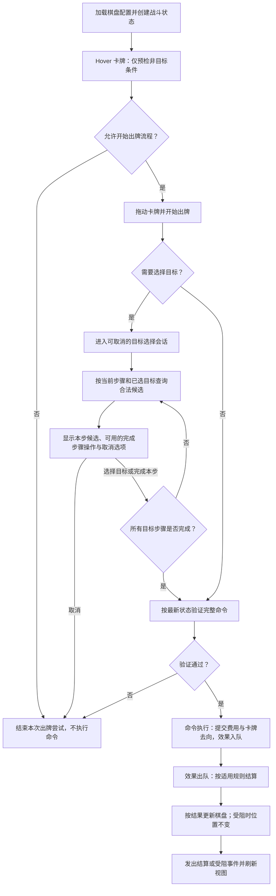

# 棋盘与坐标系统

- 文档版本：v0.1
- 文档状态：草案
- 负责人：
- 对应里程碑：
- 最后更新：2026-09-27
- 相关GDD：[卡牌系统](../../GDD/核心系统/卡牌系统.md)、[棋盘系统](../../GDD/核心系统/战棋系统/棋盘系统.md)、[实体系统](../../GDD/核心系统/战棋系统/实体系统.md)
- 相关模块：[实体与状态系统](实体与状态系统.md)、[卡牌与效果系统](卡牌与效果系统.md)、[UI与输入](../UI与输入.md)
- 相关ADR：

## 1. 职责

棋盘负责格子范围、地形布置、实体占位和逻辑坐标，提供边界、地形于占位查询，并维护实体移动后的占位状态。实体生命值等属性由实体系统维护；卡牌效果由卡牌与效果结算模块负责；移动距离、路径和回合条件由规则模块判定。UI与动画读取结算结果进行展示，不决定棋盘规则。

## 2. 设计约束

- 所有实体不能在棋盘外，也不能移动到棋牌外
- 每个格子上可以被多个实体，但至多只能被一个占据类型的实体占据
- 实体和部分地形都会阻挡实体移动
- 地形由其属性来决定是否能承载实体，以及实体在其格子上的响应
- 技术上最大棋盘为10×10
- 战斗规则需要能脱离动画验证
- 同一关卡的初始棋盘形式固定

## 3. 核心概念

- **格子**指的是棋盘上的一块块的方形区域
- **地形**指的是每个格子的具体形式，如有的格子是普通地块，而有的格子是水域
- **占位**指的是占据型实体在某个有效格之上，该有效格则被占据，其他占据型实体就不能进入该格，也不能移动途径该格
- **有效格**指的是可以承载实体的格子
- **可进入格**指的是未被其他实体占据的有效格
- 格子模型的轴心应当置于该格子的x、z中心处
- 格子的逻辑格坐标映射到格子模型的世界坐标（即格子模型的轴心处）
- 逻辑格坐标的原点(0,0)映射到x、z坐标均最小的格子的世界坐标（轴心），逻辑格坐标的轴向与格子的世界坐标的轴向一致
- 逻辑格坐标中的距离定义为曼哈顿距离

## 4. 数据模型

### BoardDefinition

| 关键字段 | 类型 | 说明 |
| --- | --- | --- |
| `length` | 整数 | 棋盘逻辑布局第一维的格子数。 |
| `width` | 整数 | 棋盘逻辑布局第二维的格子数。 |
| `gridCells[length*width]` | 格子类型的一维数组 | 存储棋盘上对应格子的类型；第一维索引 `i` 的范围为 `0` 至 `length - 1`，第二维索引 `j` 的范围为 `0` 至 `width - 1`，对应的一维索引为 `i * width + j`。 |

### BoardState

| 关键字段 | 类型 | 说明 |
| --- | --- | --- |
| `cellsState[]` | `CellState` 数组 | 存储整个棋盘中每个格子的运行时状态；数组长度为 `length * width`，索引方式与 `BoardDefinition.gridCells` 一致。 |

### CellState

| 关键字段 | 类型 | 说明 |
| --- | --- | --- |
| `entities[]` | 实体 ID 数组 | 存储位于该格的全部实体，包括占据类型与非占据类型实体；同一实体 ID 不得重复。 |
| `occupiedBy` | 可空实体 ID | 指向该格唯一的占据类型实体；为空表示该格没有占据类型实体。非空时，该 ID 必须存在于 `entities[]` 中。 |
| `isOccupied` | 只读派生属性（布尔值） | 由 `occupiedBy` 是否为空计算，不单独存储。 |

## 5. 运行流程

战斗初始化时，根据 `BoardDefinition` 创建包含 `BoardState` 的战斗状态。卡牌 Hover 只检查费用、回合等非目标条件；`canStartSelection` 只表示能否开始出牌流程，不检查是否存在合法格子或实体，离开 Hover 后重置为 `false`。需要目标的卡牌在进入选择会话后，才根据当前步骤和已选目标查询合法候选；没有候选且未达到本步最少选择数量时保留取消选项，已达到最少数量时可确认完成本步。取消不会提交命令或消耗卡牌与费用。收齐目标后，命令按最新状态重新验证；无目标卡牌跳过选择会话。验证通过后先生成运行时效果对象，再提交费用与卡牌去向并将效果入队。效果出队后按当前状态结算；推动或拉动受阻可使棋盘位置不变，但仍发出受阻结果，且不退还卡牌与费用。

## 6. 状态与生命周期

`BoardDefinition` 是只读的棋盘配置；`BoardState` 是每场战斗独立创建的运行时状态，随所属 `BattleState` 存在。格子的固定类型和属性来自 `BoardDefinition`，`BoardState` 只记录实体分布等会在战斗中变化的状态，不将运行时变更写回配置资产。

| 阶段 | 棋盘状态的处理 |
| --- | --- |
| 战斗初始化 | `BattleFlow` 根据 `BoardDefinition`、遭遇配置和 `RunState` 创建 `BattleState`。校验棋盘尺寸与 `gridCells` 数量，为每个格子建立空的 `CellState`，再通过 `BattleState` 放置初始实体，并同步实体位置与格子索引。初始化完成后，棋盘进入可查询、可接受合法战斗操作的状态。 |
| 战斗进行中 | 目标选择和规则验证可以读取棋盘状态，但不修改它。命令执行产生的战斗效果通过 `BattleState` 统一放置、移动或移除实体；`BattleState` 同步更新 `EntityState` 的位置、`CellState.entities[]` 和 `occupiedBy`。变更成功后发出表现事件，由视图更新画面；动画进度不决定规则状态。 |
| 战斗结束 | 战斗结束后停止接受新的棋盘变更。表现层清理本场棋盘视图，`BoardState` 随 `BattleState` 一起退出本场战斗生命周期；`BoardDefinition` 仍可供其他战斗复用。 |

状态变更必须保持以下约束：

- `cellsState[]` 的长度始终等于 `length * width`，并与 `BoardDefinition.gridCells` 使用相同的索引规则。
- 每个已放置实体的 ID 在整张棋盘的 `entities[]` 中恰好出现一次，所在格与 `EntityState` 记录的位置一致；移除实体时同时清除对应的格子索引。
- 每格至多有一个占据类型实体。`occupiedBy` 非空时必须指向该格 `entities[]` 中的占据类型实体；`isOccupied` 由 `occupiedBy` 派生。
- 移动操作在规则验证通过后统一提交：从原格移除实体、加入目标格，并更新实体位置。验证失败时不改变棋盘或实体状态。

## 7. 模块接口

下表约定模块之间传递的信息和状态修改权限，具体 C# 方法名可在实现时确定。查询、坐标转换和目标验证不修改 `BoardState`；实体的放置、移动和移除只通过 `BattleState` 统一提交。

| 接口能力 | 调用方 → 负责模块 | 输入 | 输出与约束 |
| --- | --- | --- | --- |
| 创建战斗棋盘 | `BattleFlow` → `BattleState` | `BoardDefinition`、遭遇配置、`RunState` | 校验配置并创建 `BoardState`，放置初始实体；配置或初始占位无效时返回明确失败，不对外提供未初始化完成的状态。 |
| 查询格子及固定属性 | 规则模块、目标选择模块 → 棋盘配置 | 逻辑格坐标 | 返回是否在棋盘内，以及对应的格子类型和固定属性；越界时返回无效结果，不访问数组。 |
| 查询格内实体与占位 | 规则模块、目标选择模块 → `BoardState` | 逻辑格坐标 | 返回只读的实体 ID 集合、`occupiedBy` 和派生的 `isOccupied`；调用方不能直接修改 `cellsState[]` 或 `entities[]`。 |
| 根据 ID 查询实体 | 规则模块、目标选择模块 → `BattleState` | `EntityId` | 返回对应的 `EntityState`；ID 不存在或实体已移除时返回明确失败。棋盘状态不保存 `GameObject` 引用。 |
| 坐标转换 | 鼠标交互、棋盘视图 → 坐标映射模块 | 世界空间命中点或逻辑格坐标 | 返回有效逻辑格坐标或格子中心的世界坐标；未命中棋盘时返回无效结果。转换本身不判定卡牌或移动是否合法。 |
| Hover 非目标预检 | 战斗 UI → `CommandProcessor` | 卡牌与当前战斗状态 | 只检查费用、回合等非目标条件，返回 `canStartSelection`；不查询合法格子或实体，不修改战斗状态。离开 Hover 后由战斗 UI 将结果重置为 `false`。 |
| 管理目标选择 | 战斗 UI、交互表现 → `TargetSelectionSession` | 卡牌、当前步骤、已选目标 | 保存选择进度；每一步都可取消，取消时清除会话与目标高亮，不提交命令或消耗卡牌与费用。 |
| 查询合法目标 | `TargetSelectionSession` → `TargetingService` | 卡牌、当前目标步骤、已选目标、当前 `BattleState` | 只查询当前步骤的合法格子或实体，返回候选集合，允许为空；实体目标以 `EntityId` 区分，同格多个实体不能仅用格坐标表示。无目标卡牌跳过选择会话。 |
| 提交命令 | `TargetSelectionSession` 或无目标卡的战斗 UI → `CommandProcessor` | 卡牌命令与完整的已选目标 | 基于最新状态验证完整命令；通过后按卡牌定义生成效果对象，再提交费用与卡牌去向，并加入 `BattleEffectQueue` 顺序结算。验证未通过时返回原因，不消耗费用或卡牌。 |
| 结算棋盘效果 | `BattleEffectQueue` → 规则模块 | 当前 `BattleState`、出队的放置、移动或推拉等效果 | 按最新位置、地形、占位和相关状态计算结算结果。推拉受阻可返回零位移和受阻原因，属于正常结算，不撤销已提交的费用与卡牌去向；规则模块不直接修改战斗状态。 |
| 变更棋盘实体 | `BattleEffectQueue` → `BattleState` | 规则结算结果中的实体 ID、起止坐标及状态变更 | 统一同步 `EntityState` 位置和 `BoardState` 的实体索引、占位索引；失败时不得只完成部分更新。 |
| 通知表现层 | `BattleEffectQueue` → `PresentationEventStream` → 棋盘与实体视图 | 已提交的实体或棋盘变化 | 状态成功更新后发出表现事件；视图据此刷新，不回写规则状态。 |

## 8. 异常与边界情况

| 情况 | 处理原则 |
| --- | --- |
| 棋盘配置无效 | `length`、`width` 必须大于 `0` 且各不超过 `10`，`gridCells` 数量必须等于 `length * width`；格子类型、初始实体位置或初始占位无效时，报告具体原因并终止本场战斗状态的创建。 |
| 坐标越界或鼠标未命中棋盘 | 不访问对应格子数组，不将其视为有效目标，也不提交棋盘变更；由交互层显示无效目标反馈。 |
| 目标不再有效 | 任一步选择后若实体被移除、位置改变，或目标格的占位发生变化，命令提交时重新验证；失败则不修改 `EntityState` 或 `BoardState`，也不发出成功结算的表现事件。 |
| 实体与占位冲突 | 未知或重复的实体 ID、重复放置、实体位置与格子索引不一致、同格出现第二个占据类型实体，均视为失败或状态错误；不得留下部分更新。 |
| 同格存在多个实体 | `entities[]` 包含该格全部实体，`occupiedBy` 仅表示其中唯一的占据类型实体。实体目标必须以 ID 指定；鼠标同时命中多个实体时，交互层需要明确最终选择的是哪个实体。 |
| 地形不允许承载或路径受阻 | 由规则模块结合固定格子属性、格内实体和当前效果判定；不因 `occupiedBy` 为空就直接认定目标可进入。推拉的目标只需满足卡牌规定的目标条件，不因推动路径受阻而被排除；效果出队后按推动规则得出实际位移，受阻时可为零，卡牌与费用照常消耗。非占据类型实体的具体阻挡规则尚待确定。 |
| 当前步骤无合法目标 | 选择界面显示空候选和取消选项；若已达到本步最少选择数量，也可确认完成本步。未达到最少数量时不自动打出卡牌或扣除费用，玩家取消后清除选择会话和高亮。 |
| 选择中取消或战斗已结束 | 任意选择步骤取消都不执行棋盘变更；战斗结束后拒绝新的战斗命令，并清理未完成的选择会话。 |

命令验证失败或状态提交错误时应返回可识别的原因，且不得留下部分棋盘或实体状态更新。推拉受阻是可识别的正常结算结果，不作为命令失败或费用回滚处理。

## 9. 调试和日志

- 开发调试视图可按需显示每格逻辑坐标、格子类型、`entities[]` 中的实体 ID、`occupiedBy`，以及当前卡牌的有效目标标记；显示内容只读取状态，不改变规则结果。
- 记录战斗棋盘创建失败、命令验证失败，以及实体放置、移动、移除的结果。日志至少包含战斗或命令标识、相关 `EntityId`、起止格、目标类型和失败原因；推拉结算还需区分实际位移与受阻原因，避免把正常受阻记成出牌失败。
- 在开发和测试环境中检查 `cellsState[]` 长度、实体位置与格子索引一致性、`occupiedBy` 所指实体的存在及占据类型。发现不变量被破坏时，日志应指出格坐标和实体 ID。
- 选择界面的逐候选验证可能频繁发生；详细候选日志仅在专门的调试开关下输出，避免常规运行时刷屏。

## 10. 测试计划

| 测试范围 | 关键用例与预期 |
| --- | --- |
| 配置与索引 | `1×1` 和 `10×10` 棋盘可正常创建；零或负尺寸、任一维超过 `10`、`gridCells` 数量不匹配时创建失败。检查首格、末格和边界外坐标的一维索引结果。 |
| 坐标转换 | 逻辑原点、各边角与格子中心在逻辑坐标和世界坐标之间按约定正确转换；鼠标命中棋盘外时不产生有效格目标。曼哈顿距离符合逻辑格坐标的定义。 |
| 格内实体与占位 | 空格、多个非占据类型实体同格、一个占据类型实体与其他实体同格均保持正确索引；第二个占据类型实体不能加入同格，`occupiedBy` 必须指向 `entities[]` 中的对应实体。 |
| 放置、移动与移除 | 成功操作后，`EntityState` 位置、源格与目标格的 `entities[]`、`occupiedBy` 一致；实体移除后不留残余索引。越界、不可承载地形、占位冲突和无效实体 ID 均不产生部分更新。 |
| 目标选择与命令提交 | Hover 只预检非目标条件，离开 Hover 后重置结果；进入选择界面后才查询当前步骤候选，允许候选为空。多步选择按已选目标筛选下一步目标，同格多个实体能以 ID 区分；任意步骤取消均不消耗卡牌或费用。无目标卡跳过选择会话，完整命令执行前重新验证并拒绝失效目标；推动路径受阻本身不排除符合卡牌条件的目标。 |
| 状态与表现一致性 | 出牌命令验证失败前后战斗状态一致，且不发出成功结算事件；合法打出后若推动受阻，卡牌与费用照常消耗，实体位置不变，并发出受阻结果供表现层反馈。实际状态提交先于表现事件，动画播放速度不影响规则结果。 |

## 11. 开放问题
