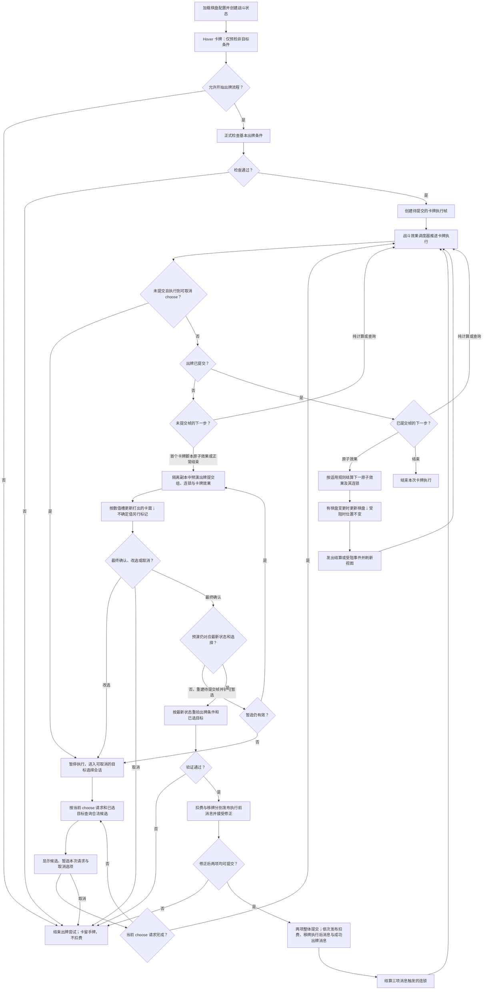

# 棋盘与坐标系统

- 文档版本：v0.1
- 文档状态：正式
- 对应里程碑：战斗垂直切片
- 最后更新：2026-10-01
- 相关GDD：[卡牌系统](../../GDD/核心系统/卡牌系统.md)、[棋盘系统](../../GDD/核心系统/战棋系统/棋盘系统.md)、[实体系统](../../GDD/核心系统/战棋系统/实体系统.md)
- 相关模块：[实体与状态系统](实体与状态系统.md)、[卡牌与效果系统](卡牌与效果系统.md)、[UI与输入](../UI与输入.md)
- 相关ADR：

## 1. 职责

棋盘负责格子范围、地形布置、实体占位和逻辑坐标，提供边界、地形于占位查询，并维护实体移动后的占位状态。实体生命值等属性由实体系统维护；卡牌效果由卡牌与效果结算模块负责；移动距离、路径和回合条件由规则模块判定。UI与动画读取结算结果进行展示，不决定棋盘规则。

## 2. 设计约束

- 所有实体不能在棋盘外，也不能移动到棋牌外
- 每个格子上可以被多个实体，但至多只能被一个占据类型的实体占据
- 占据型实体和部分地形会阻挡实体移动；非占据型实体不占据所在格，也不阻挡其他实体的移动、推动、拉动等位移
- 地形由其属性来决定是否能承载实体，以及实体在其格子上的响应
- 技术上最大棋盘为10×10
- 战斗规则需要能脱离动画验证
- 同一关卡的初始棋盘形式固定

## 3. 核心概念

- **格子**指的是棋盘上的一块块的方形区域
- **地形**指的是每个格子的具体形式，如有的格子是普通地块，而有的格子是水域
- **占位**指的是占据型实体在某个有效格之上，该有效格则被占据，其他占据型实体就不能进入该格，也不能移动途径该格
- **非占据型实体**仍位于有效格并记录在该格的 `entities[]` 中，但不写入 `occupiedBy`，不占据该格，也不阻挡其他实体的移动、推动、拉动等位移
- **有效格**指的是可以承载实体的格子
- **可进入格**指的是未被其他实体占据的有效格
- 格子模型的轴心应当置于该格子的x、z中心处
- 格子的逻辑格坐标映射到格子模型的世界坐标（即格子模型的轴心处）
- 逻辑格坐标的原点(0,0)映射到x、z坐标均最小的格子的世界坐标（轴心），逻辑格坐标的轴向与格子的世界坐标的轴向一致
- 逻辑格坐标中的距离定义为曼哈顿距离

## 4. 数据模型

### BoardDefinition

| 关键字段 | 类型 | 说明 |
| --- | --- | --- |
| `length` | 整数 | 棋盘逻辑布局第一维的格子数。 |
| `width` | 整数 | 棋盘逻辑布局第二维的格子数。 |
| `gridCells[length*width]` | 格子类型的一维数组 | 存储棋盘上对应格子的类型；第一维索引 `i` 的范围为 `0` 至 `length - 1`，第二维索引 `j` 的范围为 `0` 至 `width - 1`，对应的一维索引为 `i * width + j`。 |

### BoardState

| 关键字段 | 类型 | 说明 |
| --- | --- | --- |
| `cellsState[]` | `CellState` 数组 | 存储整个棋盘中每个格子的运行时状态；数组长度为 `length * width`，索引方式与 `BoardDefinition.gridCells` 一致。 |

### CellState

| 关键字段 | 类型 | 说明 |
| --- | --- | --- |
| `entities[]` | 实体 ID 数组 | 存储位于该格的全部实体，包括占据类型与非占据类型实体；同一实体 ID 不得重复。 |
| `occupiedBy` | 可空实体 ID | 指向该格唯一的占据类型实体；为空表示该格没有占据类型实体。非空时，该 ID 必须存在于 `entities[]` 中。 |
| `isOccupied` | 只读派生属性（布尔值） | 由 `occupiedBy` 是否为空计算，不单独存储。 |

## 5. 运行流程

战斗初始化时，根据 `BoardDefinition` 创建包含 `BoardState` 的战斗状态。卡牌 Hover 只检查费用、回合等非目标条件，其中基础费用必须可支付；`canStartSelection` 只表示能否开始出牌尝试，不检查是否存在合法格子或实体，离开 Hover 后重置为 `false`。正式开始出牌尝试时仍按基础费用等基本条件检查，检查通过后创建待提交的卡牌执行帧交给 `BattleEffectScheduler`。执行到 `choose()` 时调度器暂停该帧，由 `ChoiceSession` 按当前选择请求和已选目标查询合法候选；没有候选且未达到该次请求的最少选择数量时保留取消选项，已达到最少数量时可暂选完成该次请求。所有可取消的 `choose()` 都在首个卡牌脚本原子效果和出牌提交组之前。玩家在最终确认前仍能改选或取消；取消则卡牌留在手牌且不扣费。无目标卡牌跳过选择会话，仍进入最终确认阶段。

全部可取消选择暂选完成后，规则预演以当前战斗和棋盘、牌区、状态运行时记录、执行帧及可复现随机状态的隔离副本，复用统一效果调度器。在副本中模拟扣费与移牌的整体提交、三项提交后消息及其连锁，再运行卡牌脚本与后续效果；棋盘效果按副本中的最新位置、占位、地形与目标状态判定。预演结果按卡牌定义显式绑定的数值槽刷新打出的卡面，显示最终修正后的效果请求值；随机、隐藏信息及依赖它们的数值标为不确定。预演不修改真实 `BattleState` 或 `BoardState`，不消耗真实随机数、不分配真实 `PlayId`，也不发出真实规则或表现事件。选择或权威状态变化使预演过期时，先重算并刷新卡面，才接受最终确认。

玩家最终确认后，仍须按最新状态复验基本出牌条件和已选目标；基础费用仍须可支付。复验通过后，调度器将扣费和移牌作为两个独立原子效果纳入一次出牌提交组，各自先发布可由状态返回有类型修正的执行前消息，再验证修正后的费用与卡牌去向。修正后任一项无法提交时，两项都不发生，也不发布执行后或成功出牌消息。两项可提交时统一更新状态，随后依次发布扣费执行后消息、移牌执行后消息与一次成功出牌消息；三项消息都分发后再结算它们触发的新效果，最后继续执行卡牌脚本。提交后不能取消出牌。之后效果按当前状态结算；推动或拉动受阻可使棋盘位置不变，但仍发出受阻结果，且不退还卡牌与费用。

## 6. 状态与生命周期

`BoardDefinition` 是只读的棋盘配置；`BoardState` 是每场战斗独立创建的运行时状态，随所属 `BattleState` 存在。格子的固定类型和属性来自 `BoardDefinition`，`BoardState` 只记录实体分布等会在战斗中变化的状态，不将运行时变更写回配置资产。

| 阶段 | 棋盘状态的处理 |
| --- | --- |
| 战斗初始化 | `BattleFlow` 根据 `BoardDefinition`、遭遇配置和 `RunState` 创建 `BattleState`。校验棋盘尺寸与 `gridCells` 数量，为每个格子建立空的 `CellState`，再通过 `BattleState` 放置初始实体，并同步实体位置与格子索引。初始化完成后，棋盘进入可查询、可接受合法战斗操作的状态。 |
| 战斗进行中 | 目标选择和规则验证可以读取权威棋盘状态，但不修改它；出牌预演只更新棋盘状态的隔离副本。确认后，命令执行产生的战斗效果通过 `BattleState` 统一放置、移动或移除实体；`BattleState` 同步更新 `EntityState` 的位置、`CellState.entities[]` 和 `occupiedBy`。变更成功后发出表现事件，由视图更新画面；动画进度不决定规则状态。 |
| 战斗结束 | 战斗结束后停止接受新的棋盘变更。表现层清理本场棋盘视图，`BoardState` 随 `BattleState` 一起退出本场战斗生命周期；`BoardDefinition` 仍可供其他战斗复用。 |

状态变更必须保持以下约束：

- `cellsState[]` 的长度始终等于 `length * width`，并与 `BoardDefinition.gridCells` 使用相同的索引规则。
- 每个已放置实体的 ID 在整张棋盘的 `entities[]` 中恰好出现一次，所在格与 `EntityState` 记录的位置一致；移除实体时同时清除对应的格子索引。
- 每格至多有一个占据类型实体。`occupiedBy` 非空时必须指向该格 `entities[]` 中的占据类型实体；`isOccupied` 由 `occupiedBy` 派生。
- 移动操作在规则验证通过后统一提交：从原格移除实体、加入目标格，并更新实体位置。验证失败时不改变棋盘或实体状态。

## 7. 模块接口

下表约定模块之间传递的信息和状态修改权限，具体 C# 方法名可在实现时确定。查询、坐标转换和目标验证不修改 `BoardState`；实体的放置、移动和移除只通过 `BattleState` 统一提交。

| 接口能力 | 调用方 → 负责模块 | 输入 | 输出与约束 |
| --- | --- | --- | --- |
| 创建战斗棋盘 | `BattleFlow` → `BattleState` | `BoardDefinition`、遭遇配置、`RunState` | 校验配置并创建 `BoardState`，放置初始实体；配置或初始占位无效时返回明确失败，不对外提供未初始化完成的状态。 |
| 查询格子及固定属性 | 规则模块、目标选择模块 → 棋盘配置 | 逻辑格坐标 | 返回是否在棋盘内，以及对应的格子类型和固定属性；越界时返回无效结果，不访问数组。 |
| 查询格内实体与占位 | 规则模块、目标选择模块 → `BoardState` | 逻辑格坐标 | 返回只读的实体 ID 集合、`occupiedBy` 和派生的 `isOccupied`；调用方不能直接修改 `cellsState[]` 或 `entities[]`。 |
| 根据 ID 查询实体 | 规则模块、目标选择模块 → `BattleState` | `EntityId` | 返回对应的 `EntityState`；ID 不存在或实体已移除时返回明确失败。棋盘状态不保存 `GameObject` 引用。 |
| 坐标转换 | 鼠标交互、棋盘视图 → 坐标映射模块 | 世界空间命中点或逻辑格坐标 | 返回有效逻辑格坐标或格子中心的世界坐标；未命中棋盘时返回无效结果。转换本身不判定卡牌或移动是否合法。 |
| Hover 非目标预检 | 战斗 UI → `CommandProcessor` | 卡牌与当前战斗状态 | 只检查基础费用可支付、回合等非目标条件，返回 `canStartSelection`；该值只表示可开始出牌尝试，不查询合法格子或实体，也不修改战斗状态。离开 Hover 后由战斗 UI 将结果重置为 `false`。 |
| 开始出牌尝试 | 战斗 UI → `CommandProcessor` → `BattleEffectScheduler` | 手牌实例与当前战斗状态 | 正式检查基础费用可支付等基本出牌条件；通过后创建待提交的卡牌执行帧并开始推进。此时不扣费、不改变卡牌去向、不发布成功出牌记录。 |
| 管理目标选择 | 执行到 `choose()` 的 `BattleEffectScheduler`、战斗 UI → `ChoiceSession` | 当前选择请求、已选目标 | 暂停卡牌执行并保存选择进度；每个可取消请求都能取消。暂选后将结果交回等待中的卡牌执行，全部暂选完成后仍可改选。取消时清除会话与目标高亮，结束待提交出牌尝试，卡留手牌且不扣费。 |
| 查询合法目标 | `ChoiceSession` → `TargetingService` | 当前选择请求、已选目标、当前 `BattleState` | 只查询该次请求的合法格子或实体，返回候选集合，允许为空；实体目标以 `EntityId` 区分，同格多个实体不能仅用格坐标表示。未遇到 `choose()` 的卡牌跳过选择会话。 |
| 隔离预演与最终确认 | 待提交的卡牌执行帧、战斗 UI → 统一效果调度器 | 已暂选目标、当前状态及可复现随机状态的副本 | 在副本中模拟提交组、消息连锁与后续效果，供已绑定数值槽更新打出的卡面；不改权威棋盘或牌区，不推进真实随机状态，不发布真实规则或表现事件。随机、隐藏或依赖它们的数值标为不确定；过期预演须先按最新状态重算。玩家可改选、取消或最终确认。 |
| 提交出牌 | 最终确认后的待提交卡牌执行帧 → `CommandProcessor` → `BattleEffectScheduler` | 手牌实例与暂选目标 | 在首个卡牌脚本原子效果前按最新状态复验基本条件（包括基础费用可支付）和已选目标；通过后由调度器将扣费与移牌作为两个独立原子效果发布执行前消息并接受状态修正，验证修正结果后整体提交。任一项失败则两项都不发生；成功时依次发布扣费、移牌执行后消息与一次成功出牌消息，三项消息都分发后才结算连锁并继续脚本。可取消的 `choose()` 不得排在出牌提交组之后。 |
| 结算棋盘效果 | `BattleEffectScheduler` → 规则模块 | 当前 `BattleState`、待执行的放置、移动或推拉等原子效果 | 按最新位置、地形、占位和相关状态计算结算结果。推拉受阻可返回零位移和受阻原因，属于正常结算，不撤销已提交的费用与卡牌去向；规则模块不直接修改战斗状态。 |
| 变更棋盘实体 | `BattleEffectScheduler` → `BattleState` | 规则结算结果中的实体 ID、起止坐标及状态变更 | 统一同步 `EntityState` 位置和 `BoardState` 的实体索引、占位索引；失败时不得只完成部分更新。 |
| 通知表现层 | `BattleEffectScheduler` → `PresentationEventStream` → 棋盘与实体视图 | 已提交的实体或棋盘变化 | 状态成功更新后发出表现事件；视图据此刷新，不回写规则状态。 |

## 8. 异常与边界情况

| 情况 | 处理原则 |
| --- | --- |
| 棋盘配置无效 | `length`、`width` 必须大于 `0` 且各不超过 `10`，`gridCells` 数量必须等于 `length * width`；格子类型、初始实体位置或初始占位无效时，报告具体原因并终止本场战斗状态的创建。 |
| 坐标越界或鼠标未命中棋盘 | 不访问对应格子数组，不将其视为有效目标，也不提交棋盘变更；由交互层显示无效目标反馈。 |
| 目标不再有效 | 任一步暂选后若实体被移除、位置改变，或目标格的占位发生变化，旧预演立即失效；先按最新状态刷新候选与预演。最终确认前复验仍失败则拒绝提交，允许重新暂选或取消，不修改权威 `EntityState` 或 `BoardState`，也不发出成功结算的表现事件。 |
| 实体与占位冲突 | 未知或重复的实体 ID、重复放置、实体位置与格子索引不一致、同格出现第二个占据类型实体，均视为失败或状态错误；不得留下部分更新。 |
| 同格存在多个实体 | `entities[]` 包含该格全部实体，`occupiedBy` 仅表示其中唯一的占据类型实体。实体目标必须以 ID 指定；鼠标同时命中多个实体时，交互层需要明确最终选择的是哪个实体。 |
| 地形不允许承载或路径受阻 | 由规则模块结合固定格子属性、占据型实体和当前效果判定；不因 `occupiedBy` 为空就直接认定目标可进入，仍须检查地形等规则。非占据型实体不占据格子，也不阻挡移动、推动、拉动等位移。推拉的目标只需满足卡牌规定的目标条件，不因推动路径受阻而被排除；效果出队后按推动规则得出实际位移，受阻时可为零，卡牌与费用照常消耗。 |
| 当前选择请求无合法目标 | 执行到 `choose()` 后，选择界面显示空候选和取消选项；若已达到该次请求的最少选择数量，也可完成本次暂选请求。未达到最少数量时不提交出牌或扣除费用，玩家取消后清除选择会话和高亮。 |
| 选择或最终确认前取消、战斗已结束 | 出牌提交组开始前的任意可取消 `choose()` 请求或最终确认阶段都可取消待提交尝试，不执行权威棋盘变更，卡留手牌且不扣费；提交组开始后不再执行可取消的 `choose()`。战斗结束后拒绝新的战斗命令，并清理未完成的选择会话及预演。 |

命令验证失败或状态提交错误时应返回可识别的原因，且不得留下部分棋盘或实体状态更新。推拉受阻是可识别的正常结算结果，不作为命令失败或费用回滚处理。

## 9. 调试和日志

- 开发调试视图可按需显示每格逻辑坐标、格子类型、`entities[]` 中的实体 ID、`occupiedBy`，以及当前卡牌的有效目标标记；显示内容只读取状态，不改变规则结果。
- 记录战斗棋盘创建失败、命令验证失败，以及实体放置、移动、移除的结果。日志至少包含战斗或命令标识、相关 `EntityId`、起止格、目标类型和失败原因；推拉结算还需区分实际位移与受阻原因，避免把正常受阻记成出牌失败。
- 在开发和测试环境中检查 `cellsState[]` 长度、实体位置与格子索引一致性、`occupiedBy` 所指实体的存在及占据类型。发现不变量被破坏时，日志应指出格坐标和实体 ID。
- 选择界面的逐候选验证可能频繁发生；详细候选日志仅在专门的调试开关下输出，避免常规运行时刷屏。

## 10. 测试计划

| 测试范围 | 关键用例与预期 |
| --- | --- |
| 配置与索引 | `1×1` 和 `10×10` 棋盘可正常创建；零或负尺寸、任一维超过 `10`、`gridCells` 数量不匹配时创建失败。检查首格、末格和边界外坐标的一维索引结果。 |
| 坐标转换 | 逻辑原点、各边角与格子中心在逻辑坐标和世界坐标之间按约定正确转换；鼠标命中棋盘外时不产生有效格目标。曼哈顿距离符合逻辑格坐标的定义。 |
| 格内实体与占位 | 空格、多个非占据类型实体同格、一个占据类型实体与其他实体同格均保持正确索引；第二个占据类型实体不能加入同格，`occupiedBy` 必须指向 `entities[]` 中的对应实体。 |
| 放置、移动与移除 | 成功操作后，`EntityState` 位置、源格与目标格的 `entities[]`、`occupiedBy` 一致；实体移除后不留残余索引。越界、不可承载地形、占位冲突和无效实体 ID 均不产生部分更新。 |
| 目标选择与出牌提交 | Hover 只预检基础费用可支付等非目标条件，离开 Hover 后重置结果；正式开始出牌尝试也先检查基础费用等基本条件，再让调度器执行至 `choose()` 并暂停请求选择。候选允许为空，多次 `choose()` 按已选结果筛选后续目标，同格多个实体能以 ID 区分；任意可取消请求或最终确认前取消均使卡留手牌且不扣费。没有 `choose()` 的卡牌跳过选择会话，但仍进入预演与最终确认；确认前过期预演需先重算，最终确认后按最新状态复验并拒绝失效目标。扣费与移牌各自的执行前消息可接受修正，修正后仍须全部可提交才整体生效；扣费、移牌的执行后消息和成功出牌消息按顺序分发后才结算连锁，出牌提交后不得再遇到可取消的 `choose()`。推动路径受阻本身不排除符合卡牌条件的目标。 |
| 隔离预演 | 模拟目标、棋盘位置与状态修正时使用副本的最新棋盘状态；预演提交组、成功出牌消息连锁及卡牌效果后，卡面按已绑定槽显示修正后的效果请求值。护盾使实际扣血为 0 时仍显示修正伤害值；随机、隐藏及依赖值显示不确定。改选或权威状态变化须使预演失效并重算；取消和未确认期间权威棋盘、牌区、随机序列、真实 `PlayId` 与真实消息均不变化。 |
| 状态与表现一致性 | 出牌命令验证失败前后战斗状态一致，且不发出成功结算事件；合法打出后若推动受阻，卡牌与费用照常消耗，实体位置不变，并发出受阻结果供表现层反馈。实际状态提交先于表现事件，动画播放速度不影响规则结果。 |

## 11. 开放问题
