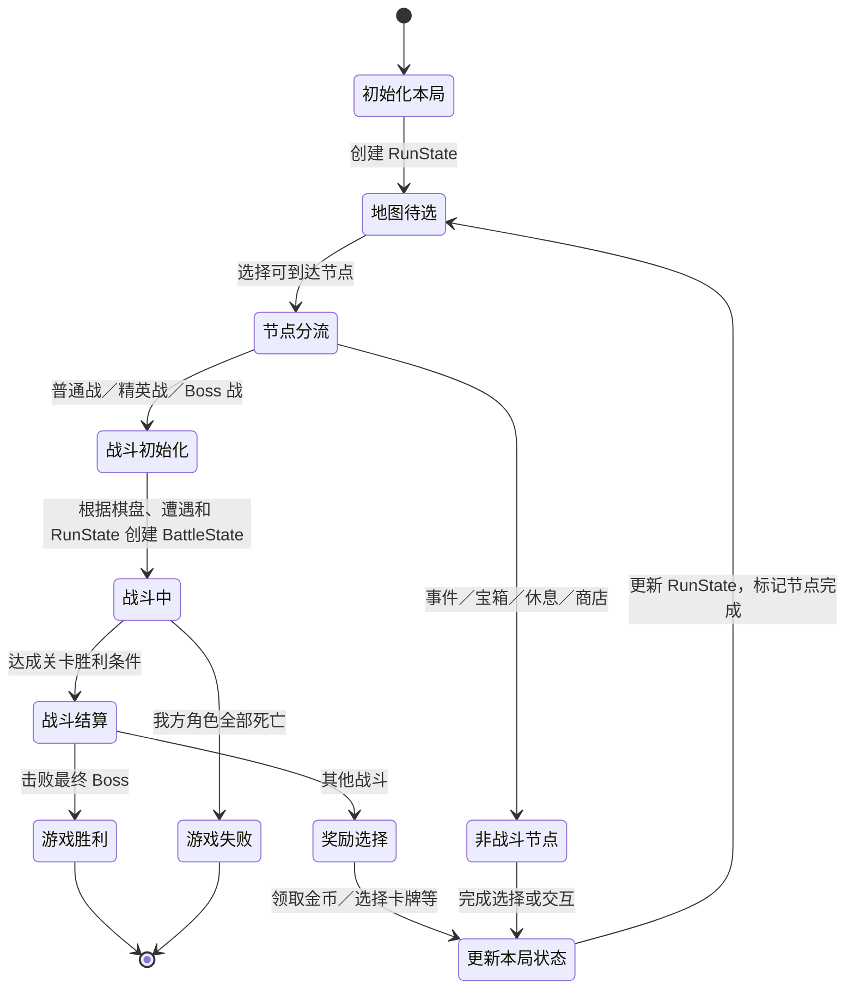

# Project Poly 技术设计概览

- 文档版本：v0.1
- 状态：草案
- 负责人：
- 对应里程碑：战斗垂直切片
- Unity 版本：6000.6.1f1
- 目标平台：PC
- 最后更新：
- 相关GDD：
- 相关ADR：

## 1. 目标

- 支持卡牌驱动多个棋盘实体
- 支持卡牌作用于实体、格子和全局
- 支持可预测、可测试的回合结算
- 支持通过配置添加卡牌、敌人
- 支持战斗奖励影响后续战斗
- 支持多个关卡的游戏进程

## 2. 非目标

当前暂不实现：

- 完整商店
- 完整事件系统
- 完整天赋树
- 全部关卡内容

## 3. 技术约束

- 使用Unity 6000.6
- 使用URP渲染管线
- 战斗规则应能脱离动画速度进行验证
- 使用json和ScriptableObject持久化数据

## 4. 总体架构

```mermaid
flowchart TB
    subgraph Presentation["表现层 · Unity"]
        BattleUI["战斗 UI<br/>手牌、费用、意图、状态"]
        Interaction["交互表现<br/>Hover、目标预览、取消"]
        CoordinateMapper["BoardCoordinateMapper<br/>世界位置 ↔ 逻辑格坐标"]
        WorldView["棋盘与实体视图"]
        Feedback["动画、VFX、音频、镜头"]
    end

    subgraph Application["应用层 · 流程编排"]
        GameFlow["GameFlow<br/>地图 → 战斗 → 奖励"]
        BattleFlow["BattleFlow<br/>战斗创建与结束"]
        TurnSM["TurnStateMachine<br/>回合与阶段"]
        Selection["TargetSelectionSession<br/>选择步骤、已选目标、取消"]
        Targeting["TargetingService<br/>合法目标查询"]
        Commands["CommandProcessor<br/>非目标预检 / Validate / Execute"]
        BattleEffects["BattleEffectQueue<br/>战斗效果与连锁结算"]
        EventStream["PresentationEventStream<br/>表现事件"]
    end

    subgraph Domain["领域层 · C# 规则与状态"]
        CardDef["CardDefinition<br/>cost、type、targetSteps、effectLogic"]
        EffectLogic["CardEffectLogic<br/>BuildEffect：生成根效果"]
        RunState["RunState<br/>牌组、金币、地图进度"]
        BattleState["BattleState<br/>战斗状态；统一放置、移动、移除实体"]
        BoardState["BoardState<br/>格子 → 全部实体 ID；占格实体索引"]
        EntityState["EntityState<br/>实体位置、生命、状态、持续时间"]
        DeckState["DeckState<br/>抽牌、手牌、弃牌、消耗"]
        Rules["规则集合<br/>占格、移动、目标、伤害、状态、胜败"]
    end

    subgraph Content["只读 Unity 内容资产"]
        EntityDef["EntityDefinition<br/>occupiesCell：是否占格"]
        BoardDef["BoardDefinition<br/>棋盘尺寸、不可变格子属性"]
        EncounterDef["EncounterDefinition"]
        RewardDef["RewardDefinition"]
    end

    subgraph Infrastructure["基础设施"]
        InputAdapter["Input System Adapter"]
        SceneLoader["场景加载"]
        Persistence["存档与读取"]
        RandomService["可复现随机数"]
        Logging["日志与调试工具"]
    end

    InputAdapter --> BattleUI
    InputAdapter --> Interaction
    BattleUI -->|"Hover：非目标预检，返回 canStartSelection"| Commands
    BattleUI -->|"开始选择／取消"| Selection
    Interaction -->|"命中点转换为格坐标"| CoordinateMapper
    Interaction -->|"选择当前步骤目标／取消"| Selection
    WorldView -->|"格坐标转换为世界位置"| CoordinateMapper
    CardDef -->|"有序目标步骤"| Selection
    CardDef -->|"引用可编程效果策略"| EffectLogic
    Selection -->|"当前步骤与已选目标"| Targeting
    Targeting -->|"按步骤规则筛选候选"| Rules
    Targeting -->|"合法候选，可为空"| Selection
    Selection -->|"显示候选、可用的完成步骤操作与取消入口"| Interaction

    Selection -->|"完整目标：PlayCardCommand"| Commands
    BattleUI -->|"无目标卡：PlayCardCommand"| Commands
    CardDef -->|"费用、目标步骤与效果逻辑引用"| Commands
    Commands -->|"按最新状态验证完整出牌命令"| Rules
    Commands -->|"验证通过后调用 BuildEffect"| EffectLogic
    Commands -->|"验证通过：提交费用与卡牌去向"| BattleState
    Commands -->|"提交根效果并入队"| BattleEffects
    TurnSM -->|"回合开始／结束时的状态触发"| BattleEffects

    BattleEffects -->|"结算时调用适用规则"| Rules
    BattleEffects -->|"按结算结果更新战斗状态"| BattleState
    BattleState -->|"同步实体位置与状态"| EntityState
    BattleState -->|"同步空间与占格索引"| BoardState
    BattleEffects --> DeckState
    BattleEffects --> EventStream

    EntityDef -->|"占格属性"| Rules
    BoardDef -->|"固定格子属性"| Rules
    BoardDef -->|"棋盘尺寸"| CoordinateMapper
    BoardState -->|"当前占格情况"| Rules

    EventStream --> WorldView
    EventStream --> Feedback
    BattleState --> BattleUI

    GameFlow --> BattleFlow
    BattleFlow --> TurnSM
    TurnSM --> Commands
    TurnSM --> Rules

    RunState -->|"创建战斗初始状态"| BattleFlow
    BattleFlow -->|"BattleResult"| GameFlow
    GameFlow -->|"奖励与牌组更新"| RunState

    CardDef --> BattleFlow
    EntityDef --> BattleFlow
    BoardDef --> BattleFlow
    EncounterDef --> BattleFlow
    RewardDef --> GameFlow

    SceneLoader --> GameFlow
    Persistence <--> RunState
    RandomService --> Commands
    Logging --> Commands
```

`BoardCoordinateMapper` 只负责逻辑格坐标与 Unity 世界位置的双向转换；鼠标命中检测由交互层处理，目标与移动合法性由目标选择及规则模块判定。

卡牌 Hover 时只预检费用、回合等非目标条件，返回的 `canStartSelection` 表示是否可以开始出牌流程，不保证存在合法目标；离开 Hover 时由战斗 UI 将其重置为 `false`。需要目标的卡牌进入 `TargetSelectionSession` 后，才按当前步骤和已选目标查询候选；已开始的拖拽与选择会话不依赖 Hover 布尔值。每一步都提供取消入口；没有合法候选且尚未满足本步最少选择数量时只能取消，已满足最少数量时可确认完成本步。取消不提交命令。选择完成后，`CommandProcessor` 对完整命令按最新战斗状态执行 `Validate`，通过后才执行效果。无目标卡牌跳过选择会话，直接提交完整命令。

`CommandProcessor → 规则集合` 表示出牌命令的最终验证。验证通过后，命令处理器根据卡牌定义和目标绑定生成运行时效果对象，再提交费用与卡牌去向，并将效果加入 `BattleEffectQueue`。`BattleEffectQueue → 规则集合` 表示效果处理器在出队结算时调用适用的领域规则，不要求所有效果重复完整的出牌验证或调用同一个验证方法。例如推动需按当前战斗状态计算方向、阻挡、边界及相关状态；治疗则需遵守目标状态和生命上限。推动、拉动受阻属于正常效果结算，可产生零位移并发出受阻结果，不撤销已经提交的费用与卡牌去向。规则计算不直接修改战斗状态；效果处理器依据结果提交状态变更并发出表现事件。

`CardDefinition.effectLogic` 引用可编程的 `CardEffectLogic` 策略，而不是要求所有卡牌符合统一的序列化效果字段格式。简单卡牌可复用带参数的逻辑，复杂卡牌可由专门的 C# 逻辑实现 `BuildEffect`；策略读取本次目标绑定和只读战斗信息，返回一个根 `BattleEffect`，自身不改状态。若后续行为依赖前一效果的实际结算结果，应把判断留给效果出队阶段或由结算结果触发连锁效果，避免在 `BuildEffect` 时提前算定。根效果可产生有序的多个后续效果；卡牌定义和策略都不保存一次出牌的可变状态。

## 5. 核心运行流程

## 6. 性能和质量目标

- 目标帧率：60帧以上
- 目标分辨率：动态的可变分辨率，但游戏画面尺寸保持16：9
- 最大棋盘尺寸：10×10
- 最大同时存在实体：暂无限制
- 最大同时播放特效：暂无限制
- 支持的输入设备：鼠标（暂时）

## 7. 测试策略
