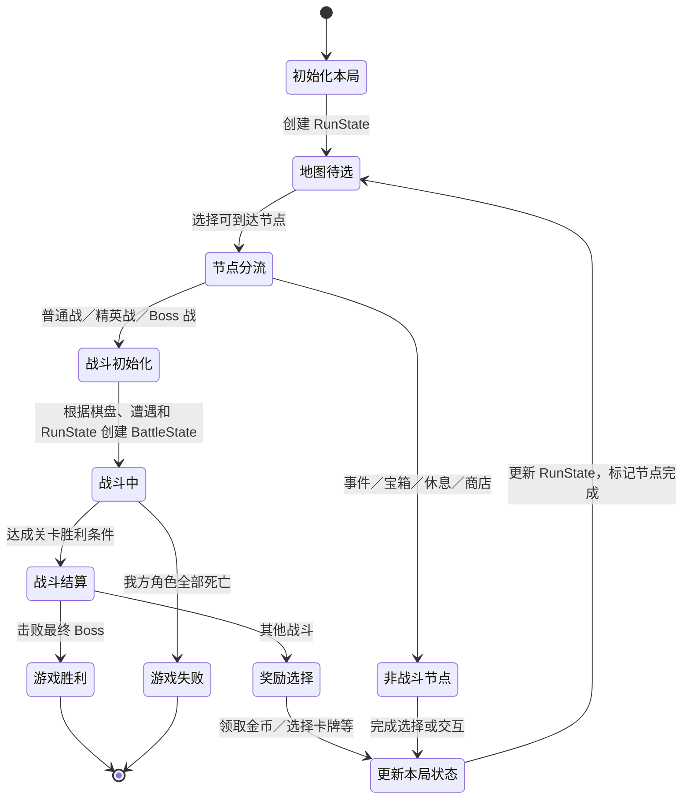

# Project Poly 技术设计概览

- 文档版本：v0.1
- 文档状态：草案
- 对应里程碑：战斗垂直切片
- Unity 版本：6000.6.1f1
- 目标平台：PC
- 最后更新：2026-09-30
- 相关GDD：
    - [游戏设计概览](../GDD/00_概览.md)
    - [核心循环](../GDD/01_核心循环.md)
    - [玩家行为和基础准则](../GDD/02_玩家行为与基础规则.md)
    - [卡牌系统](../GDD/核心系统/卡牌系统.md)
    - [棋盘系统](../GDD/核心系统/战棋系统/棋盘系统.md)
    - [实体系统](../GDD/核心系统/战棋系统/实体系统.md)
    - [地图节点系统](../GDD/核心系统/地图节点系统.md)
    - [奖励系统](../GDD/核心系统/奖励系统.md)
- 相关ADR：

## 1. 目标

- 支持卡牌驱动多个棋盘实体
- 支持卡牌作用于实体、格子和全局
- 支持可预测、可测试的回合结算
- 支持通过配置添加卡牌、敌人
- 支持战斗奖励影响后续战斗
- 支持多个关卡的游戏进程

## 2. 非目标

当前暂不实现：

- 完整商店
- 完整事件系统
- 完整天赋树
- 全部关卡内容

## 3. 技术约束

- 使用Unity 6000.6
- 使用URP渲染管线
- 战斗规则应能脱离动画速度进行验证
- 使用json和ScriptableObject持久化数据

## 4. 总体架构

```mermaid
flowchart TB
    subgraph Presentation["表现层 · Unity"]
        BattleUI["战斗 UI<br/>手牌、费用、意图、状态"]
        Interaction["交互表现<br/>Hover、目标预览、取消"]
        CoordinateMapper["BoardCoordinateMapper<br/>世界位置 ↔ 逻辑格坐标"]
        WorldView["棋盘与实体视图"]
        Feedback["动画、VFX、音频、镜头"]
    end

    subgraph Application["应用层 · 流程编排"]
        GameFlow["GameFlow<br/>地图 → 战斗 → 奖励"]
        BattleFlow["BattleFlow<br/>战斗创建与结束"]
        TurnSM["TurnStateMachine<br/>回合与阶段"]
        Selection["ChoiceSession<br/>运行中 choose 请求、选择与取消"]
        Targeting["TargetingService<br/>合法目标查询"]
        Commands["CommandProcessor<br/>基本检查、提交复验与消费"]
        BattleEffects["BattleEffectScheduler<br/>可恢复执行帧、原子效果与嵌套连锁"]
        EventStream["PresentationEventStream<br/>表现事件"]
    end

    subgraph Domain["领域层 · C# 规则与状态"]
        CardDef["CardDefinition<br/>cost、type、effectLogic"]
        EffectLogic["CardEffectLogic<br/>BuildEffect：创建可恢复执行计划"]
        RunState["RunState<br/>牌组、金币、地图进度、角色状态"]
        CharacterState["CharacterState<br/>本局属性、天赋与当前生命"]
        BattleState["BattleState<br/>战斗状态；统一放置、移动、移除实体"]
        StatusDispatch["状态订阅分发<br/>按来源阵营、开局监听序号处理"]
        BoardState["BoardState<br/>格子 → 全部实体 ID；占格实体索引"]
        EntityState["EntityState<br/>实体位置、可选生命、临时型与永久型状态"]
        DeckState["DeckState<br/>抽牌、手牌、弃牌、消耗"]
        Rules["规则集合<br/>占格、移动、目标、伤害、状态、胜败"]
    end

    subgraph Content["只读 Unity 内容资产"]
        EntityDef["EntityDefinition<br/>occupiesCell、hasHealth、canReceiveStatuses"]
        BoardDef["BoardDefinition<br/>棋盘尺寸、不可变格子属性"]
        EncounterDef["EncounterDefinition"]
        RewardDef["RewardDefinition"]
    end

    subgraph Infrastructure["基础设施"]
        InputAdapter["Input System Adapter"]
        SceneLoader["场景加载"]
        Persistence["存档与读取"]
        RandomService["可复现随机数"]
        Logging["日志与调试工具"]
    end

    InputAdapter --> BattleUI
    InputAdapter --> Interaction
    BattleUI -->|"Hover：非目标预检，返回 canStartSelection"| Commands
    BattleUI -->|"开始出牌尝试"| Commands
    Interaction -->|"命中点转换为格坐标"| CoordinateMapper
    Interaction -->|"回应运行中的选择／取消"| Selection
    WorldView -->|"格坐标转换为世界位置"| CoordinateMapper
    CardDef -->|"引用可编程效果策略"| EffectLogic
    BattleEffects -->|"执行到 choose：暂停并发起请求"| Selection
    Selection -->|"当前 choose 条件与已选值"| Targeting
    Targeting -->|"按最新状态筛选候选"| Rules
    Targeting -->|"合法候选，可为空"| Selection
    Selection -->|"显示候选与取消入口"| Interaction
    Selection -->|"选择结果或取消：恢复或丢弃执行帧"| BattleEffects

    CardDef -->|"费用、类型与效果逻辑引用"| Commands
    Commands -->|"按最新状态检查基本出牌条件"| Rules
    Commands -->|"基本检查通过后调用 BuildEffect"| EffectLogic
    EffectLogic -->|"待提交的卡牌执行帧"| BattleEffects
    BattleEffects -->|"可取消选择完成：请求重验并提交"| Commands
    Commands -->|"成功提交费用与卡牌去向"| BattleState
    Commands -->|"成功出牌：发布一次通用记录"| StatusDispatch
    TurnSM -->|"回合开始／结束根效果"| BattleEffects
    BattleEffects -->|"每个原子效果：结算前与执行后通知"| StatusDispatch
    StatusDispatch -->|"依序返回修正或触发嵌套效果"| BattleEffects

    BattleEffects -->|"结算时调用适用规则"| Rules
    BattleEffects -->|"按结算结果更新战斗状态"| BattleState
    BattleState -->|"维护实体上的活动状态订阅"| StatusDispatch
    BattleState -->|"同步实体位置与状态"| EntityState
    BattleState -->|"同步空间与占格索引"| BoardState
    BattleEffects --> DeckState
    BattleEffects --> EventStream

    EntityDef -->|"占格属性"| Rules
    BoardDef -->|"固定格子属性"| Rules
    BoardDef -->|"棋盘尺寸"| CoordinateMapper
    BoardState -->|"当前占格情况"| Rules

    EventStream --> WorldView
    EventStream --> Feedback
    BattleState --> BattleUI

    GameFlow --> BattleFlow
    BattleFlow --> TurnSM
    TurnSM --> Commands
    TurnSM --> Rules

    RunState -->|"持有本局我方角色"| CharacterState
    RunState -->|"本局角色数据与牌组"| BattleFlow
    CharacterState -->|"每场建立我方战斗实体"| BattleFlow
    BattleFlow -->|"BattleResult"| GameFlow
    GameFlow -->|"奖励、角色成长与牌组更新"| RunState

    CardDef --> BattleFlow
    EntityDef -->|"本局开始创建我方角色"| CharacterState
    EntityDef -->|"创建敌方与中立战斗实体"| BattleFlow
    BoardDef --> BattleFlow
    EncounterDef --> BattleFlow
    RewardDef --> GameFlow

    SceneLoader --> GameFlow
    Persistence <--> RunState
    RandomService --> Commands
    Logging --> Commands
```



`EntityDefinition` 决定实体是否占格、是否有生命以及是否可受状态；角色必须有生命，非角色可按定义决定。仅有生命的 `EntityState` 记录当前生命和可变生命上限。状态分为临时型和永久型：Buff／Debuff 是临时型的典型代表，能力牌施加到实体的能力效果是永久型的典型代表。临时状态的层数同时表示数值和剩余回合数，同名状态层数相加，例如 3 层再获得 1 层变为 4 层、持续 4 个对应回合。临时状态存在时即可响应适用效果，不受当前阵营回合限制；我方与敌方实体在所属阵营回合结束时减 1 层，施加当回合也扣减；中立实体在双方各完成一个回合后减 1 层。永久状态在任一方回合均可生效且不按回合到期。同名永久状态无数值时重复获得不产生额外效果，有数值时将数值相加。两类状态都在战斗结束时清除，不带入下一场战斗；`CharacterState` 中的天赋则跨战斗保留。

活动状态附着于战斗实体，并在规则层订阅适用的出牌与原子效果消息。成功出牌提交时发布一份通用出牌记录，带有本次出牌标识，相关卡牌效果引用该标识；其他来源的效果可没有出牌标识。对具有效果来源阵营的效果，先按战斗开始确定的监听序号升序检查来源阵营的在场角色，再按同一规则检查另一阵营的在场角色；同一角色身上的状态按其当前活动状态首次获得的顺序处理。监听者自行判断范围与条件，因此范围能力可以响应队友的效果。监听序号的生成规则，以及中立、非角色、无来源或多来源效果的分发顺序待定。

`BattleEffectScheduler` 在原子效果结算前发布可修正的消息：订阅者返回有类型的修正提案，调度器按上述顺序依次应用，再依据最新 `BattleState` 结算效果并提交变更。效果执行后还会发布执行通知；即使实际扣血为 0，已执行的 `DamageEffect` 仍可触发“造成攻击伤害时抽牌”等能力。能力调用 `draw(1)` 会产生独立 `DrawEffect`，也由同一调度器发布消息、结算及处理连锁；这条连锁结束后才恢复父效果调用和卡牌脚本。结算前修正与执行后触发属于规则消息，和仅供 UI、动画读取的 `PresentationEventStream` 分开。回合开始／结束效果也由该调度器处理；回合通知与状态衰减的具体先后、目标改写后的重派发规则仍待确定。

`EntityDefinition` 是所有实体的只读初始模板。一局开始时，据此为我方角色创建各自的 `CharacterState`，由 `RunState` 持续持有；角色的属性与天赋成长、当前生命在同一局中跨战斗保留。每场战斗开始时，`BattleFlow` 从 `CharacterState` 建立新的我方 `EntityState` 投影，不从定义重置角色成长；敌方和中立实体可在战斗创建或战斗中出现时从定义创建 `EntityState`。战斗结算后，角色的当前生命同步回 `CharacterState`。具体属性合成方式与天赋规则待定。

`BoardCoordinateMapper` 只负责逻辑格坐标与 Unity 世界位置的双向转换；鼠标命中检测由交互层处理，目标与移动合法性由目标选择及规则模块判定。

卡牌 Hover 时只预检费用、回合等基本出牌条件，返回的 `canStartSelection` 表示是否可以开始出牌尝试，不保证后续 `choose()` 有合法候选；离开 Hover 时由战斗 UI 将其重置为 `false`。正式尝试出牌时，`CommandProcessor` 检查基本条件，通过后启动卡牌的可恢复执行计划。计划执行到 `choose()` 时，调度器暂停该执行帧，通过 `ChoiceSession` 按最新战斗状态查询合法候选并等待 UI 选择。所有可取消选择均须发生在首个原子效果之前；原子效果即使本身不改状态，也可能经规则通知触发连锁变化。取消时丢弃执行帧，卡牌仍在手牌，费用不扣，也不发布成功出牌记录。可取消选择完成后，首个原子效果执行前按最新状态复验出牌条件，成功才提交费用和卡牌去向，发布一次成功出牌记录；若计划没有原子效果，则在正常结束前复验并提交。无目标卡牌跳过选择会话，仍须复验和提交。

`CommandProcessor → 规则集合` 表示基本条件检查和消费前的复验。`BattleEffectScheduler → 规则集合` 表示每个原子效果执行时按当前战斗状态调用适用的领域规则，不要求它重复完整的出牌验证。例如推动需按当时的位置、阻挡和边界计算实际移动；治疗需遵守目标状态和生命上限。推动、拉动受阻属于正常效果结算，可产生零位移并发出受阻结果，不撤销已经提交的费用与卡牌去向。规则计算不直接修改战斗状态；调度器依据结果提交状态变更并发出表现事件。

`CardDefinition.effectLogic` 引用可编程的 `CardEffectLogic` 策略，而不是要求所有卡牌符合统一的序列化效果字段格式。简单卡牌可复用带参数的逻辑，复杂卡牌可由专门的 C# 逻辑实现 `BuildEffect`；它只创建本次出牌的可恢复执行计划，不弹出选择 UI、不预先结算效果，也不改战斗状态。计划可以按顺序执行 `choose()`、`damage()`、`push()` 等调用；每次原子效果执行完、其引发的连锁结算完后才将结果返回脚本，供后续语句使用。`damage()` 返回按监听顺序修正后的伤害数值，实际生命变化另记在效果结果中。卡牌定义和策略不保存一次出牌的可变状态。

## 5. 核心运行流程



## 6. 性能和质量目标

- 目标帧率：60帧以上
- 目标分辨率：动态的可变分辨率，但游戏画面尺寸保持16：9
- 最大棋盘尺寸：10×10
- 最大同时存在实体：暂无限制
- 最大同时播放特效：暂无限制
- 支持的输入设备：鼠标（暂时）

## 7. 测试策略

下面的伪代码用于核对可暂停的选择与原子效果顺序，并非已有玩法代码：

```text
effect(){
    enemy = choose(entity);
    damage(enemy,6);
    push(enemy,2);
}
```

文档阶段核对卡牌、实体状态、棋盘 TDD 与 GDD 的术语和时序一致性。后续实现时应验证取消选择不消费、消费前复验、状态修正顺序、`DamageEffect` 零扣血时的触发、嵌套 `DrawEffect` 在 `push()` 前完成，以及规则结果与表现动画速度解耦。当前没有已建立的自动化测试套件。
