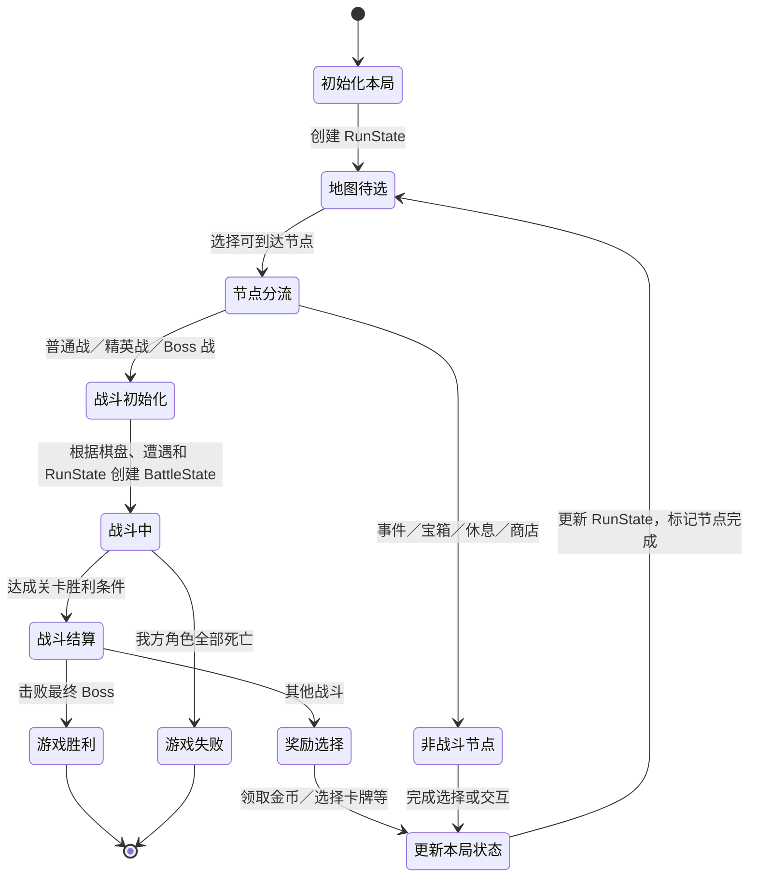

# Project Poly 技术设计概览

- 文档版本：v0.1
- 文档状态：草案
- 对应里程碑：战斗垂直切片
- Unity 版本：6000.6.1f1
- 目标平台：PC
- 最后更新：2026-10-04
- 相关GDD：
    - [游戏设计概览](../GDD/00_概览.md)
    - [核心循环](../GDD/01_核心循环.md)
    - [玩家行为和基础准则](../GDD/02_玩家行为与基础规则.md)
    - [卡牌系统](../GDD/核心系统/卡牌系统.md)
    - [棋盘系统](../GDD/核心系统/战棋系统/棋盘系统.md)
    - [实体系统](../GDD/核心系统/战棋系统/实体系统.md)
    - [地图节点系统](../GDD/核心系统/地图节点系统.md)
    - [奖励系统](../GDD/核心系统/奖励系统.md)
- 相关ADR：

## 1. 目标

- 支持卡牌驱动多个棋盘实体
- 支持卡牌作用于实体、格子和全局
- 支持可预测、可测试的回合结算
- 支持通过配置添加卡牌、敌人
- 支持战斗奖励影响后续战斗
- 支持多个关卡的游戏进程

## 2. 非目标

当前暂不实现：

- 完整商店
- 完整事件系统
- 完整天赋树
- 全部关卡内容

## 3. 技术约束

- 使用Unity 6000.6
- 使用URP渲染管线
- 战斗规则应能脱离动画速度进行验证
- 使用json和ScriptableObject持久化数据

## 4. 总体架构

```mermaid
flowchart TB
    subgraph Presentation["表现层 · Unity"]
        BattleUI["战斗 UI<br/>手牌、费用、意图、状态、卡面预演"]
        Interaction["交互表现<br/>Hover、目标暂选、改选、取消与最终确认"]
        CoordinateMapper["BoardCoordinateMapper<br/>世界位置 ↔ 逻辑格坐标"]
        WorldView["棋盘与实体视图"]
        Feedback["动画、VFX、音频、镜头"]
    end

    subgraph Application["应用层 · 流程编排"]
        GameFlow["GameFlow<br/>地图 → 战斗 → 奖励"]
        BattleFlow["BattleFlow<br/>战斗创建与结束"]
        TurnSM["TurnStateMachine<br/>回合与阶段"]
        Selection["ChoiceSession<br/>运行中 choose 请求、暂选、改选与取消"]
        Targeting["TargetingService<br/>合法目标查询"]
        Commands["CommandProcessor<br/>基本检查与提交复验"]
        BattleEffects["BattleEffectScheduler<br/>可恢复执行帧、原子效果与嵌套连锁"]
        Preview["规则预演<br/>隔离副本中复用统一调度器"]
        EventStream["PresentationEventStream<br/>表现事件"]
    end

    subgraph Domain["领域层 · C# 规则与状态"]
        CardDef["CardDefinition<br/>cost、type、effectLogic、卡面数值槽"]
        EffectLogic["CardEffectLogic<br/>可恢复的 effect() 程序定义"]
        RunState["RunState<br/>牌组、金币、地图进度、角色状态"]
        CharacterState["CharacterState<br/>本局属性、天赋、当前生命与复活冷却"]
        BattleState["BattleState<br/>战斗状态；统一放置、移动、移除实体"]
        StatusDispatch["状态订阅分发<br/>来源方：其他角色 → 非角色 → 来源者<br/>对应方：角色 → 非角色（跳过不监听侧）"]
        BoardState["BoardState<br/>格子 → 全部实体 ID；占格实体索引"]
        EntityState["EntityState<br/>实体位置、生命、格挡、临时型与永久型状态"]
        DeckState["DeckState<br/>抽牌、手牌、弃牌、消耗"]
        Rules["规则集合<br/>占格、移动、目标、伤害、状态、胜败"]
    end

    subgraph Content["只读 Unity 内容资产"]
        EntityDef["EntityDefinition<br/>faction、occupiesCell、初始生命上限、初始状态"]
        BoardDef["BoardDefinition<br/>棋盘尺寸、不可变格子属性"]
        EncounterDef["EncounterDefinition"]
        RewardDef["RewardDefinition"]
    end

    subgraph Infrastructure["基础设施"]
        InputAdapter["Input System Adapter"]
        SceneLoader["场景加载"]
        Persistence["存档与读取"]
        RandomService["可复现随机数"]
        Logging["日志与调试工具"]
    end

    InputAdapter --> BattleUI
    InputAdapter --> Interaction
    BattleUI -->|"Hover：非目标预检，返回 canStartSelection"| Commands
    BattleUI -->|"开始出牌尝试"| Commands
    Interaction -->|"命中点转换为格坐标"| CoordinateMapper
    Interaction -->|"回应运行中的选择、改选／取消"| Selection
    Interaction -->|"最终确认或取消"| BattleEffects
    WorldView -->|"格坐标转换为世界位置"| CoordinateMapper
    CardDef -->|"引用可编程效果策略"| EffectLogic
    BattleEffects -->|"执行到 choose：暂停并发起请求"| Selection
    Selection -->|"当前 choose 条件与已选值"| Targeting
    Targeting -->|"按最新状态筛选候选"| Rules
    Targeting -->|"合法候选，可为空"| Selection
    Selection -->|"显示候选与取消入口"| Interaction
    Selection -->|"暂选结果或取消：推进或丢弃待提交帧"| BattleEffects

    CardDef -->|"费用、类型与效果逻辑引用"| Commands
    Commands -->|"按最新状态检查基本出牌条件"| Rules
    Commands -->|"基本检查通过：启动本次卡牌程序"| BattleEffects
    EffectLogic -->|"供调度器运行的只读程序逻辑"| BattleEffects
    BattleEffects -->|"可取消选择完成：请求隔离预演"| Preview
    BattleState -->|"当前战斗与棋盘状态快照"| Preview
    DeckState -->|"牌区状态快照"| Preview
    RandomService -->|"可复现随机状态副本"| Preview
    Preview -->|"在副本中复用调度器规则"| BattleEffects
    Preview -->|"按已绑定数值槽刷新打出的卡面"| BattleUI
    BattleEffects -->|"最终确认：请求最新状态复验"| Commands
    Commands -->|"复验通过：启动出牌提交组"| BattleEffects
    BattleEffects -->|"扣费与移牌两原子效果整体提交"| BattleState
    BattleEffects -->|"整体提交后发布成功出牌记录"| StatusDispatch
    TurnSM -->|"回合开始／结束根效果"| BattleEffects
    BattleEffects -->|"每个原子效果：执行前与执行后通知"| StatusDispatch
    StatusDispatch -->|"依序返回修正或触发嵌套效果"| BattleEffects

    BattleEffects -->|"结算时调用适用规则"| Rules
    BattleEffects -->|"按结算结果更新战斗状态"| BattleState
    BattleState -->|"维护实体上的活动状态订阅"| StatusDispatch
    BattleState -->|"同步实体位置与状态"| EntityState
    BattleState -->|"同步空间与占格索引"| BoardState
    BattleEffects --> DeckState
    BattleEffects --> EventStream

    EntityDef -->|"占格属性"| Rules
    BoardDef -->|"固定格子属性"| Rules
    BoardDef -->|"棋盘尺寸"| CoordinateMapper
    BoardState -->|"当前占格情况"| Rules

    EventStream --> WorldView
    EventStream --> Feedback
    BattleState --> BattleUI

    GameFlow --> BattleFlow
    BattleFlow --> TurnSM
    TurnSM --> Commands
    TurnSM --> Rules
    BattleUI -->|"结束我方回合请求"| TurnSM
    BattleUI -->|"部署冷却结束的角色"| Commands

    RunState -->|"持有本局我方角色"| CharacterState
    RunState -->|"本局角色数据与牌组"| BattleFlow
    CharacterState -->|"每场建立我方战斗实体"| BattleFlow
    BattleFlow -->|"BattleResult"| GameFlow
    GameFlow -->|"奖励、角色成长与牌组更新"| RunState

    CardDef --> BattleFlow
    EntityDef -->|"本局开始创建我方角色"| CharacterState
    EntityDef -->|"创建敌方与中立战斗实体"| BattleFlow
    BoardDef --> BattleFlow
    EncounterDef --> BattleFlow
    RewardDef --> GameFlow

    SceneLoader --> GameFlow
    Persistence <--> RunState
    RandomService --> Commands
    Logging --> Commands
```



`EntityDefinition` 定义所有实体的阵营、是否占格与初始状态；所有实体都有生命与格挡且都可接收状态，`EntityState` 记录当前生命、可变生命上限与格挡，并在创建时从定义取得本场固定的阵营。伤害先扣格挡再扣生命；生命或生命上限降至 `0`，或受到直接移除效果时，实体立即移除。非占据型实体仍登记在所在格的 `entities[]` 中，但不写入 `occupiedBy`，不占据格子，也不阻挡其他实体的移动、推动、拉动等位移。

状态分为临时型和永久型：Buff／Debuff 是临时型的典型代表，能力牌施加到实体的能力效果是永久型的典型代表。临时状态的层数同时表示数值和剩余回合数，同名状态层数相加，例如 3 层再获得 1 层变为 4 层、持续 4 个对应回合。具有监听资格的实体所持临时状态可响应适用效果，不受当前阵营回合限制；我方与敌方实体在所属阵营回合结束时减 1 层，施加当回合也扣减；中立实体在双方各完成一个回合后减 1 层，可持有状态但不监听效果通知。永久状态在任一方回合均可生效且不按回合到期，按 `StatusDefinition.repeatMode` 分为三种重复模式：可重复可叠加时合并实例并累加数据字段，UI 显示一个图标及累计值；可重复不可叠加时保留独立实例，数值字段不合并，UI 按实例重复显示图标；不可重复不可叠加时保留唯一实例，数值字段统一为 `0`，UI 不重复显示图标且不显示对应数值。具有监听资格的实体把状态实例分为永久区与临时区加入效果订阅列表，先处理永久区、再处理临时区，各区按获得顺序；合并时保留原有位置，新实例排到对应分区末尾。获得、移除状态与减少层数都是原子效果，只有回合末的自然衰减直接提交。带内置计数器的能力不使用可重复可叠加模式。详细数据模型见[实体与状态系统](战斗系统/实体与状态系统.md)。两类状态都在战斗结束时清除，不带入下一场战斗；`CharacterState` 中的天赋则跨战斗保留。

活动状态附着于战斗实体，具有监听资格的实体所持状态在规则层订阅适用的原子效果消息；出牌记录的订阅范围仍待确定。成功出牌提交时发布一份通用出牌记录，带有本次出牌标识，相关卡牌效果引用该标识；其他来源的效果可没有出牌标识。`BattleState` 保存本场出牌历史，供“每回合第一张攻击牌”等能力查询。每个效果按来源阵营与本次交互的一个对应阵营路由：来源方其他在场角色 → 来源方其他在场非角色实体 → 来源实体本人 → 对应方在场角色 → 对应方在场非角色实体，各组按监听序号升序，来源本人不在前两组中重复处理。每个实体内部先永久区、后临时区，各区按状态实例获得顺序处理，监听者自行判断范围与条件。对应阵营取作用对象所属阵营，与来源阵营相同时只遍历该阵营一次；状态触发的效果默认以持有者为来源。中立每次只与另一个阵营交互，中立侧不监听效果通知；无明确来源使用无监听者的虚拟阵营，同样只与一个对应阵营配对，该分类仅用于路由。多来源、多目标操作生成多个效果按产生顺序依次入队，各效果分别发布前后通知并按最新状态结算。监听序号在每个阵营内唯一，且不回收：我方开局按出战顺序为全部本局角色赋号，敌方开局按遭遇配置的监听顺序赋号；重新部署的我方角色沿用原序号，其他新增实体取本阵营已分配的最大序号加 `1`；实体移除时退出监听，仅在导致其移除的那次执行后消息中再接收一次；中立实体不赋号。

`BattleEffectScheduler` 对同一原子效果发布两个规则通知。执行前消息在规则计算与状态变更前发出，携带待结算的效果及请求值；订阅者返回有类型的修正提案，调度器按上述顺序依次应用；不设独立的取消修正，抵消效果即把请求数值修正为 0，效果仍属已执行。数值修正每次应用后四舍五入取整，不设硬上限。出队时目标已不在场的效果不结算，也不发布执行前、执行后消息。随后调度器依据最新 `BattleState` 结算并提交变化。执行后消息携带已提交的 `EffectResult`，供状态判断是否触发新效果。该消息先通知完全部监听者，各状态依据分发时的状态登记触发的效果，分发期间不改变战斗状态；随后调度器按登记顺序深度优先结算，每项连同其连锁稳定后才处理下一项，登记的效果不因持有者随后被移除而取消。效果的提交移除了实体（含来源本人）时，这次执行后消息仍按原监听位置通知被移除的实体一次，供反伤、“死亡时触发”等状态响应；其状态在该次分发结束后清除。即使实际扣血为 0，已执行的 `DamageEffect` 仍可触发“造成攻击伤害时抽牌”等能力。能力调用 `draw(1)` 会产生独立 `DrawEffect`，也由同一调度器发布消息、结算及处理连锁；这条连锁结束后才恢复父效果调用和卡牌脚本。出牌提交组是例外：扣费与移牌各自的执行前消息仍可接受修正，但两项验证通过后须整体提交，再依次发布扣费、移牌的执行后消息与成功出牌消息；这三项消息触发的新效果要等消息全部分发后才结算。两次规则通知都与仅供 UI、动画读取的 `PresentationEventStream` 分开。回合产生的效果也由该调度器处理；回合开始／结束通知仅由对应回合阵营的状态响应，按角色组、非角色组及各组监听序号、实体内状态获得顺序处理，另一阵营与中立不接收该回合通知。它与原子效果通知的双阵营路由不同；具体回合时序见[战斗流程与回合状态机](战斗系统/战斗流程与回合状态机.md)。目标改写后的重派发规则仍待确定。

`BattleFlow` 根据 `EncounterDefinition` 配置我方、敌方和中立实体的初始位置，依据本局牌组建立本场卡牌实例并先用战斗随机源洗牌。`TurnStateMachine` 固定我方先手，同一轮双方共用从 `1` 开始的编号。我方主动结束回合；未提交的出牌尝试先取消，已提交的出牌或部署及其连锁则先结算完，再处理待结束请求。只有敌方角色行动：初始行动顺序由遭遇定义提供，新增敌方角色追加到末尾，敌方结束状态触发阶段才出现的下一敌方回合才行动。意图在我方回合开始前生成，在我方回合开始阶段稳定后、每次完整行动及连锁稳定后刷新；敌方角色轮到行动时由 AI 按最新状态确定实际行动。我方角色死亡后进入跨战斗保存的 `3` 个我方回合复活冷却，冷却结束后可免费手动部署并以生命上限上场。战斗胜败在稳定状态下判断：场上没有敌方角色为胜，场上没有我方角色为负，同时满足时判失败。费用、牌区、回合阶段与结果的完整逻辑模型见[战斗流程与回合状态机](战斗系统/战斗流程与回合状态机.md)。

`EntityDefinition` 是所有实体的只读初始模板。一局开始时，据此为我方角色创建各自的 `CharacterState`，由 `RunState` 持续持有；角色的属性与天赋成长、当前生命在同一局中跨战斗保留。每场战斗开始时，`BattleFlow` 从 `CharacterState` 建立新的我方 `EntityState` 投影，不从定义重置角色成长；敌方和中立实体可在战斗创建或战斗中出现时从定义创建 `EntityState`。战斗结算后，角色的当前生命、复活冷却与永久生命上限变化同步回 `CharacterState`；只属于本场 `EntityState` 的临时生命上限变化不写回。具体属性合成方式与天赋规则待定。

`BoardCoordinateMapper` 只负责逻辑格坐标与 Unity 世界位置的双向转换；鼠标命中检测由交互层处理，目标与移动合法性由目标选择及规则模块判定。

卡牌 Hover 时只预检费用、回合等基本出牌条件，其中费用检查要求当前资源付得起卡牌的基础费用；返回的 `canStartSelection` 表示是否可以开始出牌尝试，不保证后续 `choose()` 有合法候选；离开 Hover 时由战斗 UI 将其重置为 `false`。正式尝试出牌时，`CommandProcessor` 仍按基础费用等基本条件检查，通过后把卡牌实例、打出者和 `effectLogic` 交给 `BattleEffectScheduler`；调度器创建本次出牌的 `EffectExecutionFrame` 并运行程序。程序执行到 `choose()` 时，调度器暂停该执行帧，通过 `ChoiceSession` 按最新战斗状态查询合法候选并等待 UI 暂选。所有可取消选择均须发生在首个卡牌脚本原子效果及出牌提交组之前；原子效果即使本身不改状态，也可能经规则通知触发连锁变化。全部可取消选择暂选完成后进入最终确认阶段；玩家仍可改选或取消。无目标卡牌跳过选择会话，也进入该阶段。取消时丢弃待提交执行帧，卡牌仍在手牌，费用不扣，也不发布成功出牌记录。

最终确认前，规则预演以本次结算会读取的全部可变规则输入建立隔离副本，包括当前 `BattleState`（含棋盘）、牌区、活动状态及其运行时记录、待提交执行帧和可复现随机状态，复用正式出牌的统一效果调度规则。预演在副本中经历扣费与移牌的出牌提交组、扣费执行后消息、移牌执行后消息、成功出牌消息及其连锁，再继续运行卡牌脚本的原子效果与后续连锁，因此卡面上的确定数值包含提交消息带来的修正。`CardDefinition` 显式标记可变卡面数值槽，预演结果按槽更新正在打出的卡牌；显示的是最终修正后的效果请求值，例如 `damage(6)` 修正为 12 后显示 12，即使实际扣血为 0。随机、隐藏信息或依赖它们的数值标为不确定，不把副本中一次模拟的结果当作确定承诺。预演不能修改权威战斗、棋盘或牌区状态，不能推进真实随机序列、分配真实 `PlayId`，也不能发出真实规则消息或表现事件。选择或权威状态变化使预演过期时，最终确认生效前先基于最新状态重算并刷新卡面，不以过期结果提交。

玩家最终确认时，先按最新状态复验基本出牌条件和已选目标；基础费用仍须可支付。复验通过后，调度器把扣费和卡牌去向变更作为两个独立原子效果纳入一次出牌提交组。两者分别发布执行前消息，接受状态按顺序返回的有类型修正，再验证修正后的费用和牌区去向；费用预检与复验已经要求基础费用可支付，修正不能使一次不满足基础条件的尝试绕过基本检查。两项状态变化必须全部成功或全部不发生：任一修正后验证失败均不扣费、不移牌，也不形成执行后或成功出牌消息。共同提交时形成完整的三条待分发消息，成功后依次分发扣费执行后消息、移牌执行后消息以及一次成功出牌记录，再结算这三项消息触发的连锁效果，最后恢复卡牌脚本执行首个原子效果。提交后不能再取消出牌；消息分发异常不得导致重复扣费或成功记录遗失，恢复策略待定。

`CommandProcessor → 规则集合` 表示基本条件检查和出牌提交组前的复验。`BattleEffectScheduler → 规则集合` 表示原子效果执行时按当前战斗状态调用适用的领域规则，不要求它重复完整的出牌验证。例如推动需按当时的位置、阻挡和边界计算实际移动；治疗需遵守目标状态和生命上限。推动、拉动受阻属于正常效果结算，可产生零位移并发出受阻结果，不撤销已经整体提交的费用与卡牌去向。规则计算不直接修改战斗状态；调度器依据结果提交状态变更并发出表现事件。

`CardDefinition.effectLogic` 引用只读的 `CardEffectLogic` 程序定义，而不是要求所有卡牌符合统一的序列化效果字段格式。简单卡牌可复用带参数的逻辑，复杂卡牌可使用专门的 C# 程序；程序定义本身不保存一次出牌的可变状态。调度器持有本次独立的执行帧，记录程序位置、局部变量和选择结果，以便在 `choose()` 或原子效果连锁之后恢复执行。出牌提交前的选择可取消；提交后程序仍可发起不可取消的选择。该执行帧只是程序控制状态，不作为原子效果发布伤害或推动消息；出牌提交组中的扣费与移牌效果各自发布规则消息，成功出牌记录在两项整体提交后另行发布。程序运行到 `damage()`、`push()` 等调用时才产生各自的原子效果；它们的规则消息与连锁结束后才把结果返回程序，供后续语句使用。`damage()` 返回按监听顺序修正后的伤害数值，实际生命变化另记在效果结果中。目标不在场而未结算时，调用返回“目标不在场”标识，不抛出错误，程序继续执行；脚本须先检查该标识再读取数值。具体 C# 暂停与恢复机制待实现时确定。

## 5. 核心运行流程



## 6. 性能和质量目标

- 目标帧率：60帧以上
- 目标分辨率：动态的可变分辨率，但游戏画面尺寸保持16：9
- 最大棋盘尺寸：10×10
- 最大同时存在实体：暂无限制
- 最大同时播放特效：暂无限制
- 支持的输入设备：鼠标（暂时）

## 7. 测试策略

下面的伪代码用于核对可暂停的选择与原子效果顺序，并非已有玩法代码：

```text
effect(){
    enemy = choose(entity);
    damage(enemy,6);
    push(enemy,2);
}
```

文档阶段核对卡牌、实体状态、棋盘 TDD 与 GDD 的术语和时序一致性。后续实现时应验证暂选后改选或取消不消费、最终确认前预演在隔离副本中复用调度器（含提交消息连锁）、按数值槽显示修正后请求值、随机及隐藏值标为不确定、状态变化导致的预演过期重算、正式确认前仍不改变权威状态或真实随机序列、出牌提交组前复验、扣费与移牌的执行前修正及共同提交、三条提交后消息的连锁顺序、`DamageEffect` 零扣血时的触发、嵌套 `DrawEffect` 在 `push()` 前完成，以及规则结果与表现动画速度解耦。当前没有已建立的自动化测试套件。
